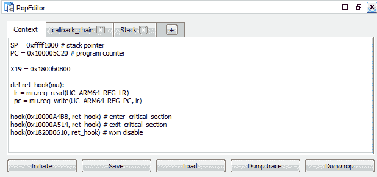
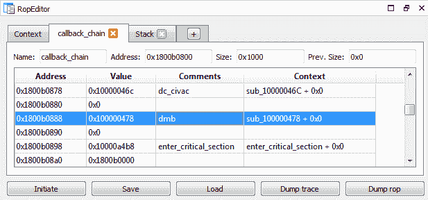

# CrauEmu:用于开发和分析代码重用攻击的有效负载的 uEmu 扩展

> 原文：<https://kalilinuxtutorials.com/crauemu/>

crauEmu 是一个 uEmu 扩展，用于开发和分析代码重用攻击的有效负载。

**安装**

**将文件 crauEmu.py 放在与 uEmu.py 相同的位置。
在 IDA 中使用文件/脚本文件…或 ALT+F7 来加载 crauEmu.py**

**也可阅读-[eaves arp:分析 ARP 请求以识别互通主机](https://kalilinuxtutorials.com/eavesarp/)**

**绳索编辑器**

[**Slides from ZeroNights 2019**](http://kalilinuxtutorials.com/wp-content/uploads/2020/04/crau.pdf)[Download](http://kalilinuxtutorials.com/wp-content/uploads/2020/04/crau.pdf) 

<http://kalilinuxtutorials.com/wp-content/uploads/2020/04/demo01_edge1.mp4>

**Demo 1 – X32-64, Edge, rop-gadgets from pwnjs**  

<http://kalilinuxtutorials.com/wp-content/uploads/2020/04/demo02_checkm8.mp4>

**Demo 2 – ARM64, checkm8 callback-chain** [**Download**](https://github.com/DSecurity/crauEmu)