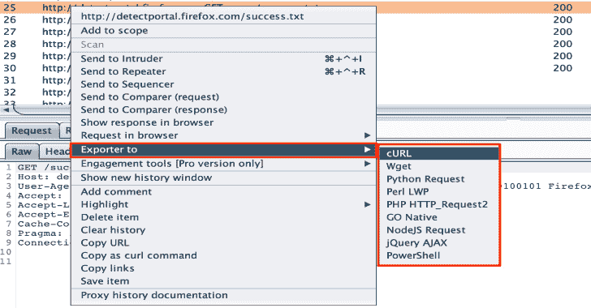

# Burp-Exporter:用多种编程语言函数请求剪贴板

> 原文：<https://kalilinuxtutorials.com/burp-exporter/>

Burp-Exporter 是一个 Burp 套件扩展，可以像多种编程语言一样将请求复制到剪贴板。

*   **您可以导出为:**
    *   卷曲
    *   Wget
    *   Python 请求
    *   Perl LWP
    *   PHP HTTP 请求 2
    *   入乡随俗
    *   NodeJS 请求
    *   jQuery AJAX
    *   PowerShell

**也可阅读-[Ps-Tools:进攻作战的高级流程监控工具包](https://kalilinuxtutorials.com/ps-tools/)**

**要求**

Jython > = 2.7.1

**打嗝套件导入**

在 Burp Suite 中，在 Extender/Extensions 选项卡下，单击 Add 按钮，选择 Extension type Python 并加载 Exporter py 文件。
用法

*   您可以从以下位置复制请求:
    *   代理>截取
    *   代理> HTTP 历史记录
    *   目标>站点地图
    *   中继器
*   右键单击>导出至>…

**可能的改进**

更多片段

[**Download**](https://github.com/artssec/burp-exporter)