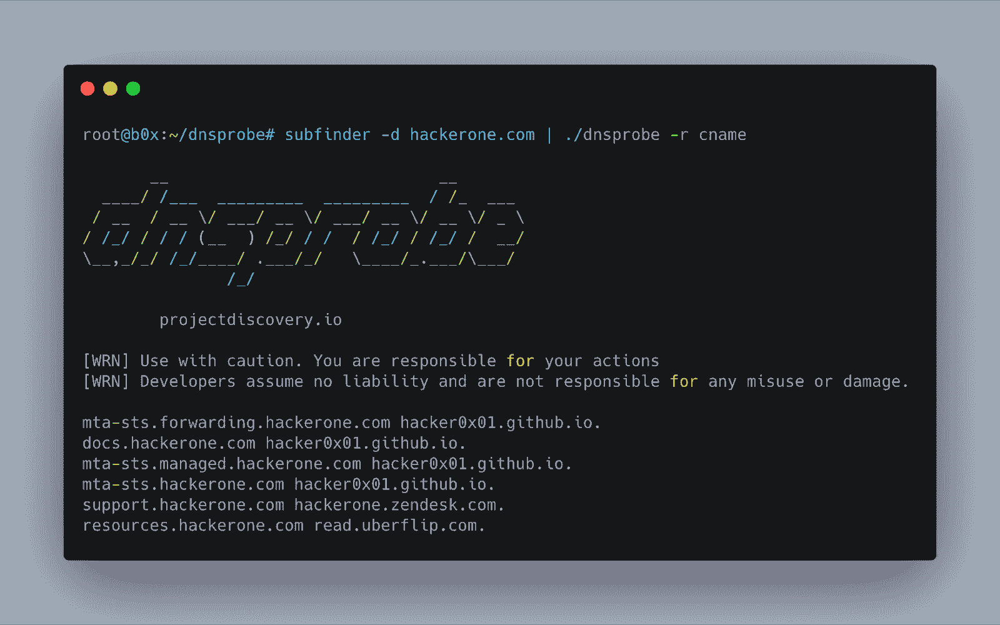

# DNSProbe:允许您执行多个 DNS 查询的工具

> 原文：<https://kalilinuxtutorials.com/dnsprobe/>

**dnsProbe** 是一个建立在 retryabledns 之上的工具，它允许您使用用户提供的解析器列表来执行您选择的多个 DNS 查询。

*   查询 DNS 记录的简单方便的工具。

**用途**

**dnsprobe -h**

**也可阅读-[CrauEmu:uEmu 扩展，用于开发&分析代码重用攻击的有效负载](https://kalilinuxtutorials.com/crauemu/)**

这将显示该工具的帮助。这里是它支持的所有开关。

| 旗 | 描述 | 例子 |
| --- | --- | --- |
| -丙 | 最大 dns 重试次数(默认值为 1) | dnsprobe -c 5 |
| -我 | dns 域列表(可选) | dnsprobe -l domains.txt |
| -r | 请求类型 A、NS、CNAME、SOA、PTR、MX、TXT、AAAA(默认为“A”) | dnsprobe -r A |
| 构成名词复数 | 解析器列表(可选) | dnsprobe -s resolvers.txt |
| 相当于-ED | 要发出的并发请求数(默认值为 250) | dnsprobe -t 500 |
| -f | 输出类型:ip，域，响应，简单(域+ ip，默认)，完整(域+响应)，json(域+原始响应) | dnsprobe -f json |
| 表示“具有…性质的” | 输出文件(可选) | dnsprobe -o
result.txt |

**安装说明**

*   **来源于**

需要 go1.13+才能成功安装。运行以下命令获取报告–

**go 111 module = on go get-u-v github.com/projectdiscovery/dnsprobe**

为了更新该工具，可以在 go get 命令中使用-u 标志。

*   **向主机查询记录**

要查询域列表，可以通过 stdin 传递列表。

**>猫 domains . txt | DNS probe**

root @ test:~ #猫 BC . txt | DNS probe
bounce.bugcrowd.com 192.28.152.174
blog.bugcrowd.com 104.20.4.239
blog.bugcrowd.com 104.20.5.239
www.bugcrowd.com 104.20.5.239
www . bug crowd . com 104 . 20 . 4 . 239
events . bug crowd . com 54 . 84 . 134 . 174

*   **向主机查询 CNAME 记录**

**>DNS probe-l domains . txt-r forum.bugcrowd.com**
root @ test:~ # DNS probe-l BC . txt-r CNAME
bugcrowd.hosted-by-discourse.com。collateral.bugcrowd.com·bugcrowd.outrch.com。
go.bugcrowd.com·mkto-ab270028.com。
ww2.bugcrowd.com bugcrowdinc.mktoweb.com。researcherdocs.bugcrowd.com·ssl.readmessl.com。docs.bugcrowd.com·ssl.readmessl.com。

这将针对`**domains.txt**`中的域运行该工具，并返回结果。该工具使用用-s 选项指定的解析器或默认系统解析器来执行查询。

*   **查询子分支输出**上的 CNAME 记录

**>sub finder-d bugcrowd.com-silent | DNS probe-r cname**

root @ b0x:~ # sub finder-d bugcrowd.com-silent | DNS probe-r cname forum.bugcrowd.com bugcrowd.hosted-by-discourse.com。docs.bugcrowd.com·ssl.readmessl.com。go.bugcrowd.com·mkto-ab270028.com
。
ww2.bugcrowd.com·bugcrowdinc.mktoweb.com。researcherdocs.bugcrowd.com·ssl.readmessl.com。
collateral.bugcrowd.com bugcrowd.outrch.com。proxilate.bugcrowd.com·proxilate.a.bugcrowd.com。

[**Download**](https://github.com/projectdiscovery/dnsprobe)