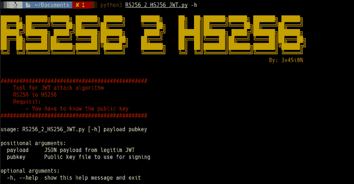
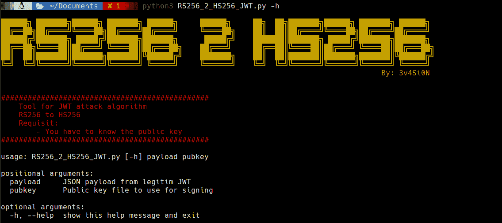

# RS256-2-HS256 : JWT 攻击将算法 RS256 更改为 HS256

> 原文：<https://kalilinuxtutorials.com/rs256-2-hs256/>

**RS256-2-HS256** 是将算法 RS256 改为 HS256 的 JWT 攻击。

**用途**

**用法:**RS 256 _ 2 _ hs 256 _ jwt . py[-h]payload pubkey

**位置参数:**
payload JSON payload from to attack
pubkey 用于签名的公钥文件

**可选参数:**
【h，–help 显示此帮助消息并退出

**也可理解为-[打嗝-导出器:对具有多种编程语言功能的剪贴板的请求](https://kalilinuxtutorials.com/burp-exporter/)**

**例子**

[**Download**](https://github.com/3v4Si0N/RS256-2-HS256)