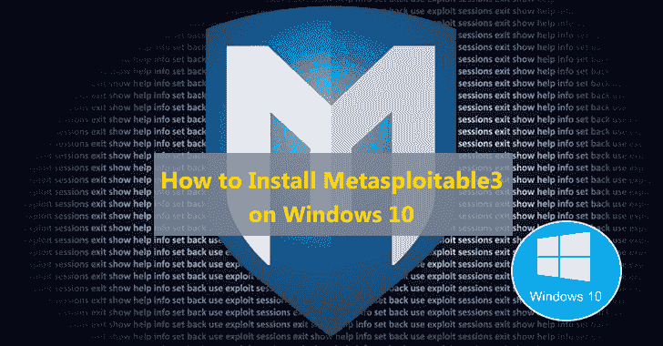
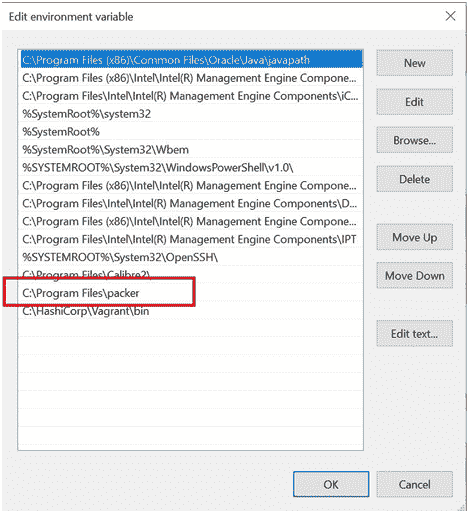
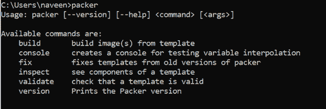
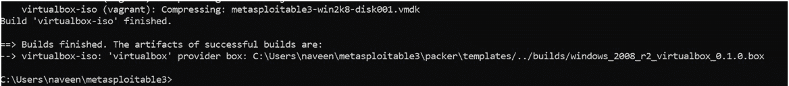
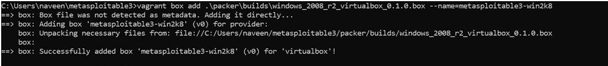
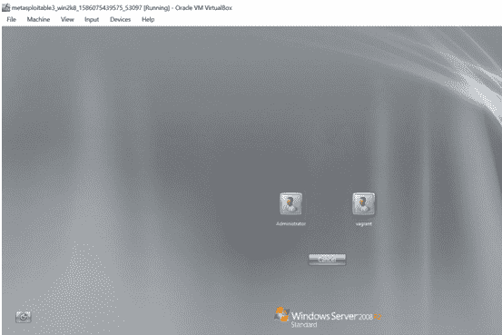

# 如何在 Windows 10 上安装 Metasploitable3

> 原文：<https://kalilinuxtutorials.com/metasploitable3-on-windows/>

一个好的家庭实验室对于一个有道德的黑客来说是不可或缺的，他/她可以在不给他人带来痛苦的情况下练习他/她的技术。初露头角的钢笔测试员必须在不同的目标上练习，以获得更广泛的经验。本文将逐步指导您在 Windows 10 上安装 Metasploitable3。

安装过程可能需要至少几个小时，这取决于您的机器和互联网连接速度。Metasploitable3 是一个易受攻击的 Windows 2008 服务器，具有许多易受攻击的应用程序。

根据 Rapid7 的 GitHub 页面“Metsaploitable3 是一个完全由大量安全漏洞构建的虚拟机。它旨在用作测试 Metasploit 漏洞利用的目标。

让我们开始安装 Metasploitable3！

## **先决条件**

安装 Metasploitable3 的先决条件如下:

Oracle VirtualBox 的最新版本

Oracle VirtualBoxExtensions 的最新版本

### **第一步:在本地主机上下载并安装 packer**

-请从[https://packer.io/downloads.html](https://packer.io/downloads.html)下载 64 位打包程序

使用 packer 名称创建一个新文件夹，并将解压缩后的 packer 保存到 C:\Program Files\packer folder 下新创建的文件夹中

现在，通过右键单击这台 PC 添加环境变量- = >单击高级系统设置= >单击环境变量= >在系统变量窗口中选择路径à单击编辑= >新建à用 C:\Program Files\packer 填充= >确定。(见下图环境变量设置截图)。

打开命令提示符，键入 packer 并输入。您应该看到下面确认成功安装在您的机器上的包装机。

### **第二步:流浪安装**

-去[https://www.vagrantup.com/downloads.html](https://www.vagrantup.com/downloads.html)下载 64 位 windows 流浪汉可执行文件。

-接受所有默认选项。安装 packer 后重新启动系统。

-现在使用此命令安装漫游插件安装漫游插件-重新加载

### **第三步:在你的电脑上安装 git 客户端**

从[https://git-scm.com/downloads](https://git-scm.com/downloads)下载并安装 64 位 windows git 可执行文件。接受安装程序的所有默认选项。此时，您可能需要重新启动您的机器。

### **第四步:安装 Metasploitable3**

-在命令提示符下运行此命令:C:\ Users \ Naven \ metasploitable 3 > git 克隆 https://github.com/rapid7/metasploitable3.git

### **步骤 5:构建 Json 步骤**

-运行此命令 C:\ Users \ Naven \ metasploitable 3 > packer build–only = Virtualbox-iso \ packer \ templates \ windows _ 2008 _ R2 . JSON

这可能需要几个小时，您必须耐心等待安装过程。

安装过程将重新启动新创建的虚拟机几次。

现在使用下面的命令 C:\ Users \ naveen \ metasploitable 3 > travel box add 在安装后添加 travel box。\ packer \ builds \ windows _ 2008 _ R2 _ virtualbox _ 0 . 1 . 0 . box–name = metasploitable 3-win2k 8

万岁，你的劳动成果终于实现了。前往 VirtualBox，你会注意到一个新的 Windows 2008 虚拟机。这里有两个用户:管理员和流浪者(见下面的屏幕截图)。两个帐户的密码都是空的。享受黑掉 Windows 2008 服务器！

有用的链接

*   https://packer.io/downloads.html
*   https://www.vagrantup.com/downloads.html
*   https://www.virtualbox.org/
*   https://github.com/rapid7/metasploitable3
*   https://github.com/rapid7/metasploitable3/wiki/Vulnerabilities
*   https://github.com/rapid7/metasploitable3/blob/master/README.md

**作者:**

我在安全工程、网络安全管理和安全解决方案架构方面有超过 10 年的经验。在业余时间，我练习瑜伽，学习阿育吠陀科学。