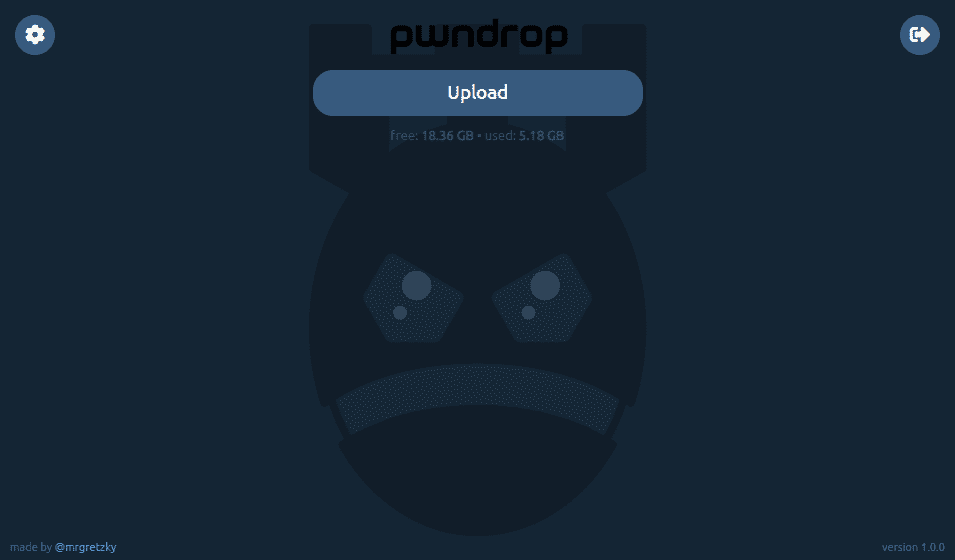

# pwndrop:自部署文件托管服务

> 原文：<https://kalilinuxtutorials.com/pwndrop/>

pwndrop 是一个自部署的文件托管服务，用于发送 red teaming 有效负载或通过 HTTP 和 WebDAV 安全地共享您的私人文件。

如果你曾经需要快速设置一个 nginx/apache web 服务器来存放你的文件，并且你对`**python -m SimpleHTTPServer**`、 **pwndrop** 的局限性不满意，那么它绝对适合你！

使用 **pwndrop** 您可以:

*   使用您自己的专用 VPS，通过拖放，上传并立即共享多个文件。
*   只需轻轻一点，即可决定文件是否可供下载。
*   为共享文件设置自定义下载 URL，而不需要改变目录结构。
*   建立 facade 文件，只要你愿意，它将代替原始文件提供给你。
*   设置自动重定向来欺骗共享链接中的文件扩展名。
*   更改所提供文件的 MIME 类型，以更改单击下载链接时浏览器的行为。
*   通过 HTTP、HTTPS 和 WebDAV 提供文件服务。
*   使用 bash oneliner 安装和设置一切。
*   设置 **pwndrop** 作为域名服务器，并使用有效的 DNS A 记录响应您选择的任何子域。
*   保护您的管理面板背后的自定义秘密网址路径，并登录与您自己的用户名和密码安全。
*   永远不要担心设置 HTTPS 证书，因为 **pwndrop** 会在后台为您做一切事情(包括自动续订)。

它的主要目标是使文件共享尽可能简单和直观，同时实现额外的功能来帮助红队评估。

**pwndrop** 的前端是在纯 Vue.js + Bootstrap 中开发的，不依赖 npm 或 webpack。后端服务于 REST API 并管理本地数据库，由 GO 语言提供支持。

**也可阅读-[隐私獾:一个浏览器扩展自动学习阻止隐形追踪器](https://kalilinuxtutorials.com/privacy-badger/)**

**向上写**

如果你想了解如何使用 **pwndrop** 或者你想了解在最近的版本中实现了哪些新特性，请务必查看我博客上的帖子:

[https://breakdev.org/pwndrop](https://breakdev.org/pwndrop)

**视频指南**

[https://www.youtube.com/embed/e3veSyIFvOE?feature=oembed&enablejsapi=1](https://www.youtube.com/embed/e3veSyIFvOE?feature=oembed&enablejsapi=1)

**先决条件**

如果你还没有可以部署的服务器，我强烈推荐数字海洋。最便宜的 5 美元/月的 25GB 存储空间的 Debian 9 服务器将会为你创造奇迹。您可以使用我的推荐链接[在 60 天内免费获得额外的 100 美元用于您的服务器](https://m.do.co/c/50338abc7ffe)。

注册一个新域，并将其 DNS A 记录指向您的 VPS IP。你也可以注册一个域名，将它的`**ns1**`和`**ns2**`域名服务器指向 **pwndrop** 实例 IP——它会自动响应有效的 DNS A 回复。

1.  作为 DNS A 记录或作为名称服务器指向 **pwndrop** 实例 IP 的注册域名。
2.  内存至少为 512 MB 的服务器。

如果您想设置没有域的 **pwndrop** ，请查看下面如何设置本地实例，这将不会自动生成 HTTPS 证书。

**安装**

在尝试安装 **pwndrop** 之前，确保没有任何 DNS 或 HTTP(S)服务器正在运行。

*   **Oneliner**

我不建议在下载和检查脚本代码之前运行 oneliners，但是如果您真的很着急，这里有:

**curl https://raw . githubusercontent . com/kgretzky/pwndrop/master/install _ Linux . sh | sudo bash**

这将下载最新的 amd64 版本二进制文件，并完全安装一个后台运行的守护程序。

*   **来自二进制**

首先你需要从[https://github.com/kgretzky/pwndrop/releases](https://github.com/kgretzky/pwndrop/releases)下载你想要的发布包

然后执行以下操作(这将对 oneliner 执行相同的操作):

**tar zxvf pwndrop-linux-amd64.tar.gz**
。/pwndrop 停止
。/pwndrop 安装
。/pwndrop start
。/pwndrop 状态

*   **来自源代码**

首先确保你已经安装了版本至少为**1.13**:【https://golang.org/doc/install】T2 的 GO

然后执行以下操作:

**git 克隆 https://github.com/kgretzky/pwndrop
CD pwndrop
make
make install**

**快速入门**

确保 **pwndrop** 正在运行。

1.  打开秘密网址授权你的浏览器:`**https://yourdomain.com/pwndrop**`(这是默认值；确保使用秘密路径，您已经预先配置)
2.  在您的浏览器中打开管理面板 URL:`**https://yourdomain.com/**`(因为您已经授权了您的浏览器，现在您将看到一个管理面板登录页面)
3.  创建您的管理员帐户或登录。
4.  单击左上角的配置图标，确保将秘密路径更改为除`/pwndrop`之外的其他路径。

你可以走了！

**从 CLI 运行**

你不必安装 **pwndrop** 作为守护进程，你可以直接从控制台运行它。

**守护进程管理:**
**> >启动:**启动守护进程
**> >停止:**停止守护进程
**> >安装:**使用可用的系统管理器安装守护进程(支持 systemd、systemv 和 upstart)
**>>删除:**卸载守护进程
> **>状态:**检查状态 pwndrop.ini '与可执行文件在同一目录)
**> > debug** :启用调试输出
**>>no-autocert**:禁用从 **> > LetsEncrypt 自动检索 TLS 证书；**当你想通过 IP 或/和本地网络连接时有用
**> > no-dns :** 不要在端口 53 UDP 上运行 dns 服务器；如果您不想将 pwndrop 用作名称服务器
**> > h :** 用法帮助，请使用此选项

**配置**

在第一次启动时， **pwndrop** 默认情况下会在可执行文件所在的目录下创建一个新的配置文件`**pwndrop.ini**`。您可以稍后修改它或者提供您自己的，例如在安装之前预配置 **pwndrop** ，以便更好地自动化工具的部署。

下面是一个示例配置文件，其中包含所有可用的配置变量和注释:

**【pwn drop】**
**>>listen _ ip =**" 190 . 33 . 86 . 22 " # pwn drop 实例的外部 IP(如果要使用名称服务器功能，必须设置)
**>>http _ port =**80 #监听端口为 HTTP 和 WebDAV
**>>https _ port =**443 #监听端口为/data" #数据存储将驻留的目录路径(相对路径来自可执行目录路径)
**>>admin _ dir =**"。/admin" #管理面板文件所在的目录路径(相对路径来自可执行目录路径)

**【setup】**#可选:如果要预先配置 pwndrop(第一次运行时将从配置文件中删除该部分)，请放入)
**>>username =**" admin " #管理帐户的用户名
**>password =**" secret password " #管理帐户的密码
如果访问者提供一个不指向任何共享文件的路径，他们将被重定向到的 URL(如果您想返回 404，请留空)
**>>secret _ path =**"/pwn drop " # secret URL path，在访问时将允许您的浏览器访问管理面板的登录页面(确保更改默认值)

如果您想在部署之前使用任何安装脚本预先配置您的 **pwndrop** 实例，将您的配置文件放在`**/usr/local/pwndrop/pwndrop.ini**`处，它将在 **pwndrop** 守护进程首次执行时被解析。

演职员表: [**@jaredhaight**](https://twitter.com/jaredhaight)

[**Download**](https://github.com/kgretzky/pwndrop)