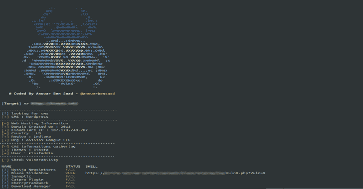
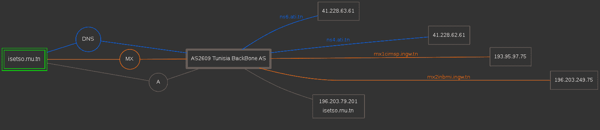
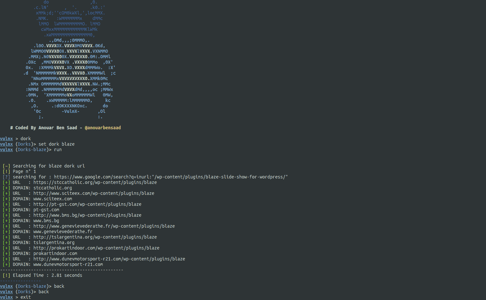

# Vulnx:自动外壳注入器，可检测多种类型的 CMS 中的漏洞

> 原文：<https://kalilinuxtutorials.com/vulnx-2/>

Vulnx 是一个智能 Bot 自动外壳注入器，可以检测多种类型的 cms 中的漏洞，快速 Cms 检测，信息收集和目标漏洞扫描，如子域，IP 地址，国家，组织，时区，地区，ans 等…

VulnX 不像其他工具那样手动注入每一个外壳，而是分析目标网站，检查是否存在漏洞，如果存在漏洞，就会注入外壳。

**特性**

*   检测 cms (wordpress，joomla，prestashop，drupal，opencart，magento，lokomedia)
*   目标信息收集
*   目标子域收集
*   按需多线程
*   检查漏洞
*   汽车外壳注射器
*   利用呆子搜索器
*   端口扫描高电平
*   DNS-服务器转储
*   输入多个要扫描的目标。
*   按名字和利用名列出的呆子。
*   将多个目标从 Dorks 导出到日志文件中。

**DNS 映射结果**

为此，请使用–DNS 标志和-d 对子域运行扫描。要生成 isetso.rnu.tn 的映射，可以在 ne w 终端中运行命令**vulnx-u iset so . rnu . TN–DNS-d–output $ path。**

**$PATH :** 存储图形结果的位置。

让我们生成一个显示目标子域、MX 和 DNS 数据的图像。

**也可阅读-[Sherloq:一个开源的数字图像取证工具集](https://kalilinuxtutorials.com/sherloq/)**

利用

*   **Joomla**
    *   [Com Jce](https://github.com/anouarbensaad/vulnx/blob/master/'#')
    *   [Com 壁纸](https://github.com/anouarbensaad/vulnx/blob/master/'#')
    *   [Com Jdownloads](https://github.com/anouarbensaad/vulnx/blob/master/'#')
    *   [Com Jdownloads2](https://github.com/anouarbensaad/vulnx/blob/master/'#')
    *   与网络链接
    *   [Com Fabrik](https://github.com/anouarbensaad/vulnx/blob/master/'#')
    *   [Com Fabrik2](https://github.com/anouarbensaad/vulnx/blob/master/'#')
    *   [Com Jdownloads 索引](https://github.com/anouarbensaad/vulnx/blob/master/'#')
    *   [Com Foxcontact](https://github.com/anouarbensaad/vulnx/blob/master/'#')
    *   [Com 博客](https://github.com/anouarbensaad/vulnx/blob/master/'#')
    *   [Com 用户](https://github.com/anouarbensaad/vulnx/blob/master/'#')
    *   [Com 广告经理](https://github.com/anouarbensaad/vulnx/blob/master/'#')
    *   [Com 性接触形式](https://github.com/anouarbensaad/vulnx/blob/master/'#')
    *   [Com 媒体](https://github.com/anouarbensaad/vulnx/blob/master/'#')
    *   [Mod_simplefileupload](https://github.com/anouarbensaad/vulnx/blob/master/'#')
    *   [Com 工具格式](https://github.com/anouarbensaad/vulnx/blob/master/'#')
    *   [Com 工具格式](https://github.com/anouarbensaad/vulnx/blob/master/'#')
    *   [用灭火器](https://github.com/anouarbensaad/vulnx/blob/master/'#')
*   **WordPress**
    *   [简单的广告管理器](https://www.exploit-db.com/exploits/36614)
    *   [线内营销](https://www.rapid7.com/db/modules/exploit/unix/webapp/wp_inboundio_marketing_file_upload)
    *   [WPshop 电子商务](https://www.rapid7.com/db/modules/exploit/unix/webapp/wp_wpshop_ecommerce_file_upload)
    *   [天气](https://cxsecurity.com/issue/WLB-2017030099)
    *   [娱乐圈专业人士](https://www.exploit-db.com/exploits/35385)
    *   [作业管理器](https://www.exploit-db.com/exploits/45031)
    *   [Formcraft](https://www.exploit-db.com/exploits/30002)
    *   [动力变焦](http://www.exploit4arab.org/exploits/399)
    *   [下载管理器](https://www.exploit-db.com/exploits/35533)
    *   [奇瑞框架](https://www.exploit-db.com/exploits/45896)
    *   [Catpro](https://vulners.com/zdt/1337DAY-ID-20256)
    *   [火焰幻灯](https://0day.today/exploits/18500)
    *   [Wysija-时事通讯](https://www.exploit-db.com/exploits/33991)
*   **Drupal**
    *   [添加管理员](https://github.com/anouarbensaad/vulnx/blob/master/'#')
    *   [Drupal BruteForcer](https://github.com/anouarbensaad/vulnx/blob/master/'#')
    *   [Drupal Geddon2](https://github.com/anouarbensaad/vulnx/blob/master/'#')
*   **预铺**
    *   [attributewizardpro](https://github.com/anouarbensaad/vulnx/blob/master/'#')
    *   [栏目广告](https://github.com/anouarbensaad/vulnx/blob/master/'#')
    *   [soopamobile](https://github.com/anouarbensaad/vulnx/blob/master/'#')
    *   [PK _ 弹性菜单](https://github.com/anouarbensaad/vulnx/blob/master/'#')
    *   [pk_vertflexmenu](https://github.com/anouarbensaad/vulnx/blob/master/'#')
    *   [nvn _ 出口 _ 订单](https://github.com/anouarbensaad/vulnx/blob/master/'#')
    *   [大菜单](https://github.com/anouarbensaad/vulnx/blob/master/'#')
    *   [tdpsthemeoptionpanel](https://github.com/anouarbensaad/vulnx/blob/master/'#')
    *   [psmode 主题选项面板](https://github.com/anouarbensaad/vulnx/blob/master/'#')
    *   [批量生产](https://github.com/anouarbensaad/vulnx/blob/master/'#')
    *   [区块证明](https://github.com/anouarbensaad/vulnx/blob/master/'#')
    *   [速食班](https://github.com/anouarbensaad/vulnx/blob/master/'#')
    *   [Vtermslideshow](https://github.com/anouarbensaad/vulnx/blob/master/'#')
    *   [简单滑展](https://github.com/anouarbensaad/vulnx/blob/master/'#')
    *   [产品页面广告](https://github.com/anouarbensaad/vulnx/blob/master/'#')
    *   [主页广告](https://github.com/anouarbensaad/vulnx/blob/master/'#')
    *   [主页广告 2](https://github.com/anouarbensaad/vulnx/blob/master/'#')
    *   [jro_homepageadvertise](https://github.com/anouarbensaad/vulnx/blob/master/'#')
    *   [高级滑块](https://github.com/anouarbensaad/vulnx/blob/master/'#')
    *   [cartabandonmentpro](https://github.com/anouarbensaad/vulnx/blob/master/'#')
    *   [cartabandonmentproOld](https://github.com/anouarbensaad/vulnx/blob/master/'#')
    *   [videostab](https://github.com/anouarbensaad/vulnx/blob/master/'#')
    *   [wg24 行政管理](https://github.com/anouarbensaad/vulnx/blob/master/'#')
    *   [fieldvmegamenu](https://github.com/anouarbensaad/vulnx/blob/master/'#')
    *   [wdoptionpanel](https://github.com/anouarbensaad/vulnx/blob/master/'#')
*   **敞篷车**
    *   [敞开式手推车粗放机](https://github.com/anouarbensaad/vulnx/blob/master/'#')

**vulneraxmode**

*   新的 vulnx 现在有一个互动模式。URLSET

*   多塞特

**可用的命令行选项**

**用法:vulnx【选项】**

-u–URL URL 目标
-D–呆子搜索有呆子的网页
-o–输出指定输出目录
-t–超时 http 请求超时
-c–cms-info 搜索 CMS 信息【主题、插件、用户、版本..]
-e–利用搜索漏洞&运行利用
-w–we b-info web 信息收集
-d–domain-info 子域信息收集
-l，–dork-list 列出利用漏洞的 dorks 名称
-n，–number-搜索引擎(Google)的页码页
-p，–ports 要扫描的端口
-i，–input 从输入文件中指定要扫描的域
–threads 线程数
–dnd

**码头工人**

vulnx 在码头！！。

**$吉特克隆 https://github.com/anouarbensaad/VulnX.git
$ CD VulnX
$ docker build-t VulnX。/docker/
$ docker run-it-name vulnx vulnx:latest-u http://example.com**

以交互模式运行 vulnx 容器

要查看日志文件，请将其装入卷中，如下所示:

**$ docker run-it–name VulnX-v " $ PWD/logs:/VulnX/logs " VulnX:latest-u http://example.com**

更改[安装目录](https://github.com/anouarbensaad/vulnx/blob/master/docker/Dockerfile#L46)..

**卷[" $路径"]**

**在 Ubuntu 上安装**

**git 克隆 https://github . com/anouanoisaad/vulcnx . git
$ CD vulcnx
$ chmod+x install . sh
$。/install.sh**

现在运行 vulnx

**安装在 Termux 上**

**$ pkg 更新
$ pkg install -y git
$ git 克隆 http://github.com/anouarbensaad/vulnx
$ CD vulnx
$ chmod+x install . sh
$。/install.sh**

**在 Windows 中安装**

*   点击这里下载 vulnx
*   下载并安装 python3
*   将 vulnx-master.zip 解压缩到 c:/
*   打开命令提示符 cmd。

**>CD c:/vulnx-master
>python vulnx . py**

带有选项的命令示例:settimeout=3，cms-gathering = all，-d 子域-收集，run 利用

**vulnx-u http://example.com–超时 3-c all-d-w–exploit**

用于搜索呆子的示例命令:-D 或-呆子，-l-列表呆子

vulnx–list-dorks 返回漏洞名称表。使用 blaze dork 发现的 vulnx -D blaze 返回 URL

[**Download**](https://github.com/anouarbensaad/vulnx)