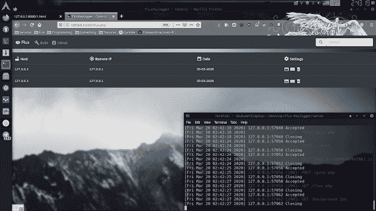

# Flux-Keylogger:带有 Web 面板的现代 Javascript 键盘记录器

> 原文：<https://kalilinuxtutorials.com/flux-keylogger/>

Flux-Keylogger 是一个带有 web 面板的现代 Javascript 键盘记录器。

**网络面板**

**测井**

*   键盘记录器
*   饼干
*   位置
*   远程 IP
*   用户代理

**安装服务器文件**

*   将文件从`**server**`目录上传到您的服务器
*   在 flux.php 更改默认用户名和密码
*   前往[http://you.host/flux.php](http://you.host/flux.php)
*   单击构建
*   现在将脚本标签注入到其他文档中

[**Download**](https://github.com/LimerBoy/Flux-Keylogger)