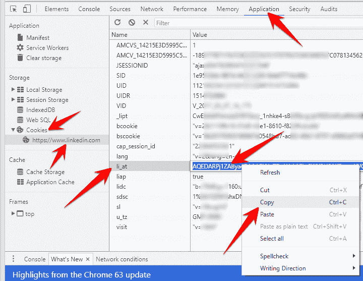
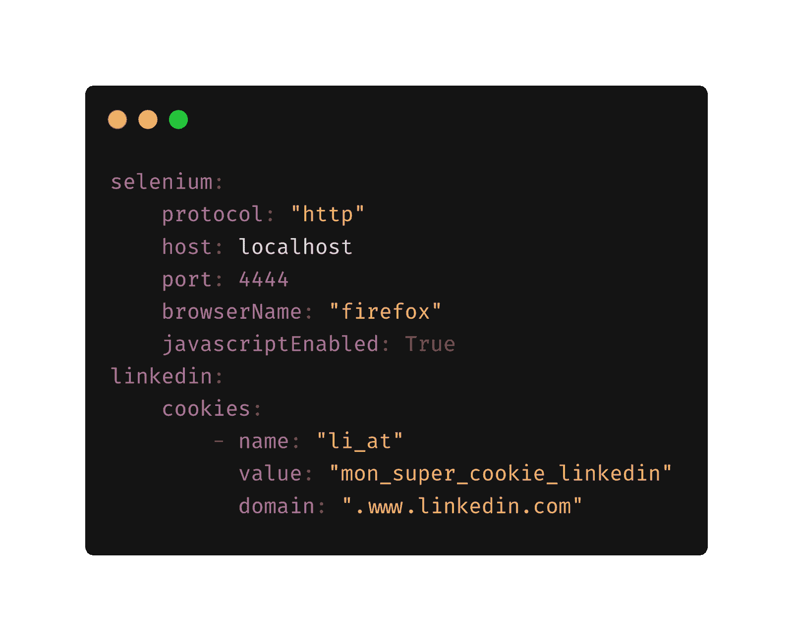

# LK_Scraper:一个完全可配置的 LinkedIn Scrape

> 原文：<https://kalilinuxtutorials.com/lk_scraper/>

Lk_scraper 是一个完全可配置的 LinkedIn scrape:抓取 LinkedIn 中的任何内容

**安装**

**pip 安装 git+git http://github . com/jqueguir/lk _ scraper**

**设置**

*   **使用 Docker 撰写**

**$ docker-复合 up-d
$ docker-复合运行 lk_scraper python3**

*   **仅针对 selenium 服务器使用 Docker**

首先，您需要运行 selenium 服务器

**$ docker run-d-p 4444:4444–shm-size 2g selenium/standalone-Firefox:3 . 141 . 59-2020 03 26**

运行此命令后，从浏览器导航到您的 IP 地址，后跟端口号和/grid/console。所以命令会是[http://localhost:4444/grid/console](http://localhost:4444/grid/console)。

**也读作-[棒棒糖:用于测试检测能力的数据渗透实用程序](https://kalilinuxtutorials.com/lollipopz/)**

**检索 Cookie**

*   **独立于浏览器:**

1.  导航到 Linkedin.com 并登录
2.  打开浏览器开发工具(Ctrl-Shift-I 或右键单击->检查元素)

*   **Chrome:**
    *   选择应用程序选项卡
    *   在左侧菜单的“Storage”标题下，单击“Cookies”下拉菜单并选择“www.linkedin.com”
    *   找到 li_at cookie，在复制之前双击选择它

*   **火狐:**
    *   选择存储选项卡
    *   点击 Cookies 下拉菜单并选择 www.linkedin.com
    *   找到并复制 li_at 值

**设置 Cookie**

*   **方法 1:在配置文件**中设置 cookie

您可以将 LinkedIn li_at cookie 添加到位于您家中的配置文件中(~/。lk_scraper/config.yml)参见

*   **方法 2:在 Scraper 级别设置 cookie**

**从 lk_scraper 导入刮刀
Li _ at = " My _ super _ LinkedIn _ cookie "
Scraper = Scraper(Li _ at = Li _ at)**

*   **方法三:使用可变环境**

(尚未实施)

**$ export LI _ AT = " My _ super _ LinkedIn _ cookie "**

**例子**

运行 jupyter 笔记本 linkedin-example.ipynb

*   **用途**

> >**从 lk_scraper 进口刮刀
> >刮刀= Scraper()**

*   **公司刮**

> >**从 lk_scraper 导入刮刀
>>Scraper = Scraper()
>>company = Scraper . get _ object(object _ name = ' company '，object_id='apple')**

*   **刮型材**

> >**从 lk_scraper 导入刮刀
>>Scraper = Scraper()
>>profil = Scraper . get _ object(object _ name = ' profil '，object_id='jlqueguiner')**

[**Download**](https://github.com/jqueguiner/lk_scraper)