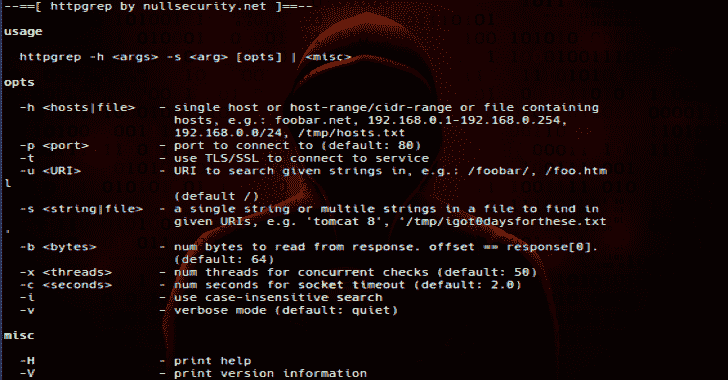

# httpgrep:扫描 HTTP 服务器以查找 URIs 中的给定字符串

> 原文： [https://kalilinuxtutorials.com/httpgrep/](https://kalilinuxtutorials.com/httpgrep/)

httpgrep 是一个 python 工具，它扫描 HTTP 服务器并在 HTTP 主体和 HTTP 响应头中找到给定的字符串。

**$ http grep-H**
**–= = =[by nullsecurity.net]= =–**

**用法**

http grep-H-s【opts】|

**选项**

–**H<hosts | file>**–单个主机或 host-range/cidr-range 或包含
主机的文件，例如:foobar.net /tmp/hosts.txt

'/tmp/igot 0 days forthese . txt '
**-S<其中>–**在给定位置搜索字符串(默认:头、体)
**-b <字节>**–从响应中读取的字节数。 offset == response[0]。
(默认值:64)
**-x <线程>**–并发检查的线程数(默认值:80)
–**c<秒>**–套接字超时的秒数(默认值:2.0)
–**I—**使用不区分大小写的搜索
**-r—**对给定的 IPv4 地址执行反向 dns 查找

**Misc**

**-H-**打印帮助
**-V-**打印版本信息

**也可阅读-[peas-特权升级牛逼脚本套件](https://kalilinuxtutorials.com/peass/)**

**注释**

*   快速而肮脏的代码
*   httpgrep 已经打包并可用于 BlackArch Linux
*   我的主枝总是稳定的；开发分支是为当前工作创建的。
*   你能找到的我所有的公开资料都是通过[nullsecurity.net](https://www.nullsecurity.net)正式宣布和发布的。

**免责声明**

我们在此强调，在[nullsecurity.net](http://nullsecurity.net)上发现的黑客相关内容仅用于教育目的。我们不对任何损坏负责。你要对自己的行为负责。

**贷方:no trix**

[**Download**](https://github.com/noptrix/httpgrep)