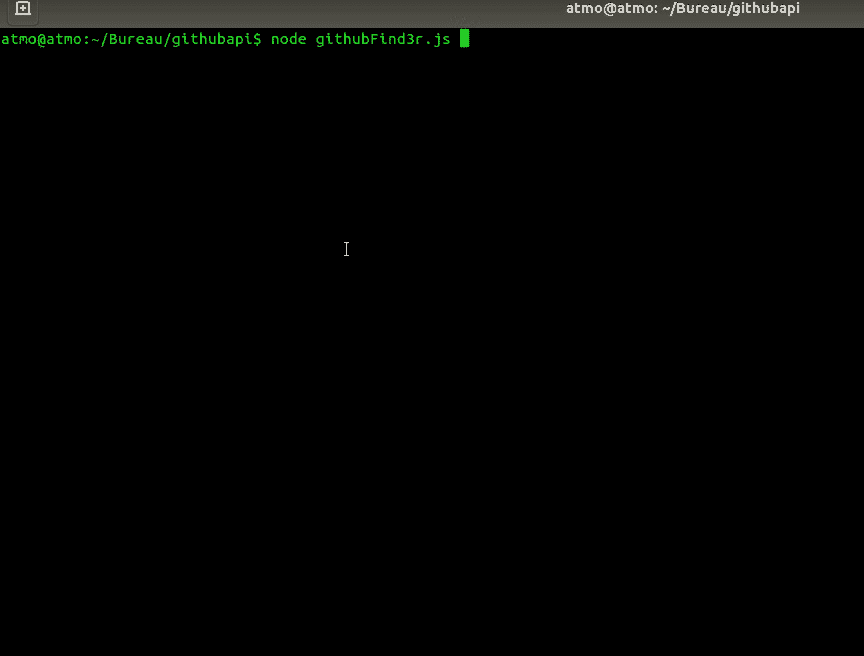

# GithubFind3r:快速命令行报告/用户/提交搜索工具

> 原文：<https://kalilinuxtutorials.com/githubfind3r/>

**GithubFind3r** 是一个非常快速的命令行 repo/user/commit 搜索工具。

**又念——[RS256-2-hs 256:JWT 攻击将算法 RS 256 改为 hs 256](https://kalilinuxtutorials.com/rs256-2-hs256/)**

**安装**

**git 克隆 https://github . com/atmoner/githubfind 3r . git
CD githubfind 3r
NPM 安装**

**运行它**

**节点 githubFind3r.js**

[**Download**](https://github.com/atmoner/githubFind3r)