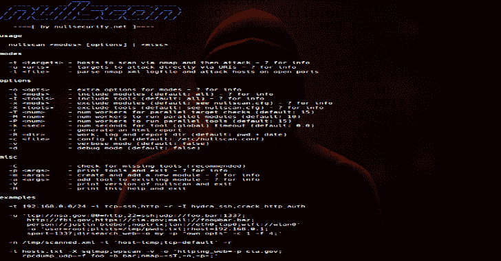

# NullScan:一个模块化框架，旨在链接和自动化安全测试

> 原文：<https://kalilinuxtutorials.com/nullscan/>

NullScan 是一个模块化框架，旨在链接和自动化安全测试。它从命令行解析目标定义，然后运行相应的模块和它们的 nullscan 工具。

它还可以接受主机并首先启动 nmap，以便执行基本的端口扫描，然后运行模块。此外，nullscan 可以解析给定的 nmap 日志文件以打开 tcp 和 udp 端口，然后再次运行这些模块。

所有结果都将以清晰的结构记录在指定的目录中，随后可以生成 HTML 报告。

**用途**

**【黑客@ black arch ~】$ nullscan-H**
**–= =[by nullsecurity.net]= =–**

**用法**

nullscan <模式>【选项】|<misc>
**模式**
-t <目标>–主机通过 nmap 扫描然后攻击——？参考信息
-u<uris>-通过 URIs 直接攻击的目标-？对于信息
-l <文件>-解析 nmap xml 日志文件并攻击开放端口上的主机

**选项**
-o <选项>-模式的额外选项-？对于信息
-I<MODS>-包括模块(默认:全部)–？用于信息
-I <工具>-包含工具(默认:全部)–？对于信息
-x<MODS>-排除模块(默认:见 nullscan . CFG)–对于信息
-X <工具>-排除工具(默认:见 nullscan . CFG)–for info
-T<num>–并行目标检查的工作线程数(默认值:15)
-M<num>–运行并行模块的工作线程数(默认值:10)
-P<num>-运行并行工具的工作线程数(默认值:15)
-k<sec>–工具(全局)超时的秒数(默认值:0.0)
-R–生成 html 日志和报告目录(默认:pwd + date)
-c <文件>–配置文件(默认:/etc/nullscan . conf)
-v–详细模式(默认:false)
-d–调试模式(默认:false)

**杂项**
-C–检查缺少的工具(推荐)
-p<args>–打印工具并退出-？ 信息
-m < args > -创建并添加一个新模块-？对于信息
-a < args > -添加工具到现有模块-？for info
-V-打印 nullscan 版本并退出
-H-打印此帮助并退出

**示例**
-t 192 . 168 . 0 . 0/24-I TCP = ssh，http -r -I hydra_ssh，crack _ http _ auth
-u ' TCP://NSA . gov:80 = http，22 = sshUDP://foo . bar:1337；
http://fbi.gov，https://CIA . gov；mail://foo @ bar . baz；
person://贾斯汀比伯，noptrixlan://eth0，tap0wifi://WLAN 0′
-o ' user = root；plists =/tmp/PWDs . txt；rhost = 192 . 168 . 0 . 1；
sport = 1337；dirsearch _ web =-o my-p " own opts "-C1-F4；
-n/tmp/scanned . XML-I ' host = icmp；TCP = default '-r
-l hosts . txt-X sqlmap，wps can-v-o ' http ing _ web =-p cia.gov；
rpcdump _ UDP =-f foo-b bar；nmap=-sT，-n，-p-；
-p 'tcp=ssh，httphost = zonetransferUDP '
-m ' icmp/ping ping _ flood ping-f-s 9999 '
-a ' TCP/ssh crack _ ssh ssh cracker-c arg-f arg '

**也可以理解为-[goBox:进入沙箱运行不受信任的代码](https://kalilinuxtutorials.com/gobox/)**

**安装**

运行`**setup.sh**`。之后使用 **`pip install -r docs/requirements.txt`安装需要的 python 模块。**

**注释**

*   请查看 docs/nullscan.1 的联机帮助页
*   使用“？”option-任何命令行选项的值。它为你提供了用法和例子的信息。
*   干净的代码；真实项目
*   nullscan 已经打包并可用于 BlackArch Linux
*   我的主枝总是稳定的；开发分支是为当前工作创建的。
*   你能找到的我所有的公开资料都是通过[nullsecurity.net](https://www.nullsecurity.net/)正式宣布和发布的。

**免责声明**

我们在此强调，在[nullsecurity.net](http://nullsecurity.net/)上发现的黑客相关内容仅用于教育目的。我们不对任何损坏负责。你要对自己的行为负责。

**贷方:no trix**

[**Download**](https://github.com/noptrix/nullscan)