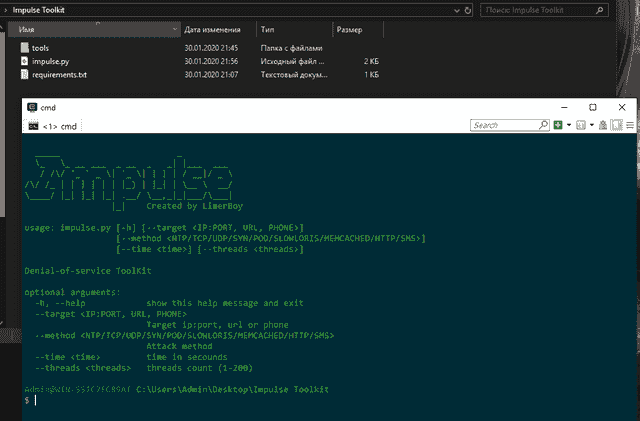
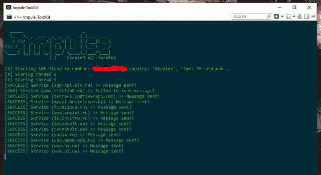

# 冲动:拒绝服务工具包

> 原文：<https://kalilinuxtutorials.com/impulse/>

**冲动**拒绝服务工具包。

**主窗口**

**方法**

| 方法 | 目标 | 描述 |
| --- | --- | --- |
| 短信 | +电话 | 短信和电话泛滥 |
| 标准温度和压力 | 进口 | NTP 放大是一种分布式拒绝服务(DDoS)攻击，攻击者利用公众可访问的网络时间协议(NTP)服务器，用用户数据报协议(UDP)流量淹没目标。 |
| synchronizing 同步 | 进口 | SYN flood(半开攻击)是一种拒绝服务(DDoS)攻击，旨在通过消耗所有可用的服务器资源，使服务器不可用于合法流量。 |
| 传输控制协议（Transmission Control Protocol） | 进口 | 什么是 SYN flood 攻击。TCP SYN flood(也称为 SYN flood)是一种分布式拒绝服务(DDoS)攻击，它利用正常 TCP 三次握手的一部分来消耗目标服务器上的资源并使其无响应。 |
| 用户数据报协议(User Datagram Protocol) | 进口 | UDP flood 是一种拒绝服务攻击，在这种攻击中，大量用户数据报协议(UDP)数据包被发送到目标服务器，目的是破坏该设备的处理和响应能力。保护目标服务器的防火墙也可能因 UDP 洪流

而耗尽，导致合法流量被拒绝服务。 |
| 死亡之乒 | 互联网协议(Internet Protocol) | Ping of Death(也称为 PoD)是一种拒绝服务(DoS)攻击，在这种攻击中，攻击者通过使用简单的 Ping 命令发送格式错误或过大的数据包，试图使目标计算机或服务崩溃、不稳定或冻结。 |
| 超文本传送协议 | 统一资源定位器 | HTTP Flood 是一种分布式拒绝服务(DDoS)攻击，在这种攻击中，攻击者操纵 HTTP 并发布不需要的请求，以攻击 web 服务器或应用程序。这些攻击通常使用在特洛伊木马等恶意软件的帮助下被接管的互连计算机。 |
| Slowloris | 进口 | Slowloris 是一种拒绝服务攻击程序，它允许攻击者通过在攻击者和目标之间同时打开和维护多个 HTTP 连接来摧毁目标服务器。 |
| Memcached | 进口 | memcached 分布式拒绝服务(DDoS)攻击是一种网络攻击，攻击者试图用互联网流量使目标受害者超载。攻击者向易受攻击的 UDP memcached*服务器发出欺骗请求，然后向目标受害者发送大量互联网流量，可能会淹没受害者的资源。当目标的 internet 基础架构过载时，新的请求无法处理，常规流量无法访问 internet 资源，从而导致拒绝服务。
 |

**也可阅读—[如何在 Windows 10 上安装 metasploitable 3](https://kalilinuxtutorials.com/metasploitable3-on-windows/)**

**安装**

*   **视窗:**
    *   从[这里](https://www.python.org/downloads/release/python-360/)下载 Python 3.6
    *   启动安装程序，点击`**add python to PATH**`
    *   下载冲动
    *   在 Impulse 目录中打开 cmd 或 powershell
    *   运行该命令:`**pip install -r requirements.txt**`
    *   还有这个:`**python impulse.py --help**`
*   **Linux/Termux:**
    *   `**sudo apt update**`
    *   `**sudo apt install python3 python3-pip git -y**`
    *   `**git clone https://github.com/LimerBoy/Impulse**`
    *   `**cd Impulse/**`
    *   `**pip install -r requirements.txt**`
    *   `**python3 impulse.py --help**`

**示例短信&呼叫洪水**

**python impulse . py–方法 SMS–目标+XXXXXXXXXXXX–时间 20–线程 2**

[**Download**](https://github.com/LimerBoy/Impulse)