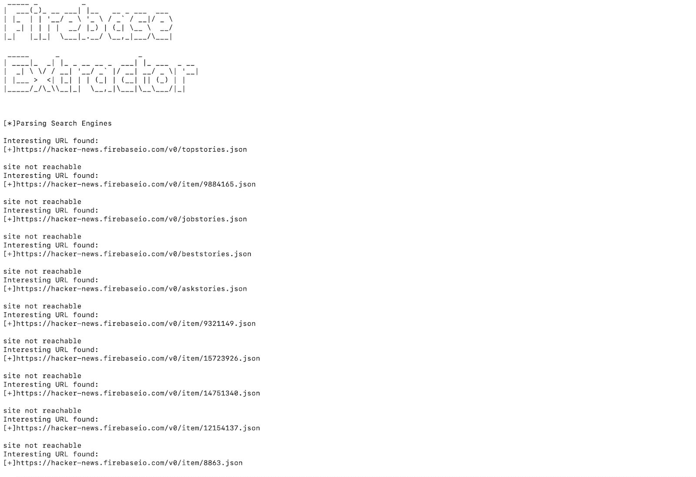

# Firebase-Extractor:一个收集 Firebase 数据的工具

> 原文：<https://kalilinuxtutorials.com/firebase-extractor/>

Firebase-extractor 是一个用 python2 编写的工具，这个工具的目的是解析 Bing 搜索的所有结果。基本上，每当发现一个应用程序的 firebaseio URL，用户就可以使用这个工具，而不是通过手动搜索结果来搜索敏感数据。

该工具的工作原理是使用给定的 Firebase URL 作为 bing 搜索引擎中的搜索查询，从搜索结果中抓取前 4 页，然后最终解析所有敏感关键字的 URL。

**模块**

> >**sys
>>requests
>>bs4//pip install bs4//
>>URL lib 2
>>pyfiglet//pip install pyfiglet//
>>re
>>[+]bs4(美汤)模块用于解析和提取特定于 html 的数据。
> > [+]pyfiglet 模块用于为工具生成横幅。**

**也可阅读-[Vulnx:自动外壳注入器，检测多种类型的 CMS 中的漏洞](https://kalilinuxtutorials.com/vulnx-2/)**

**运行指令**

*   在命令行上运行 python**firebase . py xyz.firebaseio.com**
*   其中 **xyz** 是应用或公司的具体名称。

**截图**

[**Download**](https://github.com/viperbluff/Firebase-Extractor)