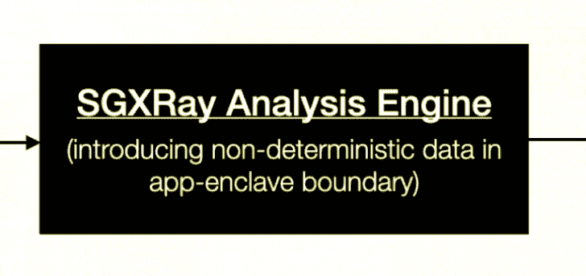
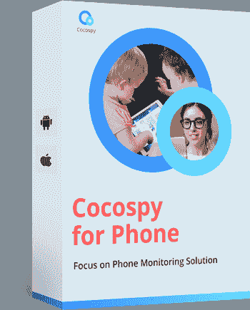
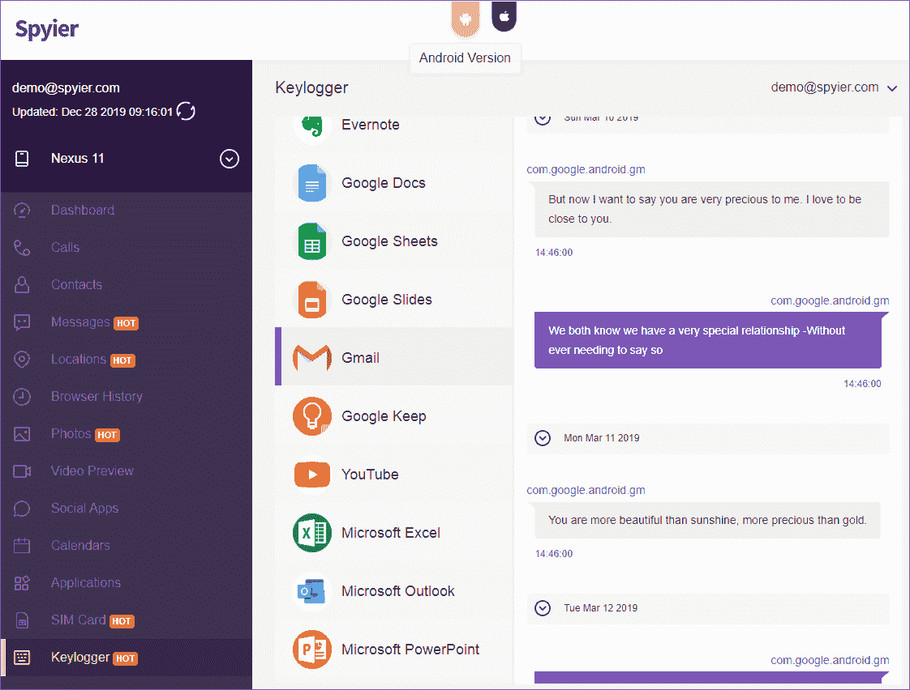
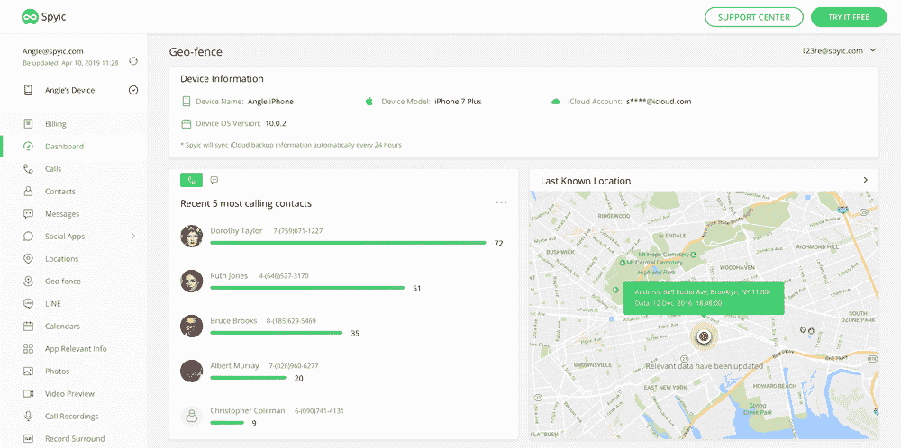

# 2020 年破解 Gmail 账户的 5 个简单方法

> 原文：<https://kalilinuxtutorials.com/gmail-hack/>

Gmail 是高度安全的电子邮件平台之一，除非你拥有这 5 种间谍工具中的任何一种，否则破解 Gmail 并不容易。一个人的 [Gmail 账户](https://support.google.com/mail/answer/56256?hl=en)可以保存很多至关重要的信息。它可以告诉你这个人最近的活动等等。此外，如今大多数在线账户都链接到了 Gmail。

如果你能成功侵入 Gmail 账户，你就能轻松获得所有这些信息和其他东西。这可能是对隐私的侵犯，但为了检查你所爱的人，这可能是必要的。

[ClickFree online](https://clickfree.com/) 有多种方法可以侵入他人的 Gmail。在这些工具的帮助下，我能够毫无问题地侵入我儿子的 Gmail。那么，怎么做呢？继续阅读，获得 Gmail 黑客的最佳选择。

## 第一部分:你真的能黑掉别人的 Gmail 吗？

这里的很多人可能会认为一个 Gmail 账户有顶级的安全性，不可能被黑掉。至少一个非技术人员不会做。然而，那是完全不真实的。用这些工具侵入任何人的 Gmail 都很简单。

所有你需要的是一个工具，有一个准确和不可察觉的键盘记录。键盘记录器可以记录目标设备上的**击键。所以，你会知道这个人的 Gmail 账户的密码。**

我在我儿子身上使用了这个特殊的工具，它创造了奇迹！让我告诉你更多关于这个简单可靠的黑掉 Gmail 的方法。

## **Gmail Hack 2020**

*   可可
*   **Spyier**
*   **明斯比**
*   **Spyic**
*   **Spyine**

### **1。Cocospy:快速简单的 Gmail 黑客**

你一定听说过 Cocospy。它是最受欢迎的黑客工具之一，而且在最近一段时间，它变得越来越受欢迎。全球数百万人使用 Cocospy 的下一代功能。

有了 Cocospy，[选择合适的 Gmail 黑客变得非常简单](https://clickfree.com/phone-hack/gmail-hack/)。事实上，这一工具已经得到了 TechRadar、PCMag、CNET 等顶级媒体的评论。所有这些评论者对 Cocospy 都只有正面评价。

由于 Cocospy 是我们所有人都可以使用的，所以我们不需要任何技术技能就可以黑进别人的 Gmail。这是一个省事又快捷的方法。以下是 Cocospy 的一些顶级特性。

### 【Does Cocospy 在黑客界带来了什么？

Cocospy 附带了一个[键盘记录器](https://cybersecuritynews.com/keylogger/)，它工作得非常好。该工具可以记录设备上的所有击键，然后将详细信息发送给你。因此，你可以找到密码，文本，以及更多的键盘记录。

每当目标用户登录他们的 Gmail 帐户时，他们都必须输入密码和用户名。所以，你会得到他们的证书，然后你可以用它黑进他们的 Gmail。

现在，您可能会想，如果这个人有双重身份验证，这是不可能成功的。Cocospy 还能让你接触到他们的短信。所以，你会得到 OTP 没有任何问题。

你应该记住，因为你将在一个未知的设备上进入他们的 Gmail 帐户，这个人会发现的。因此，您可以选择通过 Cocospy 查看邮件的替代方式。

这不会是一次完全的 Gmail 黑客攻击，但会非常谨慎。

## 第二部分:间谍

**Spyier** 在市场上还比较新，但它已经迅速获得了很大的知名度。该工具可以在 iOS 和 Android 设备上运行。此外，它不需要根或**越狱设备。**

你可以利用 Spyier 的内置键盘记录器侵入任何人的 Gmail 账户。这种谨慎的黑客工具具有各种其他功能，这使得监视和跟踪目标设备变得非常简单。

查看 Spyier 网站上的免费演示，了解 Spyier 的工作和设置。

## 第三部分:Minspy

对每个人来说，窃听和追踪智能手机都变得非常简单和方便。你现在可以利用这个工具侵入任何人的设备。我深入检查了它们的功能和准确性，它是一流的。

Minspy 在 iOS 和 Android 设备上都运行良好，不需要越狱或 root。你可以随时检查你的亲人，了解他们在 Minspy 上的所有活动和行踪。

该应用程序带有一个内置的键盘记录器，这使得黑客攻击变得非常简单。

## **第 4 部分:Spyine**

Spyine 拥有坚实的用户基础，它的功能让很多人感到惊讶。所有年龄段的人都可以使用 Spyine。此外，您不必为了设置 Spyine 而摆弄目标设备。

该工具带有一个 **[内置键盘记录器](http://kalilinuxtutorials.com/spykeyboard-keylogger-sends-data-gmail/)** ，这使得入侵 Gmail 非常方便。你可以获得帐户凭证，或者你可以简单地检查他们的电子邮件。后一种选择更加谨慎，目标用户不会对黑客有任何想法。

## **第五部分:Spyic**

Spyic 已经在市场上存在了一段时间，有数百万人在使用它。用户和受欢迎的媒体在使用 Spyic 时只有正面的评价。此外，它可以在 iPhones 和 Android 设备上运行。

Spyic 内置的**键盘记录程序准确度很高，你会很容易得到用户的凭证。Spyic 拥有超过 35 项功能，这使得监控和跟踪智能手机变得非常简单。**

查看其网站上的免费演示，了解设置过程。另外，Spyic 是一个基于网络的工具。所以，你不需要在你的设备上下载任何东西。您将能够通过仪表板访问所有功能和工具。

## **尾注**

你想黑进别人的 Gmail 账户，了解他们在做什么吗？嗯，这些工具只应该用在人身上，你知道的。所以，如果你对你孩子或妻子的活动感到好奇，选择上面提到的任何一种方式。

所有这些工具都非常好用，它们让选择合适的 Gmail 黑客变得更加简单。此外，所有这些应用程序都以一种谨慎的方式工作，您不必对目标设备进行 root 或越狱。

那么，你还在等什么？我很有效地使用了这些工具。现在密切关注你所爱的人，确保他们没有卷入任何错误。