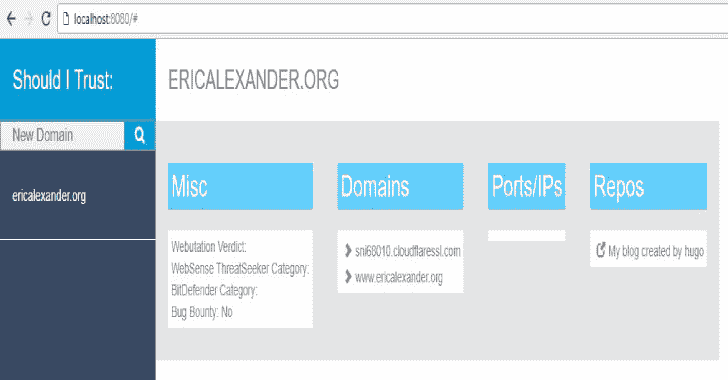

# 我应该信任吗:评估公司可信度的新工具

> 原文：<https://kalilinuxtutorials.com/should-i-trust/>

**Should-I-Trust** 是一个评估一个域的 OSINT 信号的工具。您是负责评估新供应商的审核委员会的成员。您专门负责确保新供应商满足法规遵从性和安全性要求。

标准操作程序要求以下一项或全部:SOC 报告、VSAQ、CAIQ、SIG/SIG-Lite。并非所有供应商都有这些报告和/或问卷答案。也许这是组织的流程，在没有这些信息的情况下拒绝供应商进入，或者，这是一个“特殊”的约定，您需要在没有文档的情况下确定可信度。也许你不相信医生的回答。

should-i-trust 是一个超越标准响应的工具，它可以寻找组织不应该被信任的信号。也许他们在没有授权的情况下将他们的 CI/CD 暴露在互联网上。也许他们有一个 EC2 实例，运行 prod 代码，没有目录限制。

should-i-trust 不能提供您做出去/不去决定所需的所有信息，但它可以让您快速收集新的数据以供进一步评估。

“我应该信任”对于红队或类似项目也很有用。它可以快速识别要探测的目标。

**要求**

*   Should-i-trust 需要来自以下来源的 API 密钥:
    *   [censys . io](https://censys.io/register)–前 250 欧元/月免费
    *   [病毒总量](https://www.virustotal.com)–免费
    *   [灰色战争](https://buckets.grayhatwarfare.com/register)——免费但结果有限

**也可阅读-[Vulnx:自动外壳注入器，检测多种类型的 CMS 中的漏洞](https://kalilinuxtutorials.com/vulnx-2/)**

**设置**

要么[通过 chrome](https://chrome.google.com/webstore/detail/should-i-trust/hocfamfiidomggjegfgenhgaaifjjmla) 安装 chrome 扩展，要么使用[开发者模式](https://developer.chrome.com/extensions/faq)下载并手动安装在 chrome 中。

**运行中**

*   打开分机
*   输入您的 API 密钥(需要一次)
*   输入要查询的域

**输出**

*   如果有迹象表明该域名参与了一个漏洞奖励计划
*   通过 VirusTotal、Censys.io 和谷歌证书透明度报告发现的域名
*   通过 Censys.io 找到的 IPs 和开放端口
*   GitHub、GitLab 和 Bitbucket 上的存储库
*   在 virustotal.com 发现的杂项数据
*   通过 GrayHatWarfare 发现暴露的 AWS 桶文件

[**Download**](https://github.com/ericalexanderorg/should-i-trust)