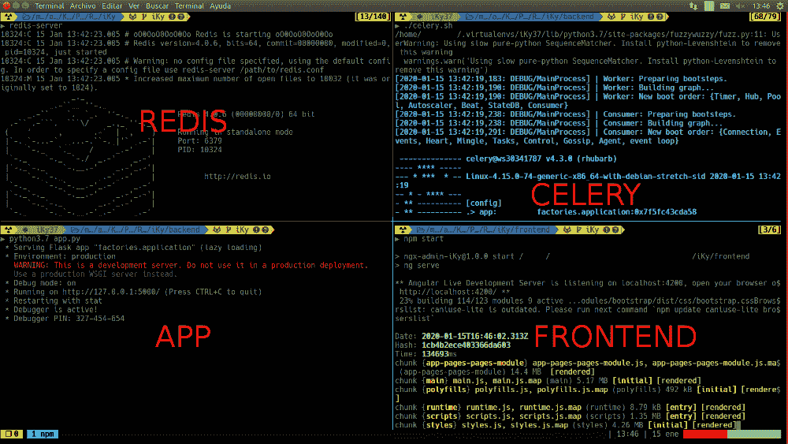

# 项目 iKy v 2 . 5 . 0-从电子邮件中收集信息的工具

> 原文：<https://kalilinuxtutorials.com/project-iky-v2-5-0-tool-that-collects-information-from-an-email/>

项目 iKy 是一个从电子邮件中收集信息并在一个漂亮的可视化界面中显示结果的工具。

**安装**

*   **克隆库**

**git 克隆 https://gitlab.com/kennbroorg/iKy.git**

*   **安装后端**
    *   **再说一遍**
        *   您必须安装 Redis

**wget http://download . redis . io/redis-stability . tar . gz
tar xvzf redis-stability . tar . gz
CD redis-stability
make
sudo make install**

*   **蟒蛇肉和芹菜**
    *   **您必须在 requirements.txt 中安装库**

**python3 -m pip 安装要求. txt**

*   **安装前端**
    *   **节点**

*   首先安装 nodejs。

**依赖关系**

*   在目录前端安装依赖项

**光盘前端**
**npm 安装**

**唤醒 iKy 工具**

*   打开后端
    *   雷迪斯
    *   在终端中打开服务器

重定向服务器

*   蟒蛇肉和芹菜
*   在另一个终端的目录后端打开芹菜

**。/celery.sh**

*   同样，在另一个终端上，从目录后端打开后端应用程序

**python3 app.py**

*   打开前端

*   最后，要运行前端服务器，从目录前端执行以下命令

**npm 开始**

**打开 iKy 后的屏幕**

**免责声明**

任何为项目做出贡献或贡献的人，包括我在内，都不对工具的使用负责(既不是合法使用，也不是非法使用，也不是“其他”使用)。请记住，这个软件最初是为了一个笑话而编写的，然后是为了教育目的(教育我们自己)，现在的目标是与社区合作制作高质量的自由软件，虽然质量并不优秀(有时甚至不好)，但我们努力追求卓越。考虑到收集的所有信息都是免费的，可以在线获得，该工具只是试图发现、收集和显示这些信息。很多时候，该工具甚至无法实现其发现和收集的目标。请在记住我妈之前加载必要的 API。如果即使使用 API 也没有显示出你期望看到的“好”东西，在你想起我母亲之前，试试其他的电子邮件。如果您仍然没有看到您期望看到的“好”的东西，您可以创建一个问题，通过电子邮件或任何 RRSS 与我们联系，但请记住，我的母亲既不是创造者，也不是该项目的贡献者。如果你不满意，我们不退款。我希望你能像我们一样喜欢使用这个工具。付出的努力过去和现在都是巨大的(时间、知识、编码、测试、评审等)。)但我们会再做一次。如果您无法清楚阅读说明和/或本免责声明，请不要使用该工具。顺便说一下，对于那些坚持要记住我母亲的人来说，她已经去世很多年了，但是我爱她，就好像她就在这里一样。

[**Download**](https://gitlab.com/kennbroorg/iKy)