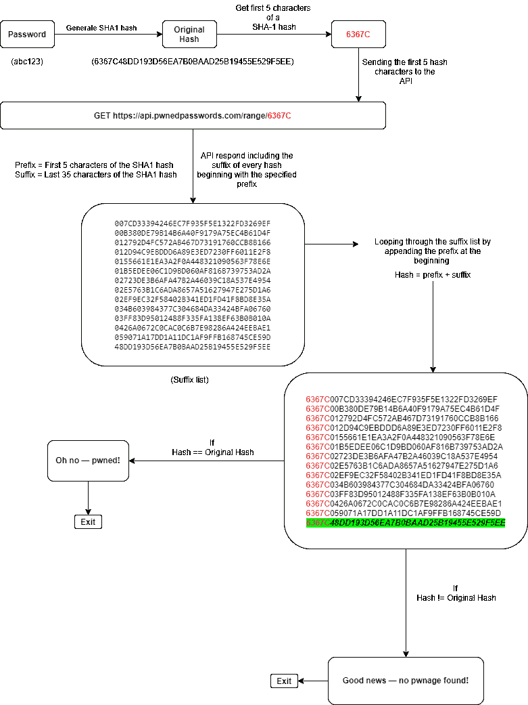

# Pwned:检查您是否有密码的简单 CLI 脚本

> 原文：<https://kalilinuxtutorials.com/pwned/>

Pwned 是一个简单的命令行 python 脚本，用于检查您的密码是否在数据泄露中受损。这个脚本使用[havibeenpwned](https://haveibeenpwned.com/API/v3)API 来检查您的密码是否在众多在线服务漏洞之一中被泄露。

该 API 使用[k-匿名模型](https://en.wikipedia.org/wiki/K-anonymity)，该模型允许通过部分哈希搜索密码，以便匿名验证密码是否泄漏，而不会泄露搜索到的密码。

**脚本如何工作？**

**也可阅读-[Flux-key logger:带有 Web 面板的现代 Javascript 键盘记录器](https://kalilinuxtutorials.com/flux-keylogger/)**

**Git 安装**

**#克隆回购**
$ git 克隆 https://github.com/sameera-madushan/Pwned.git

**#将工作目录改为 Pwned**
$ CD Pwned

**#安装需求**
$ pip 3 install-r requirements . txt

**用途**

**python pwned.py -p <你这里的密码>**

[**Download**](https://github.com/sameera-madushan/Pwned#pwned---check-your-passwords)