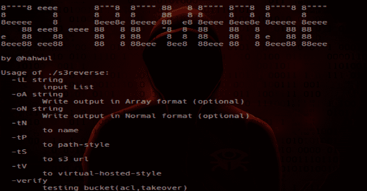

# S3 反转:各种 S3 桶的格式

> 原文：<https://kalilinuxtutorials.com/s3reverse/>

**s3Reverse** 是将各种 S3 桶转换成一种格式格式。bugbounty 和安全测试。

**安装**

**$ go get-u github.com/hahwul/s3reverse**

**用途**

**输入选项**

*   **基本用法**

的用法。/S3 反过来:
-iL 字符串
**输入列表**
-oA 字符串
**以数组格式写输出(可选)**
-oN 字符串
**以正常格式写输出(可选)**
-tN
**到名称**
-tP
**到路径样式**
-tS
**到 S3 URL**

 ***   **使用来自文件**

**$ S3 reverse-iL sample-tN**
udemy-web-upload-transitional
github-cloud
github-production-repository-file-5c 1 aeb
github-production-upload-manifest-file-7 fdce 7
github-production-user-asset-6210 df
github-education-web
github-jobs
s3-us-west-2.amazonaws.com
optimizely
app-USA-mode ast-prod-a01

*   **使用来自管道的**

**$ cat sample | S3 reverse-tN**
udemy-web-upload-transitional
github-cloud
github-production-repository-file-5c 1 aeb
github-production-upload-manifest-file-7 fdce 7
github-production-user-asset-6210 df
github-education-web
github-jobs
s3-us-west-2.amazonaws.com
optimizely
app-USA-mode ast-prod-a01

**也可阅读-[金刚-窃贼:解密基于 Chromium 的浏览器密码&信用卡](https://kalilinuxtutorials.com/adamantium-thief/)**

**输出选项**

*   **来命名**

**$ S3 reverse-iL sample-tN**
udemy-web-upload-transitional
github-cloud
github-production-repository-file-5c 1 aeb
github-production-upload-manifest-file-7 fdce 7
…snip…

*   **到路径样式**

**$ S3 reverse-iL sample-tP**
https://s3.amazonaws.com/udemy-web-upload-transitional
https://s3.amazonaws.com/github-cloud
https://S3 . Amazon AWS . com/github-production-repository-file-5c 1 aeb
…snip…

*   **转为虚拟主持风格**

**$ S3 reverse-iL sample-tV**【udemy-web-upload-transitional.s3.amazonaws.com】T2
github-cloud.s3.amazonaws.com
github-production-repository-file-5c1aeb.s3.amazonaws.com
github-制作-上传-清单-文件-7 fdce 7 . S3 . Amazon AWS . com
github-production-user-asset-6210df.s3.amazonaws.com
…snip…

**验证模式**

**$ S3 reverse-iL sample-verify**
【NoSuchBucket】adslfjasldfkjasdfkajsljasdf
【publiccessdenied】github-production-user-asset-6210 df
【publiccessdenied】github-jobs
【publiccessdenied】public.chaturbate.com
【publiccessdenied】github-education-web
【publiccessdenied】github-production-reposity-file-5c 1 aeb
【publiccessdenied】

**案例研究**

*   流水线操作 meg，s3reverse，gf，s3scanner，用于查找 S3 错误配置。

**$ Meg-d 1000-v/；cd 输出；gf s3-buckets | s3reverse -tN >铲斗；S3 扫描桶**

*   **找到 S3 斗收购案**

**$ Meg-d 1000-v/；cd 输出；gf S3-buckets | S3 reverse-verify | grep NoSuchBucket>接管**

[**Download**](https://github.com/hahwul/s3reverse)**