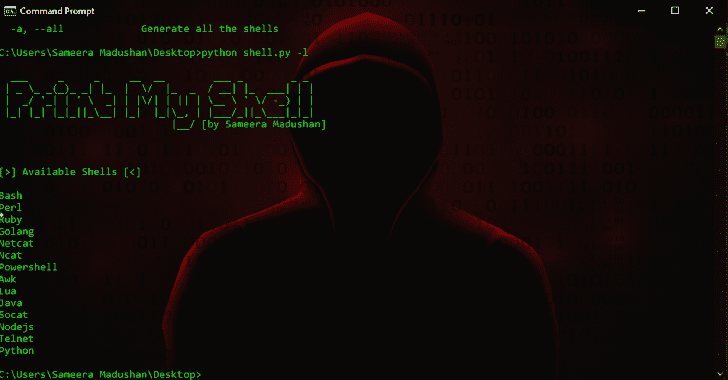

# Print-My-Shell:生成各种反向外壳的过程

> 原文：<https://kalilinuxtutorials.com/print-my-shell/>

**Print-My-shell** 是一个 python 脚本，编写它是为了基于 [PayloadsAllTheThings](https://github.com/swisskyrepo/PayloadsAllTheThings/blob/master/Methodology%20and%20Resources/Reverse%20Shell%20Cheatsheet.md) 和 [Pentestmonkey](http://pentestmonkey.net/cheat-sheet/shells/reverse-shell-cheat-sheet) 反向 Shell 备忘单自动生成各种反向 Shell。

使用这个脚本，您可以轻松地生成各种类型的反向 shells，而无需离开命令行。这个脚本将在你玩 [CTF](https://en.wikipedia.org/wiki/Capture_the_flag#Computer_security) 之类的挑战时派上用场。

**可用的外壳类型**

*   尝试
*   Perl 语言
*   红宝石
*   Golang
*   网猫
*   Ncat
*   Powershell
*   Awk
*   左上臂
*   Java 语言(一种计算机语言，尤用于创建网站)
*   Socat
*   Nodejs
*   用于远程联接服务的标准协议或者实现此协议的软件(可为动词)
*   计算机编程语言

**Git 安装**

**#克隆回购**
$ git 克隆 https://github.com/sameera-madushan/Print-My-Shell.git

**#将工作目录改为 Print-My-Shell**
$ CD Print-My-Shell

**也可以理解为-[Firebase-Extractor:一个抓取 fire base 数据的工具](https://kalilinuxtutorials.com/firebase-extractor/)**

**用途**

**用法:**shell . py[-h][-I IP addr][-p Port num][-t TYPE][-l][-a]

**可选参数:**
-h，–help 显示此帮助信息并退出
-i IPADDR，–IP IP IP addr
IP 地址
-p PORTNUM，–Port Port num
端口号
-t TYPE，–TYPE TYPE 生成反向 shell 的类型【T11

[**Download**](https://github.com/sameera-madushan/Print-My-Shell)