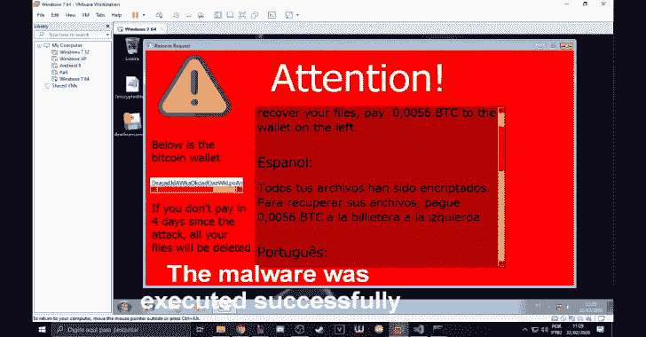

# DeathRansom:一个绕过 Technics 用于教育目的的勒索软件

> 原文：<https://kalilinuxtutorials.com/deathransom/>

**DeathRansom** 是一个用 python 开发的勒索软件，带有 bypass 技术，用于教育目的。

**什么是勒索软件？**

勒索软件是一种恶意软件，它可以加密你的所有文件，并显示赎金请求，告诉你在规定的时间内支付规定的金额，通常是比特币(BTC)，以解密你的文件，否则他将删除你的文件。

它是如何工作的？

首先，脚本检查它是否在沙箱、调试器、vm 等中，并尝试绕过它。
然后，它从 deathransom.py 中第 60 行定义的目录开始加密所有文件。
然后，下载赎金请求脚本，禁用 cmd、taskmanager 和注册表工具。并启动计数器删除文件。

**如何使用？**

*   安装要求输入:**T0 和`python3 -m pip install PyQt5`T3**
*   生成密钥，将公钥上传到 pastebin，复制原始链接，并在 deathransom.py 的第 7 行更改站点`**python generate_key.py**`
*   将 time_script.py 和 main.py(位于 Ransom Request)转换为 exe。
*   在 python2 版本中使用 pyinstaller 将 time_script 转换成 exe，输入`**pyinstaller --onefile --windowed <FILE>**`
*   为了转换赎金请求的主体，我们将使用 python3 版本`**pyinstaller --onefile --windowed main.py**`中的 pyinstaller
*   然后将脚本上传到任何文件托管服务，并更改 deathransom.py 中第 28 行和第 31 行的链接
*   所以只要用 python2 版本的 pyinstaller 把 deathransom.py 转换成 exe 就可以了，开心就好。

**也可以阅读-[2020 年黑 Gmail 账户的 5 种简单方法](https://kalilinuxtutorials.com/gmail-hack/)**

**旁路工艺**

*   **防拆卸**
    *   创建几个变量，试图使拆卸变得困难。
*   **反调试器**
    *   使用 ctypes 函数检查调试器是否处于活动状态:windll . kernel 32 . isdebuggerpresent()
*   **反虚拟机**
    *   检查机器的 mac 是否与标准 vms mac 相同。
*   **反沙盒**
*   **睡眠加速**
    *   一些沙箱加速睡眠，这个函数检查是否没有异常情况发生。
*   **沙盒正在运行**
    *   检查正在运行的进程中是否有沙箱
*   **显示提示**
    *   显示一条消息，如果用户与弹出窗口交互，恶意软件将被执行。
*   **空闲时间**
    *   睡一会儿，然后继续。一些沙箱等待一段时间后停止运行，试图绕过这一点。
*   **勾选-点击**
    *   如果用户没有点击必要的次数，恶意软件将不会被执行。
*   **检查光标位置**
    *   如果用户在设定的时间内没有移动鼠标，恶意软件不会被执行。

**如何编辑赎金要求**？

要进行编辑，您需要安装 [PySide2](https://pypi.org/project/PySide2/) 。打开 main.ui 文件，编辑您想要的内容。

**演示视频**

https://www.youtube.com/watch?v=wiWBa-SfNCU[**Download**](https://github.com/ReddyyZ/DeathRansom)