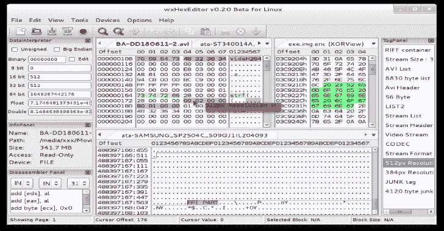

# wxHexEditor:用于 Linux、Windows 和 MacOSX 设备的官方 GIT Repo

> 原文：<https://kalilinuxtutorials.com/wxhexeditor/>

wxHexEditor 是一个十六进制编辑器/磁盘编辑器，用于 Linux、Windows 和 MacOSX 上的大型文件或设备。这不是一个普通的十六进制编辑器，但也可以作为低级别的磁盘编辑器。

如果您的硬盘或分区有问题，您可以通过编辑原始十六进制的扇区从硬盘或分区恢复数据。你可以编辑你的分区表或者在 wxHexEditor 的帮助下从文件系统中手动恢复文件。

或者你可能想分析你的大二进制文件，分区，设备…如果你需要一个好的逆向工程工具，如一个好的十六进制编辑器，你欢迎。wxHexEditor 可以编辑硬盘/SDD 磁盘设备或分区的原始数据，最大可达 EB 大小。

**又读-[Print-My-Shell:生成各种逆向 Shell 的过程](https://kalilinuxtutorials.com/print-my-shell/)**

**特性**

*   它使用 64 位文件描述符(支持高达 2^64 字节的文件或设备，这意味着一些艾字节，但只测试了 1 Pb 的文件)。).
*   它不会将整个文件复制到你的内存中。这使得它速度很快，可以打开文件(文件大小为数千兆
*   您可以多次删除/插入字节到文件，**而无需创建临时文件！。**
*   可以在 Linux、Windows 或 MacOSX 上打开您的设备。
*   内存使用:打开多个> ~8GB 的文件时，当前为~ 25mb。
*   可以通过异或加密操作文件。
*   有多个视图显示多个文件在同一时间。
*   拥有 **x86 反汇编支持**(通过集成的 udis86 库)来更快地破解东西。
*   有彩色标签，使逆向工程更容易和更有趣。
*   你可以用它复制/编辑你的磁盘，硬盘扇区。(适用于手动救援文件/分区。)
*   **磁盘上的扇区指示**设备，也有转到扇区对话框…
*   格式化副本！很容易复制一个十六进制格式的文件的一部分为 C/C++源，ASM 源，也支持 HTML，phpBB 和维基网页格式的标签！！
*   支持十六进制或文本编辑器单独操作。也可以禁用偏移区域。
*   支持**可定制的十六进制面板格式**和颜色。
*   允许 **Linux 进程内存编辑**操作
*   比较二进制文件，允许合并相近的结果。
*   支持**** * *多****** 编码包括几乎所有的 DOS/Windows/MAC OS CP 和多字符集像 UTF8/16/32，Shift JIS，GBK，EUC_KR…
*   十进制、十六进制、八进制和 LBA(“扇区+偏移”)寻址模式，**(在偏移面板上点击鼠标右键可切换一种模式。**
*   保存选择作为一个转储文件功能，使生活更容易。
*   “查找一些字节”功能，用于在文件/磁盘上快速查找下一个有意义的字节
*   MD/RIPEMD/SHA/TIGER/HAVAL/CRC/ADLER/GOST/WHRILPOOL/SNE fru 校验和函数(通过集成的 mhash 库。)
*   从文件导入和导出标签支持。
*   用 C++/wxWidgets GUI 库编写，可以作为本机应用程序用于其他操作系统，如 Mac OS、Windows。

**编译指令**

就发射 **`make`！**

**对 Linux 的编译依赖**

*   wxga tk；

[**Download**](https://github.com/EUA/wxHexEditor)