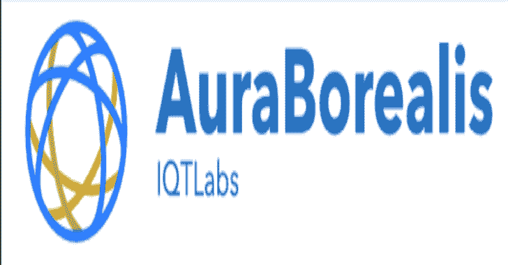

# 通过 OG0-091 和 OG0-092 考试转储成为开放组 TOGAF 9 认证的过程

> 原文：<https://kalilinuxtutorials.com/open-group-certified/>

像开放集团这样的全球协会的认证不仅仅是技能验证。这显然是一种侵蚀你对公司价值的方式，即使你正在准备他们的认证考试。简单地说，这些种类的证书不言自明。

显然，没有更多的磨磨蹭蹭，因为他们的徽章计划很好地证明了你的知识，技术技能和经验。但是开放小组如何将个人转变成专家呢？嗯，作为世界知名的认证机构，开放集团有一套专业的 IT 考试，可以获得不同技术产品、服务甚至关键流程的认证。

此外，该供应商强调提供符合现代技术标准的出色考试和证书。

[https://www . prepa way . biz/the-open-group-togaf-9-certified-certificate-dumps . html](https://www.prepaway.biz/the-open-group-togaf-9-certified-certification-dumps.html)

因此，从这篇文章中，你将了解到所有你想知道的关于 TOGAF 证书及其相关考试的知识。此外，我们将与您分享一些有价值的资源，以帮助您准备考试。好奇？如果是，请继续下一节。

#### **通过开放组**实现您的凭证需求

显然，当我们说开放组时，它通常与他们的 TOGAF 认证联系在一起。该证书授予在 TOGAF 标准中成功证明其专业技能的候选人。本国际标准关注企业架构框架，以提高业务效率。

然而，该标准一直在不断发展，以确保纳入专业人士和企业所需的最新和最可靠的方法。目前，TOGAF 徽章持有者超过 70，000 人，他们不断追求职业发展。回到过去，TOGAF 证书认可你在 TOGAF 原则方面的技能。与其他徽章不同，这是一个供应商中立的验证，证明您的能力和对关键企业架构特性的承诺。

[https://www.prepaway.biz/og0-091-exam-dumps.html](https://www.prepaway.biz/og0-091-exam-dumps.html)

现在，让我们了解更多关于 TOGAF 认证程序的最新更新。

#### **了解最新的 TOGAF 认证**

由于 TOGAF 框架随着行业趋势而定期变化，其相应的徽章也必须跟上。现在，Open Group 提供了 TOGAF 9 证书，其中包含了方法论的最新更新。具体来说，它遵循 TOGAF 标准的当前 9.x 版本，即 9.2 版本的教学大纲。

拥有这个证书意味着你不仅精通 TOGAF 的基本概念，而且熟悉它的底层技能。因此，您可以有效地将您在 TOGAF 结构和功能方面的知识应用到行动中。这也意味着您已经精通了 TOGAF 原则，以及一些关键主题，如 ADM 阶段、工具、技术和内容元模型。

[https://www.prepaway.biz/og0-092-exam-dumps.html](https://www.prepaway.biz/og0-092-exam-dumps.html)

#### **开始规划您的 TOGAF 9 认证**

如果你有计划的话，很容易为你的 TOGAF 9 认证做准备。但是首先，让我们了解一下认证考试的细节，这样你会有一个平稳的准备。一旦你完成了两个考试，即 OG0-091(第一部分)和 OG0-092(第二部分)，你就可以获得这个证书。

OG0-091 包含 40 个问题，时限为 1 小时，而 OG0-092 由 8 个问题组成，时限为 1 小时 30 分钟。进一步阐述，如果你通过了第一部分，那么你将被授予 TOGAF 9 基础认证。

因此，如果你完成了 OG0-091 和 OG0-092 考试，你实际上就获得了两项认证——TOGAF 9 基础认证和 TOGAF 9 认证。如果你喜欢综合考试，你也可以这样做。只需参加 OG0-093 考试，这是一个 48 道题的测试，需要在 2 小时 30 分钟内完成。

既然你已经具备了这三种考试的必要知识，现在让我们来关注一下考试的准备材料。加油！

#### **查看 TOGAF 9 官方资源**

学习 TOGAF 概念不会有什么困难，因为许多材料都是由 Open Group 提供的。他们有具体的计划数据表，将为您提供关于他们资质的更全面的说明。此外，他们还有一个自学包，可以帮助你满足考试需求。

这可以在 Open Group 商店买到，不过你也可以下载一些学习指南的样本。当然，他们在世界各地甚至网上都有培训课程。这些课程由专家讲授，他们将在您的认证申请中对您进行管理。

[https://www.prepaway.biz/og0-093-exam-dumps.html](https://www.prepaway.biz/og0-093-exam-dumps.html)

**挖到开放的群库**

除了提供的培训课程、数据表等，您还可以利用开放组库。这一部分有您需要的一切，从指南到网络研讨会等等！保持与认证和行业相关的最新消息是非常必要的。这一系列出版物为你提供了你需要知道的最新趋势和主要变化。

此外，浏览虚拟图书馆也很容易，因为文件是按标题和类别来标记的。同样，您可以选择创建自己的库，其中包含您认为对您的学习有重要意义的所有开放组内容。只需将它保存在您的个人仪表板上，阅读文件，并扩展您的知识！

**和 Prepaway.com 一起锻炼你的技能**

大多数顶级供应商都挤在这个受欢迎的认证考试转储供应商中。寻求高质量垃圾的个人不断接触来自 Prepaway.com 的垃圾。该提供商为您提供了 TOGAF 认证考试的高级套装，您可以在其中找到六个必备项目，开始准备 OG0-091 和 OG0-092 考试。

这些产品是以前的考试问题和专家验证的答案的两个集合，两个学习指南和两个 TOGAF 认证评估的视频教程，它们以 vce 格式存在。这个伟大的软件包只需 79.98 美元，可以为您即将到来的考试提供最相关的知识和技能。

不过，你可以选择下载免费的和不断更新的 OG0-091 和 OG0-092 vce 文件，这些文件由最近的考生附在 Prepaway 官方页面上。除此之外，别忘了使用 VCE 考试模拟器。该测试引擎将使处理这些转储的过程更加容易和有益，因为该软件允许您创建自己的测试并设置时间限制，从而在真实的测试环境中进行练习。

然而，请注意，很大一部分取决于你掌握思想的能力。因此，你必须利用 Prepaway 的考试转储来刺激你的技能和提高你的知识。然而，当使用转储时，您需要最大限度的自我控制。不要只背考题。确保你知道每个问题背后的概念，这样你就不会在真正的评估中遇到困难。

**结论**

简而言之，从开放组获得 TOGAF 9 认证认可是您职业生涯中的一个非凡举措。这让你拥抱国际标准，以及行业的新兴要求。

当然，这也体现了你作为一名职业人士的可靠性。因此，继续专注于你的徽章训练。在您的 OG0-091 和 OG0-092 考试准备过程中聪明地学习，并记住利用来自 Prepaway 等受人尊敬的在线平台的最可靠和最新的考试转储，以实现富有成效的 TOGAF 9 之旅！