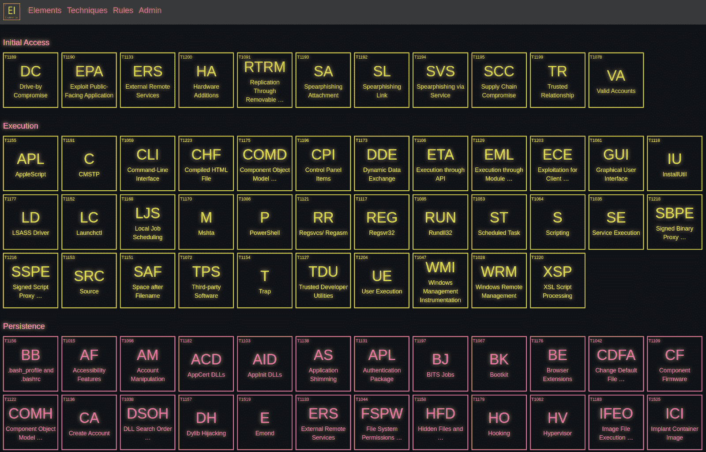
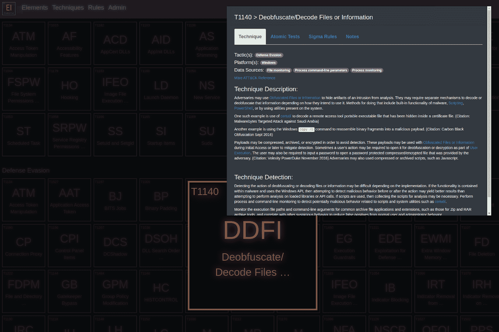
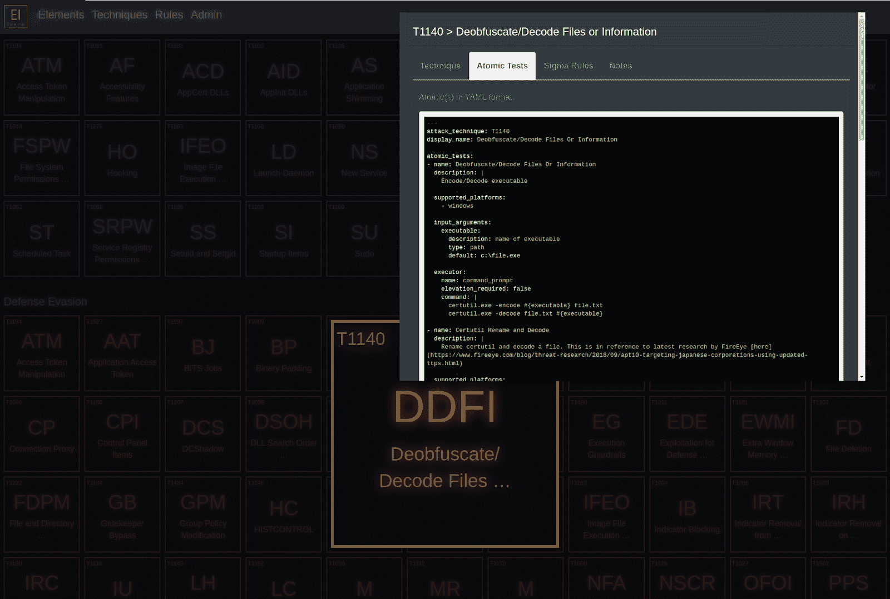
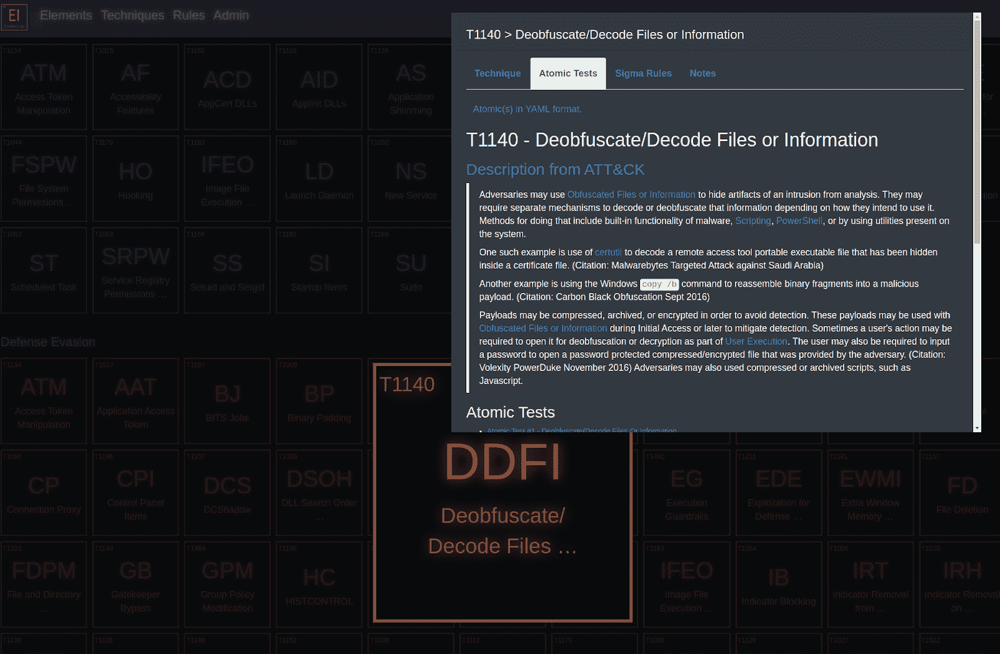
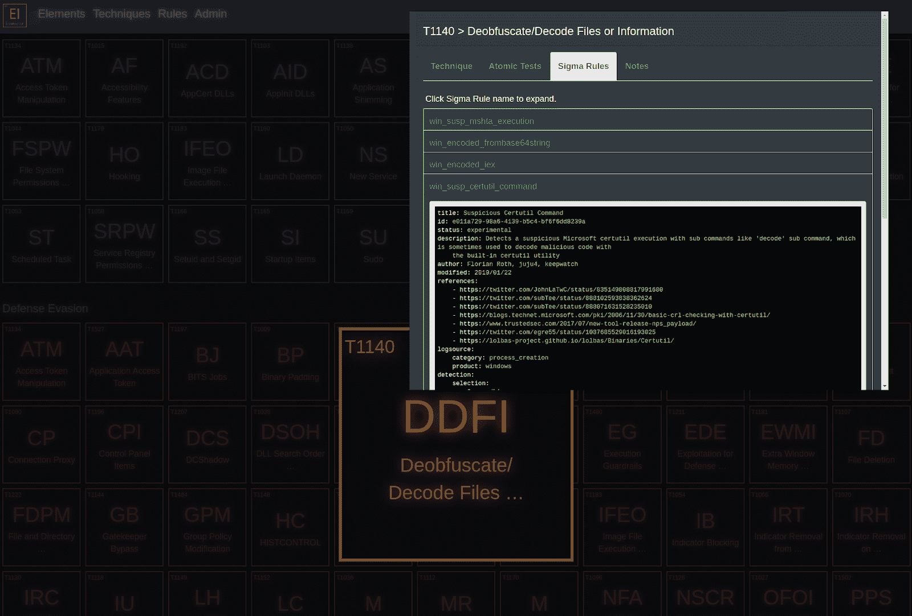

# 元素:一个 ATT 和 CK 威胁库

> 原文：<https://kalilinuxtutorials.com/elemental/>

**Elemental** 是一个集中的威胁库，包含米特 ATT & CK 技术、原子红队测试和超过 280 条适马规则。它提供了一种探索 ATT & CK 数据集的替代方法，将相关的原子红队测试和适马规则映射到它们各自的技术。

它允许捍卫者创造自定义的 ATT 和 CK 技术和上传适马规则。ATT 和 CK 的数据集是通过 hunters-forge attackcti Python 客户端收集的。Atomic Red Team 测试是从 Atomic Red Team GitHub 存储库中导入的。如果适马规则包含 ATT 和 CK 标签，则从适马的 GitHub 规则集合中导入。

这个平台被认为是加州大学伯克利分校信息和网络安全硕士项目的顶点项目。我们期待社区对新想法和改进的反馈。

Elemental 的这个实例是实验性的，没有针对生产部署进行配置。请参阅关于配置生产服务器的 Django 文档。

**特性**

*   查看 ATT 和 CK 技术信息
*   在 Markdown 和 Yaml 中查看 Atomic Red 团队测试
*   在 Yaml 中查看适马规则
*   添加新的 ATT 和 CK 技术(目前只能从 Django 管理面板)
*   上传新的适马规则(目前只能从 Django 管理面板获得)

**安装**

$**git clone[https://github.com/Elemental-attack/Elemental.git](https://github.com/Elemental-attack/Elemental.git)
$ CD Elemental/Elemental
$ pip install-r requirements . txt
$ python manage . py runserver
$ Default Django admin page credentials:user:Elemental | password:berkelium**

**也可阅读-[Should-I-Trust:o Sint 工具评估一家公司的可信度](https://kalilinuxtutorials.com/should-i-trust/)**

**截图**

*   **主要元素视图**

*   **技术视图**

*   **原子论观点**

*   **适马规则视图**

[**Download**](https://github.com/Elemental-attack/Elemental)