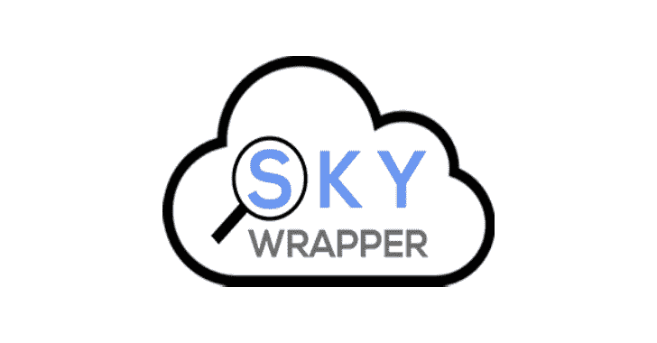

# SkyWrapper:发现可疑创作形式的工具

> 原文：<https://kalilinuxtutorials.com/skywrapper/>

SkyWrapper 是一个开源项目，它分析在给定 AWS 帐户中创建的临时令牌的行为。该工具旨在发现可疑的创建形式和临时令牌的使用，以检测帐户中的恶意活动。

该工具分析 AWS 帐户，并创建一个包含所有当前活动临时令牌的 excel 表。每次运行后，在屏幕上打印结果摘要。

**用途**

*   在**配置**文件中填写所需数据
*   确保您的用户拥有运行该脚本的满意权限(您可以在 IAM 的用户摘要页面中检查这一点)
*   运行 python 脚本

**python SkyWrapper.py**

**也可阅读-[Pwned:检查您是否有密码的简单 CLI 脚本](https://kalilinuxtutorials.com/pwned/)**

**权限**

要运行此脚本，您至少需要以下权限策略:

{
"Version": "2012-10-17 "，
" Statement ":[
{
" Sid ":" S3 trailbucketpermissions "，
"Effect": "Allow "，
"Action": [
"s3:GetObject "，
" S3:ListBucketMultipartUploads "，
"s3:ListBucket "，
"s3:GetBucketLocation "，
" S3:list bucket " Resource": " "
}，
{
" Sid ":" CLOUDTRAILReadPermissions "，
"Effect": "Allow "，
" Action ":[
" cloudtrail:DescribeTrails "
]，
"Resource": " *" }，{ " Sid ":" athenaareadpermissions "，" Effect": "Allow "，" Action ":[" Athena:GetQueryResults "，" Athena:startqueryesults "*

*   **确保用您的踪迹的存储桶名称来更改“{trail_bucket} ”!**

如果您有多个踪迹，并且您希望对它们使用脚本，那么您还必须将它们添加到策略权限资源部分。

**配置**

**“config . YAML”**是配置文件。在大多数情况下，您可以保持配置不变。如果您需要更改它，配置文件是有记录的。

Athena:# Athena configuration
database _ name:default # Athena 用于查询跟踪桶的数据库的名称。
table _ name:cloud trail _ logs _ { table _ name } # trail bucket name
output _ location:S3://AWS-Athena-query-results-{ account _ id }-{ region }/#查询结果默认输出位置 bucket
output:
excel _ output _ file:run _ results _ { trail }*{ account _ id }-{ date }。xlsx # Excel 结果文件 summary _ output _ file:run _ summary*{ trail } _ { account _ id }-{ date }。txt #摘要文本结果文件
verify_https: True #启用/禁用对 HTTP 请求的 SSL 证书的验证
account:
account_id: 0 #帐户 id–如果您不知道它，请将其保留为 0
aws _ access _ key _ id:#如果您将其保留为空，脚本将查找存储在~/中的默认 AWS 凭据。aws/credentials
AWS _ secret _ access _ key:#如果保留为空，脚本将查找存储在~/中的默认 AWS 凭证。aws/credentials
AWS _ session _ token:#如果保留为空，脚本将查找存储在~/中的默认 AWS 凭据。AWS/凭据

**参考文献**

更多评论、建议或问题，可联系 Omer Tsarfati([@ Omer Tsarfati](https://twitter.com/OmerTsarfati))和赛博方舟实验室。你可以在 https://github.com/cyberark/[的](https://github.com/cyberark/)找到更多我们开发的项目。

[**Download**](https://github.com/cyberark/SkyWrapper)