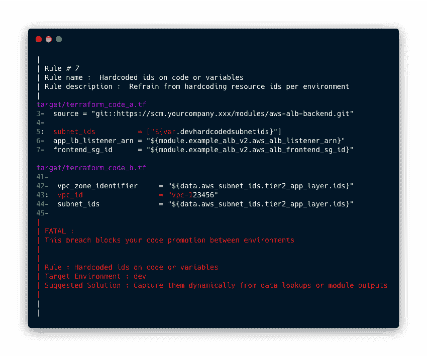

# 拦截:作为代码静态分析审计的策略

> 原文：<https://kalilinuxtutorials.com/intercept/>

**拦截**简单易用，占用空间小**策略作为代码**亚秒命令行扫描器，利用最快的多行搜索工具扫描您的代码库。它可以用作棉绒，护栏控制或简单的数据收集器和检查员。就当它是一款跨平台武器化 **ripgrep** 。

**特性**

*   作为代码的策略
*   细粒度的正则表达式策略
*   多个实施级别
*   静态分析，没有守护进程
*   占用空间小、可自我更新的二进制文件
*   易于集成到任何 CI/CD 管道中
*   声明式表单策略/降低的复杂性
*   没有自定义策略语言

**政策代码**

策略即代码是编写代码来管理和自动化策略的思想。通过将策略表示为 YAML 文件中的代码，可以采用成熟的软件开发最佳实践，例如版本控制、自动化测试和自动化部署。

它是如何工作的？

*   **拦截** CLI 二进制
*   政策 YAML 文件

**Intercept** 合并环境标志、策略 YAML 和可选异常 YAML，以生成全局配置。它针对您的代码递归地扫描目标路径以发现违反策略的情况，并生成人类可读的详细结果输出。

**也读作-[RMS:运行时移动安全](https://kalilinuxtutorials.com/rms/)**

**示例输出**

**用例**

*   降低复杂性 **Hashicorp Sentinel** 替代方案。策略只是正则表达式，不使用自定义的策略语言。
*   你是否发现[开放政策代理](https://www.openpolicyagent.org/) **rego** 文件对你的管道来说太甜了？
*   从 [git-secrets](https://github.com/awslabs/git-secrets) 和[truffhog](https://github.com/dxa4481/truffleHog)中捕获模式，并可以防止敏感信息通过您的管道传播。([松露猪 regex](https://github.com/dxa4481/truffleHog/blob/dev/scripts/searchOrg.py) )
*   识别违反策略的情况(文件路径和行号)，向其调查结果报告解决方案/建议，使其成为简化开发人员团队加入统一部署渠道的绝佳工具。
*   可以执行风格指南、编码标准、最佳实践，还可以报告次优配置。
*   可以收集模式或高熵数据，并以多种格式输出。
*   任何你可以在正则表达式上处理的东西都可以被执行。

**最新发布**

*   **单个平台的标准包(intercept+rip grep)**
    *   拦截-rg-linux.zip
    *   intercept-rg-macos.zip
    *   intercept-rg-win.zip
*   **清洁单个平台的包装(仅拦截)**
    *   核心拦截 linux.zip
    *   core-intercept-macos.zip
    *   core-截击-win.zip
*   **适用于所有平台的完整包(intercept+rip grep)**
    *   x-intercept.zip
*   **完全使用 Makefile 所需的包**
    *   setup-buildpack.zip
*   **rip grep 最新兼容版本的包(不包括 intercept)**
    *   i-ripgrep-linux.zip
    *   i-ripgrep-macos.zip
    *   i-ripgrep-win.zip

[**Download**](https://github.com/xfhg/intercept)