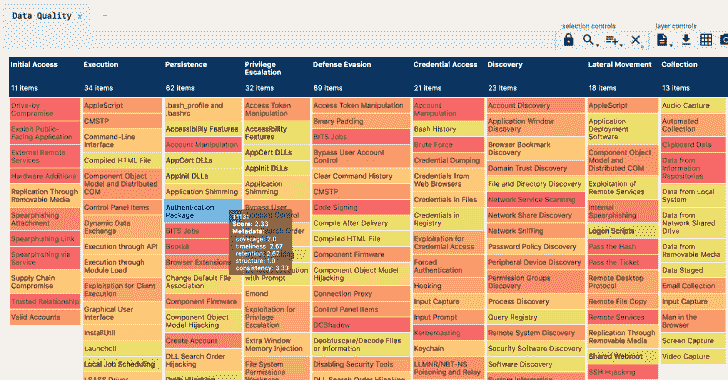
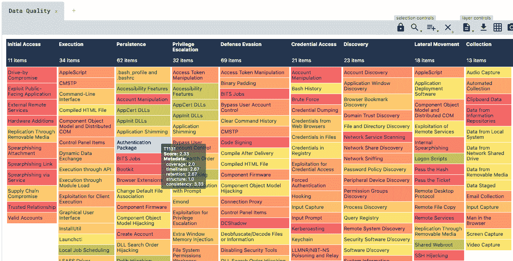
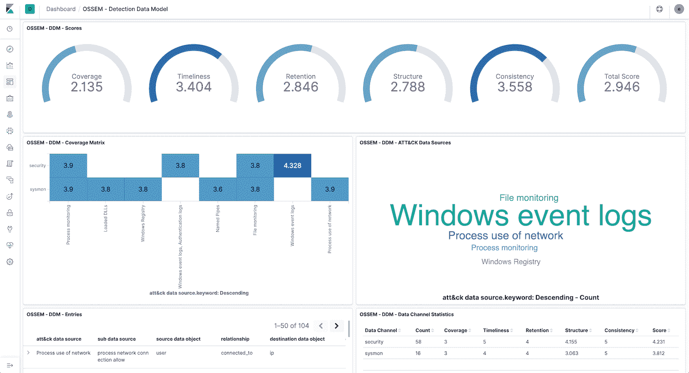
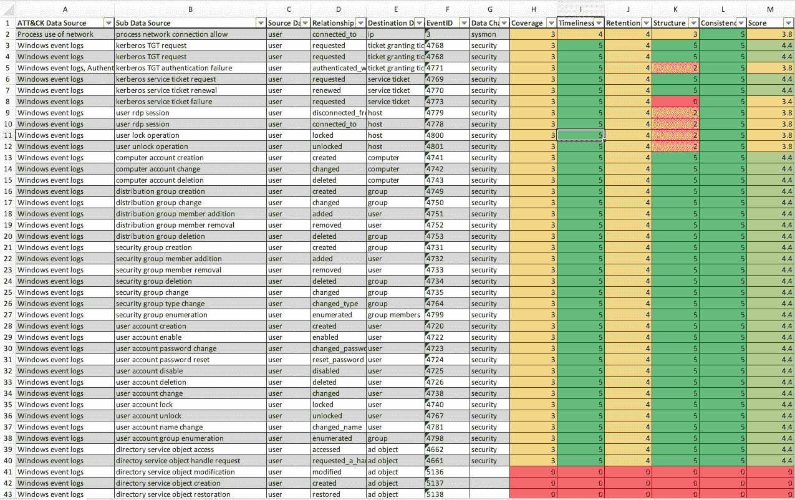

# Ossem Power Up:评估数据质量的工具

> 原文：<https://kalilinuxtutorials.com/ossem-power-up/>

Ossem Power Up 是一个评估数据质量的工具，建立在令人敬畏的 T2 Ossem T3 项目之上。

**任务**

*   回答问题:我想开始狩猎 ATT&CK 技术，什么日志来源和事件更合适？
*   让您的日志资源的优势和劣势透明化
*   提供一种简单的方法来评估您的日志

**概述**

**加电**使用 OSSEM [检测数据模型](https://github.com/hunters-forge/OSSEM/tree/master/detection_data_model) (DDM)作为其数据质量评估的基础。这样做的主要原因是因为它提供了一种结构化的方法来将[【ATT】&【CK】数据源](https://github.com/hunters-forge/OSSEM/tree/master/attack_data_sources)、[公共信息模型实体](https://github.com/hunters-forge/OSSEM/tree/master/common_information_model) (CIM)和[数据字典](https://github.com/hunters-forge/OSSEM/tree/master/data_dictionaries)(事件)相互关联。

对于那些不熟悉 DDM 结构的人，这里有一个示例:

| ATT 和 CK 数据来源 | 子数据源 | 源数据对象 | 关系 | 目标数据对象 | EventID |
| --- | --- | --- | --- | --- | --- |
| 程序控制 | 流程创建 | 过程 | 创造 | 过程 | Four thousand six hundred and eighty-eight |
| 程序控制 | 流程创建 | 过程 | 创造 | 过程 | one |
| 程序控制 | 过程终止 | 过程 | 终止的 | – | Four thousand six hundred and eighty-nine |
| 程序控制 | 过程终止 | 过程 | 终止的 | – | five |

如您所见，DDM 中的每个条目都使用抽象实体(如流程、用户、文件等)定义了子数据源(范围)。这些条目中的每一个还包含一个事件 ID，适用于该范围。你可以在这里阅读更多关于这些实体的信息。

简而言之，DDM 条目通过提供定义如何使用日志源(数据通道)的*范围*,在消除原始事件的复杂性方面发挥了重要作用。

**数据质量维度**

**加电**根据**五个**不同维度评估数据质量得分:

| 尺寸 | 类型 | 描述 |
| --- | --- | --- |
| 新闻报道 | 数据通道 | 数据通道覆盖多少设备或网段 |
| 及时 | 数据通道 | 活动需要多长时间才能开始 |
| 保留 | 数据通道 | 这个活动持续多长时间 |
| 结构 | 事件 | 如果相关字段可用，事件的完成程度如何 |
| 一致性 | 事件 | 如果字段已经被规范化，那么事件字段的标准程度如何 |

每个维度的评分在 0(无)到 5(优秀)之间。

**覆盖面、及时性和保留率**

这些维度被绑定到数据通道，并传播到它提供的所有事件。

由于这些维度的性质，它们必须根据数据通道的规格进行手动评级。

**上电**使用`**resources/dcs.yml**`定义数据通道并评定尺寸:

**数据通道:** sysmon
**描述:** sysmon 监控
**覆盖范围:** 2
**时效性:** 5
**留存:**2
**——————————————**
**数据通道:**安全
**描述:** windows 安全审计
**覆盖范围:【T25**

**结构**

为了计算事件结构有多完整，**加电**将数据字典**标准名称**与 DDM 条目(源和目的地)中引用的**实体** (CIM)的字段进行比较。

因为不是所有的**实体**字段都相关(取决于上下文)，**加电**使用**配置文件**的概念来选择哪些字段需要匹配数据字典标准名称。例如:

**#OSSEM CIM Profile**
进程:
–进程名
–进程路径
–进程命令行

**注意:**profiles/default . yml 中有一个示例配置文件供你玩。

结构分数通过以下公式计算:

**SCORE _ PERCENT =(MATCHED _ FIELDS/TOTAL _ RELEVANT _ FIELDS)* 100**

为了清楚起见，下面是一个如何计算结构得分的示例:

**注意:**因为 Sysmon 事件 Id 1 数据字典与相关实体字段 100%匹配，所以结构得分将被评定为 5 (excelent)。

结构分数通过以下方式转换为 0-5 分:

| 百分率 | 得分 |
| --- | --- |
| Zero | Zero |
| 1 至 25 岁 | one |
| 26 至 50 岁 | Two |
| 51 至 75 岁 | three |
| 76 至 99 岁 | four |
| One hundred | five |

注意:根据使用情况(SIEM、威胁追踪、取证)，您可以定义不同的配置文件，以便对日志进行不同的评级。

**一致性**

为了计算一致性，**加电**简单地计算数据字典中带有**标准名称**的字段的百分比。具有大量映射到标准名称的字段的数据字典更有可能与 CIM 实体相关联。

一致性分数通过以下公式计算:

**分数百分比=(标准名称字段/总计字段)* 100**

一致性分数通过以下方式转化为 0-5 分:

| 百分率 | 得分 |
| --- | --- |
| Zero | Zero |
| 1 到 50 | one |
| 51 岁至 99 岁 | three |
| One hundred | five |

**如何使用？**

*   **开始前**
    *   **开机**是一个 python 脚本，一定要`**pip install -r requirements.txt**`
    *   确保拥有 [OSSEM 库](https://github.com/hunters-forge/OSSEM)的本地副本

*   **运行加电**

**用法:**power up . py[-h][-o OSSEM][-y OSSEM _ YAML][-p PROFILE][–excel]
[–elastic][–YAML]

一款评估 ATT 的工具& CK 数据源覆盖，构建在 awesome OSSEM 之上。

**可选参数:**
-h，–帮助显示此帮助消息并退出
-o OSSEM，–OSSEM OSSEM
导入 OSSEM markdown 的路径
-y OSSEM_YAML，–OSSEM-YAML OSSEM _ YAML
导入 OSSEM yaml
-p 配置文件的路径，–PROFILE PROFILE
CIM 配置文件的路径
–excel 导出 OSSEM DDM 到 excel
–弹性导出 OSSEM

如您所见，**上电**可以使用两种不同格式的 OSSEM 数据:

*   OSSEM markdown–从 git 克隆时 OSSEM 的原生格式。
*   OSSEM YAML——OSSEM 的总结格式，只有数据字段和一些元数据。您可以**上电**将 OSSEM markdown 转换为 yaml。

目前，**上电**将 OSSEM 输出输出到:

*   Yaml——在 YAML 的`output/`文件夹中创建 OSSEM 结构
*   excel–在`ouput/`文件夹中创建一个 OSSEM DDM 表，其中包含数据质量分数
*   Elastic–在 elastic 中创建一个 OSSEM 结构，索引如下:
    *   OSSEM . DDM–OSSEM DDM 表，增加了数据质量分数
    *   OSSEM . CIM–OSSEM CIM 条目
    *   OSSEM . DDS–OSSEM 数据字典
    *   OSSEM . DCS–OSSEM 数据通道

注意:如果没有指定配置文件路径，缺省情况下加电使用 profiles/default.yml。

$> python3 powerup.py -o../OSSEM–YAML

[*]配置文件路径:profiles/default . yml*
*[*]解析 markdown 中的 OSSEM
[*]将 OSSEM 导出到 YAML*
*[* ]已创建输出/DDM _ 2019 11 14 _ 160246 . yml
[*已创建输出/cim_20191114_16024*

向/从 YAML 出口/进口的目的是促进 OSSEM 定制。很可能你首先要做的是创建你自己的数据字典，然后添加新的 DDM 条目，这样 YAML 会使更新更容易。

注意 1:修改 resources/config.yml 以指示加电关于正确结构的文件名。然后你只需要把它放在一个文件夹里，然后传递给 OSSEM_YAML 参数。

注 2:加电不解析整个 OSSEM 对象到 YAML，只解析数据字段和一些元数据(即描述)。这样做的原因是我想让 YAML 对象尽可能精简，只包含评估数据质量所需的数据。

**导出到 EXCEL**

$> python3 powerup.py -o../OSSEM–excel

[*]配置文件路径:profiles/default . yml*
*[*]解析 markdown 中的 OSSEM
[*]导出 OSSEM DDM 到 Excel*
*[* ]保存 Excel 到 output/DDM _ enriched _ 2019 11 14 _ 160041 . xlsx

当导出到 Excel 时，**加电**将创建一个赏心悦目的 DDM，每个条目有各自的数据质量维度:

**导出到弹性**

$> python3 powerup.py -o../OSSEM–Elastic

[*]*配置文件路径:profiles/default . yml*
*[*]*解析 markdown 中的 OSSEM
[*]*导出 OSSEM 到 Elastic*
*[*]* 创建弹性指标 ossem.ddm
[*] *创建弹性指标 OSSEM . CIM*
*[*]*创建弹性指标 OSSEM

导出到 elastic 时，**加电**会将所有 OSSEM 数据存储在 Elastic 中。由于 DDM 还增加了相应的数据质量维度，因此您将能够创建如下所示的控制面板:

**出口到 ATT & CK 航海家**

$> python3 powerup.py -o../OSSEM–Layer

[*]*配置文件路径:profiles/default . yml*
[*]从 markdown 解析 OSSEM
*[*]将 OSSEM 导出到 Naviagator 层*
[*]拉 ATT & CK 数据
*[*]生成数据源质量层*
[*]创建的输出/ds _ Layer _ 2019 11119 _ 220141 . JSON

当导出到层时，**加电**将创建一个攻击导航层 JSON 文件，其中包含每种技术各自的数据质量维度:

注:技术得分来源于 DDM 中的数据源平均得分。

[**Download**](https://github.com/hxnoyd/ossem-power-up)