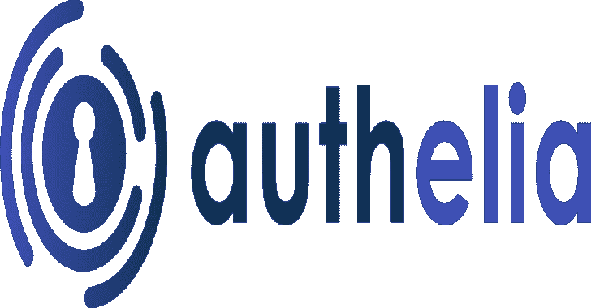
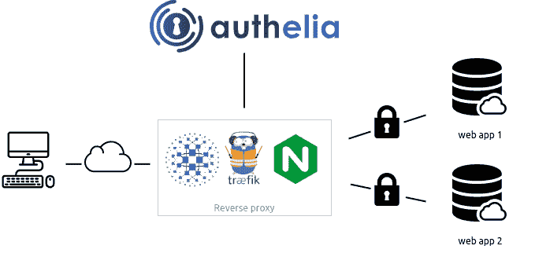
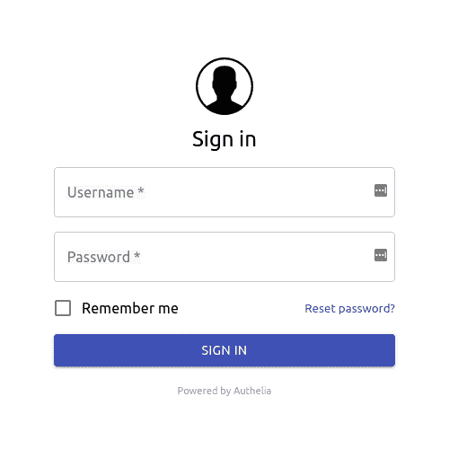

# authelia:Web 应用的单点登录多因素门户

> 原文：<https://kalilinuxtutorials.com/authelia/>

Authelia 是一款开源认证和授权服务器，通过 web 门户为您的应用提供双因素认证和单点登录(SSO)。

它充当反向代理的同伴，如 [nginx](https://www.nginx.com/) 、 [Traefik](https://traefik.io/) 或 [HAProxy](https://www.haproxy.org/) ，让它们知道查询是否应该通过。未经验证用户将被重定向到 Authelia 登录门户。

该架构如下图所示。

它可以从 [AUR](https://aur.archlinux.org/packages/authelia/) 使用[静态二进制](https://github.com/authelia/authelia/releases/latest)、 [Docker](https://docker.com/) 作为独立服务安装，也可以利用入口控制器和入口配置轻松部署在 [Kubernetes](https://kubernetes.io/) 上。

这是 Authelia 的门户网站的样子

**功能总结**

以下是主要可用功能的列表:

*   几种第二因素:
    *   **[【U2F】](https://docs.authelia.com/features/2fa/security-key)**与 [Yubikey](https://www.yubico.com/products/yubikey-hardware/yubikey4/) 。
    *   **[基于时间的一次性密码](https://docs.authelia.com/features/2fa/one-time-password)** 带[谷歌认证器](https://play.google.com/store/apps/details?id=com.google.android.apps.authenticator2&hl=en)。
    *   **[移动推送通知](https://docs.authelia.com/features/2fa/push-notifications)** 与[掇](https://duo.com/)。
*   使用电子邮件确认的身份验证重置密码。
*   仅单因素身份验证方法可用。
*   多次身份验证尝试后的访问限制。
*   每个子域、用户、资源和网络的细粒度访问控制。
*   支持受单一因素保护的端点的基本身份验证。
*   使用远程数据库和 Redis 作为高可用性 KV 存储实现高可用性。
*   兼容 Kubernetes [ingress-nginx](https://github.com/kubernetes/ingress-nginx) 控制器开箱即用。

有关功能的更多详情，请关注[功能](https://docs.authelia.com/features/)。

**代理支持**

Authelia 与 [nginx](https://www.nginx.com/) 、 [Traefik](https://traefik.io/) 或 [HAProxy](https://www.haproxy.org/) 配合使用。它可以用 Docker 部署在裸机上，也可以部署在 [Kubernetes](https://kubernetes.io/) 之上。

**入门**

您可以通过提供的`docker-compose`包开始使用 Authelia:

*   [**本地**](https://docs.authelia.com/getting-started)

本地组合包旨在测试 Authelia，而不用担心配置。它旨在用于服务器不暴露于互联网的场景。域将在本地主机文件中定义，并将使用自签名证书。

*   [**一点点**](https://docs.authelia.com/deployment/deployment-lite)

Lite compose 捆绑包适用于服务器将暴露于互联网的场景，需要相应地设置域和 DNS，并通过 LetsEncrypt 生成证书。Lite 元素是指最小的外部依赖性；基于文件的用户存储，基于 SQLite 的配置存储。在这种配置下，服务将无法很好地扩展。

*   [**满载**](https://docs.authelia.com/deployment/deployment-ha)

完整的 compose bundle 适用于服务器将暴露于互联网的场景，需要相应地设置域和 DNS，并通过 LetsEncrypt 生成证书。完整元素是指包括外部依赖项的可扩展设置；基于 LDAP 的用户存储，基于数据库的配置存储(MariaDB、MySQL 或 Postgres)。

**部署**

既然您已经测试了 **Authelia** 并且想要在您自己的基础设施中试用它，那么您可以学习如何通过[部署](https://docs.authelia.com/deployment/deployment-ha)来部署和使用它。本指南将向您展示如何在裸机和 [Kubernetes](https://kubernetes.io/) 上部署它。

**安全**

Authelia 非常重视安全性。我们遵循[负责任披露](https://en.wikipedia.org/wiki/Responsible_disclosure)的规则，我们也鼓励社区这样做。

如果您发现 Authelia 中的漏洞，请首先通过下面的[联系选项](https://github.com/authelia/authelia#contact-options)中描述的[矩阵](https://github.com/authelia/authelia#matrix)或[电子邮件](https://github.com/authelia/authelia#email)私下联系维护者之一。

有关在 Authelia 中实施的安全措施的详细信息，请点击此[链接](https://docs.authelia.com/security/measures.html)，有关威胁模型的信息，请点击此[链接](https://docs.authelia.com/security/threat-model.html)。

**联系人选项**

*   **矩阵**

加入[矩阵室](https://riot.im/app/#/room/#authelia:matrix.org)并找到一个维护者。你可以认出他们，因为他们是房间管理员。或者，你可以找一个维护者。一旦你取得联系，我们会要求你私下给维护者发消息，告知漏洞。

*   **电子邮件**

你可以通过发电子邮件给[security@authelia.com](mailto:security@authelia.com)联系任何维护者来解决安全漏洞相关的问题。这封电子邮件是严格保留的安全和漏洞披露相关事宜。如果您因其他原因需要联系我们，请使用【team@authelia.com】的[矩阵](https://github.com/authelia/authelia#matrix)或。

[**Download**](https://github.com/authelia/authelia)