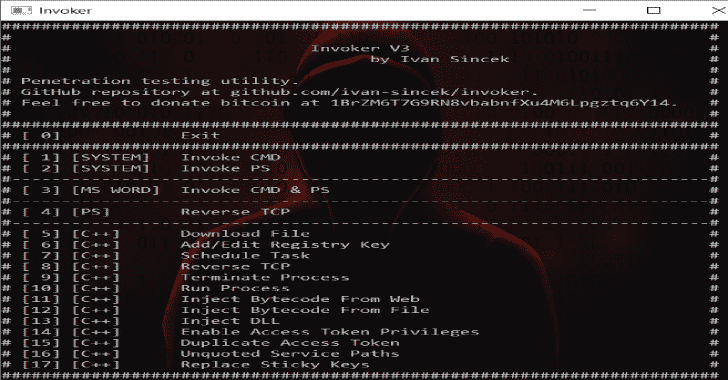
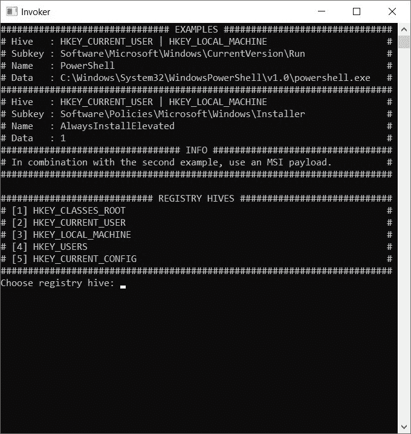
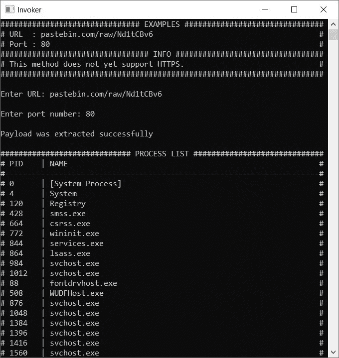

# 调用程序:渗透测试实用程序

> 原文：<https://kalilinuxtutorials.com/invoker/>

Invoker 是一个渗透测试工具。目标是在通过 GUI 访问某些 Windows 操作系统功能受到限制时使用该工具。

有些功能需要管理权限。

**能力**

*   调用命令提示符和 PowerShell，
*   下载一个文件，
*   添加一个注册表项，
*   安排一项任务，
*   连接到远程主机，
*   终止正在运行的进程，
*   运行新流程，
*   将字节码注入到正在运行的进程中，
*   将 DLL 注入到正在运行的进程中，
*   启用访问令牌权限，
*   正在运行的进程的重复访问令牌，
*   列出未引用的服务路径并重新启动正在运行的服务，
*   更换粘滞键。

使用 Dev-C++ IDE v5.11 (64 位)构建，使用 TDM-GCC v4.9.2 (64 位)编译，并在 Windows 10 Enterprise OS (64 位)上测试。从[这里](https://sourceforge.net/projects/orwelldevcpp/files/Portable%20Releases/)下载 Dev-C++。

为教育目的制作的。希望有帮助！

**调用者库**

在这里检查所有的能力[。请随意使用图书馆。](https://github.com/ivan-sincek/invoker/tree/master/src/lib/invoker)

**PowerShell 脚本**

在这里检查主 C++程序[中使用的所有 PowerShell 脚本。](https://github.com/ivan-sincek/invoker/tree/master/ps)

**怎么跑？**

运行 ['\exec\Invoker.exe'](https://github.com/ivan-sincek/invoker/tree/master/exec) 。

**字节码注入**

通过将字节码注入到更高特权的进程来提升特权。

该工具可以解析 HTTP 响应，并从自定义元素中提取有效负载，即从`****`中提取有效负载，其中`**payload**`是以 Base64 编码的二进制代码/文件。

如果防病毒软件不断删除您的本地负载，这可能会很有用。

您也可以指定您自己的自定义元素，但是您必须修改程序源代码并重新编译它。

在[pastebin.com/raw/Nd1tCBv6](https://pastebin.com/raw/Nd1tCBv6)检查一个例子。

提供的字节码肯定不会为你工作。

**生成反向外壳负载**

了解如何从我的另一个[项目](https://github.com/ivan-sincek/penetration-testing-cheat-sheet#generate-a-reverse-shell-payload)中生成反向 shell 有效负载。

**获取 LocalSystem 账号(NT AUTHORITY\SYSTEM)**

*   以管理员身份运行 Invoker.exe。
*   启用所有访问令牌权限。
*   从例如 Windows 登录应用程序(winlogon.exe)复制访问令牌，并运行 Invoker.exe 的新实例。
*   在新的 Invoker.exe 实例中，打开命令提示符并运行`**whoami**`，您现在应该看到 **`nt authority\system`。**
*   再次启用所有访问令牌权限。
*   关闭 Invoker.exe 的旧实例。
*   P.S .您从本地安全机构子系统服务(lsass.exe)获得更多访问令牌权限。

**图像**

[**Download**](https://github.com/ivan-sincek/invoker)