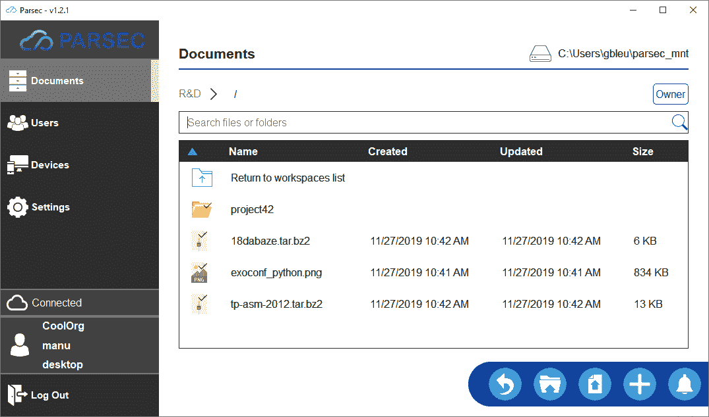

# Parsec 云:安全的云框架

> 原文：<https://kalilinuxtutorials.com/parsec/>

Parsec 是一款免费软件(AGPL v3 ),旨在通过加密安全，在完全隐私的情况下轻松共享你的工作和数据。

**主要特征**

*   在您的计算机上作为虚拟驱动器工作。你可以用常规软件访问和修改存储在 Parsec 中的所有数据，就像在本地硬盘上一样。
*   绝不丢失任何数据。与远程服务器的同步不会破坏任何数据，因此您可以浏览数据历史并从任何时间点恢复。
*   客户端加密安全性。数据和元数据仅对您和您选择共享的人可见。
*   加密签名。每一个修改都由作者签名，使得识别修改变得很简单。
*   与云提供商无关。服务器为 S3 和 swift 对象存储提供连接器。
*   简化招生。新用户注册非常简单，只需共享一个链接和一个令牌码。

**安装方法**

*   **Windows 安装程序**

Windows 安装程序可在[https://github.com/Scille/parsec-cloud/releases/latest](https://github.com/Scille/parsec-cloud/releases/latest)获得

*   **Linux 快照**

在 https://snapcraft.io/parsec 的[通过 Snapcraft 为 Linux 提供](https://snapcraft.io/parsec)

*   **巨蟒皮普**

使用命令:`**pip install parsec-cloud**`(或者，如果您需要指定 Python 3 pip 版本，`**pip3 install parsec-cloud**`)也可以通过 PIP 为 Linux 和 Windows 直接获得 Parsec