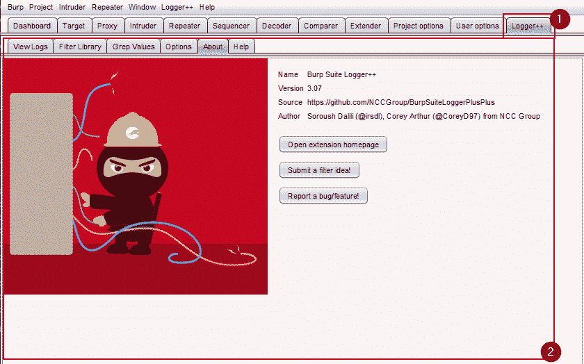
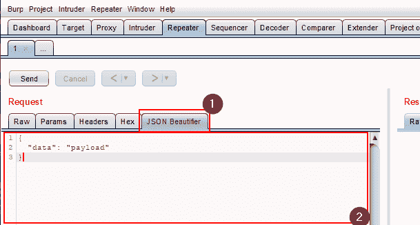
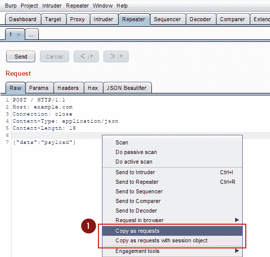
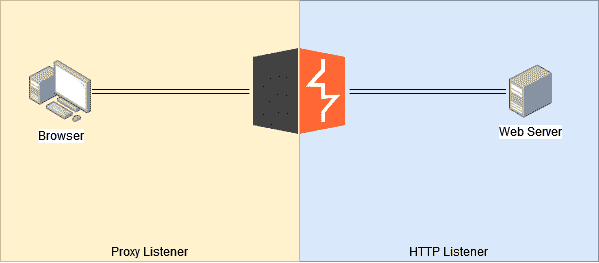
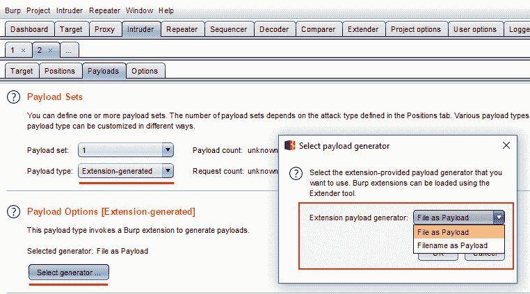
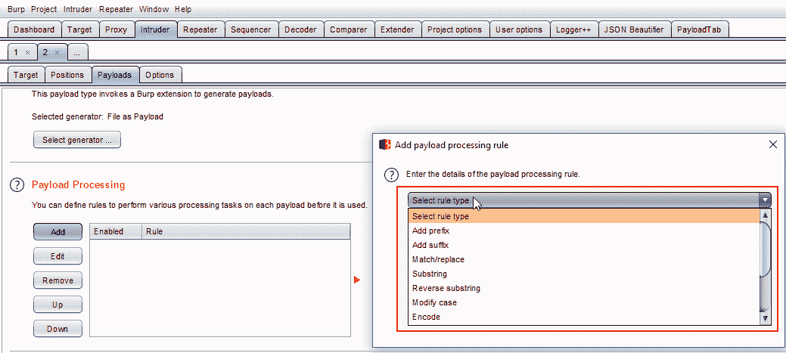
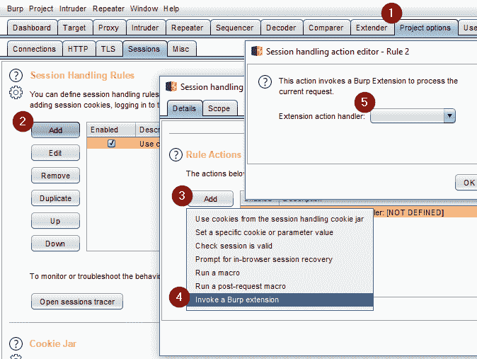

# 发电机打嗝扩展:你需要的一切

> 原文：<https://kalilinuxtutorials.com/burp-extension/>

当您生成您的插件项目时，生成器会询问您插件中应该包含哪些特性。如果你熟悉 burp 扩展开发，那么这些特性的名称就足够说明问题了，但是，如果你是第一次使用 **burp 扩展**，这里有一个简短的描述，说明每个特性可以做什么。

**安装**

首先，使用 [npm](https://www.npmjs.com/) 安装 [Yeoman](http://yeoman.io) 和 generator-burp-extension(我们假设你已经预装了 [node.js](https://nodejs.org/) )。

npm 安装-g yo
npm 安装-g 发电机-打嗝-扩展

然后生成您的新项目:

**哟打嗝-伸展**

**也可阅读-[sky wrapper:发现可疑创作形式的工具](https://kalilinuxtutorials.com/skywrapper/)**

**扩展选项卡 GUI**

将添加到 Burp 用户界面的自定义选项卡。通常用于添加一些功能(如 [logger++](https://github.com/PortSwigger/logger-plus-plus) 扩展),或者只是让用户能够配置扩展。

**消息编辑器标签 GUI**

自定义消息编辑器标签将被添加到 Burp 的消息编辑器用户界面(Repeter，intrusor…)。通常用于在请求/响应负载中提供某种自定义编辑器/视图功能。一个例子是 [JSON Beutifier](https://github.com/PortSwigger/json-beautifier) 扩展。

**上下文菜单 GUI**

自定义上下文菜单将被添加到 Burp 的用户界面几乎任何地方，按下右键。Burp 允许在以下任何情况下显示上下文菜单:

*   入侵者攻击结果。
*   入侵者有效载荷位置编辑器。
*   请求编辑器。
*   响应编辑器。
*   不可编辑的请求查看器。
*   不可编辑的响应查看器。
*   代理历史。
*   扫描仪结果。
*   搜索结果窗口。
*   目标站点地图表。
*   目标站点地图树。

这个功能的一个简单例子是 [copy-as-python-requests](https://github.com/PortSwigger/copy-as-python-requests) 扩展，它允许将请求复制为 python 代码(只是一个例子)。

**HTTP 监听器/代理监听器**

代理工具(代理监听器)或任何 Burp 工具(HTTP 监听器)正在处理请求和响应时，监听器会得到通知。扩展可以对这些消息进行定制分析或修改。

换句话说，代理侦听器拦截来自浏览器的请求和来自浏览器的响应。HTTP 侦听器拦截从 burp 到 web 服务器的传出请求和来自 web 服务器的传入响应。

一个现实生活中使用这个扩展特性的插件例子是 [AutoRepeater](https://github.com/nccgroup/AutoRepeater)

**入侵者有效载荷发生器**

扩展入侵者有效载荷，增加自定义生成器功能。该功能一个可能的用途是生成随机有效的 IBAN 号码。一个真实的例子是扩展[入侵者文件有效载荷生成器](https://github.com/PortSwigger/intruder-file-payload-generator)(我没有使用它，这只是一个例子)

**入侵者有效载荷处理器**

扩展入侵者有效载荷增加定制处理器能力，一个可能的例子是基于静态密钥执行 AES 加密。

*   **扫描仪检查**

执行扫描时，Burp 将要求检查对基本请求执行主动或被动扫描，并报告任何已识别的扫描仪问题。

*   **扫描仪插入点提供者**

当一个请求被主动扫描时，扫描器将调用它，提供者应该提供一个将在扫描中使用的定制插入点的列表。

*   **会话处理动作**

每个注册的动作将在会话处理规则 UI 中可供用户选择作为规则动作。用户可以选择直接调用动作本身，或者在执行宏之后调用动作。

*   **扩展状态监听器**

当从 Burp 中卸载扩展时，监听器将得到通知。注意:任何启动后台线程或打开系统资源(如文件或数据库连接)的扩展都应该注册一个监听器，并在卸载扩展时终止线程/关闭资源。

*   **扫描仪监听器**

监听器将被通知 Scanner 工具报告的新问题。通过注册扫描仪监听器，扩展可以执行自定义的扫描仪问题分析或日志记录。

*   **范围改变监听器**

只要 Burp 的套件范围的目标范围发生变化，监听器就会得到通知。

可能没用，因为 Burp 不允许您访问全局作用域定义。

*   **取舍**

本节解释模板开发中的一些决策。

**为什么是 Java 而不是 Python/Ruby？**

首先，我不是 Java 迷

您可能知道，BurpSuite 允许用三种主要语言开发扩展:Java、Python 和 Ruby。实际上这并不完全正确。Burp 允许你用 Jython 和 JRuby 开发。这里真正的问题是，当你在一个 Burp 扩展中使用 Jython 或 JRuby 时，你仍然需要用 Java 来思考(因为是 Burp 的主要语言)，所以，最终，你将使用 Python 和 Java 来开发，但是在将你的项目与一个真正的 IDE、自动完成和那些现代的东西集成时会有很多问题。

另一个用 Java 代替 Jython 的好理由是因为它是基于 python 2.7 的，我不用 JRuby 是因为我不喜欢 Ruby，仅此而已。

**一切都是单一的(主导文章)**

正如你可能注意到的，Burp 接口的所有实现都遵循[单例模式](https://en.wikipedia.org/wiki/Singleton_pattern)其主要原因完全是主观的。

事情是，打嗝是一个很好的工具，但它的内部有点模糊，可能有点乱。例如，Burp 允许您注册多个 IHTTPListeners，但是您会失去一些重要的决定，比如调用这个侦听器的顺序。以我个人的拙见，这种情况可能会使对 Burp 扩展和代码可维护性的理解变得模糊和困难。

你可以把每个单例类看作是 Burp 的一个必要连接点，它必须是唯一的。从这个连接点开始，您可以控制您的代码，执行任何类型的面向对象的设计。

[**Download**](https://github.com/rsrdesarrollo/generator-burp-extension)