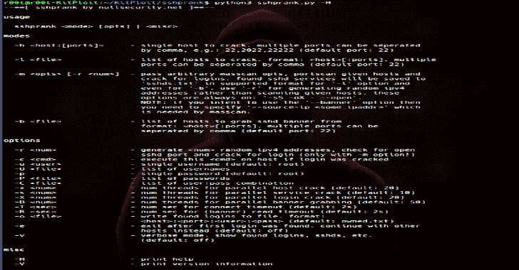
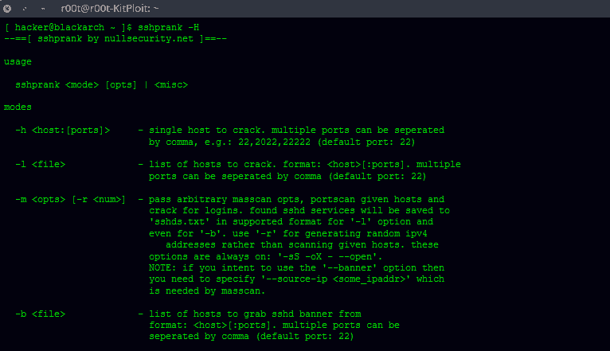
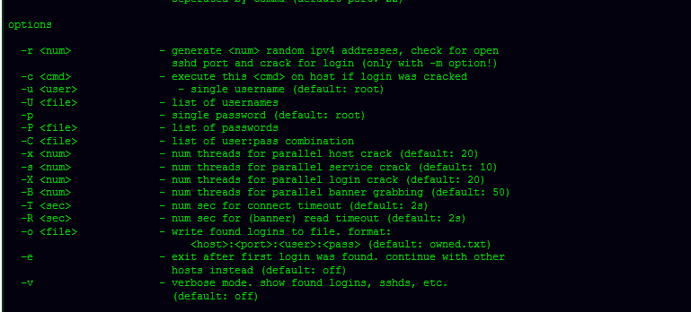
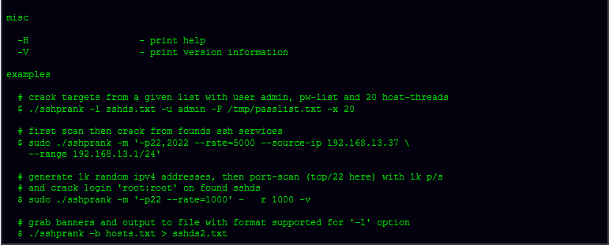

# SSH 恶作剧:一个快速的 SSH 大规模扫描器，登录破解和横幅抓取

> 原文：<https://kalilinuxtutorials.com/sshprank/>

是一个快速的 SSH mass-scan、登录破解和横幅抓取工具，使用 python-masscan 和 shodan 模块。

**用途**

**注释**

*   快速而肮脏的代码
*   ssh 恶作剧已经打包并可用于 BlackArch Linux
*   我的主枝总是稳定的；开发分支是为当前工作创建的。
*   你能找到的我所有的公开资料都是通过[nullsecurity.net](https://www.nullsecurity.net)正式宣布和发布的。

**也可阅读-[Thoron:一个利用 Linux TCP 漏洞](https://kalilinuxtutorials.com/thoron/)的 Linux 后开发框架**

**免责声明**

我们在此强调，在[nullsecurity.net](http://nullsecurity.net/)上发现的黑客相关内容仅用于教育目的。我们不对任何损坏负责。你要对自己的行为负责。

**信用:**no prix

[**Download**](https://github.com/noptrix/sshprank)