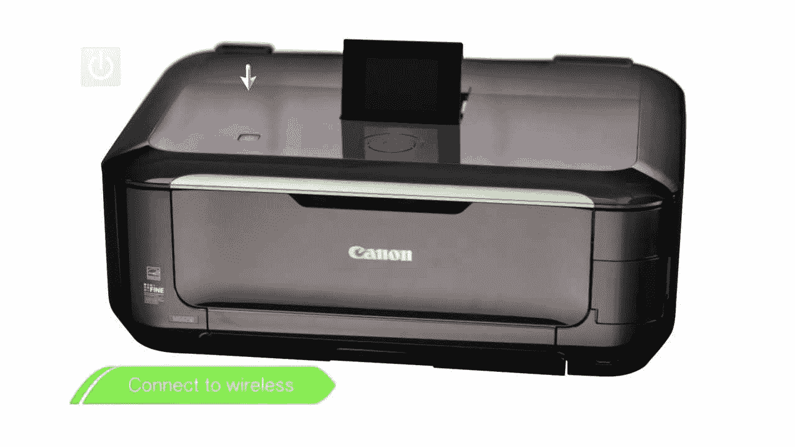

# 为什么有些佳能打印机比其他打印机更有效

> 原文：<https://kalilinuxtutorials.com/why-some-canon-printers-are-more-effective-than-others/>

并非所有的打印机都是一样的，在比较来自同一制造商的打印机时也是如此。如果你拥有一台佳能打印机，并想投资购买一台新的，那么不要认为你的新打印机会一样出色！

在购买打印机时，你必须考虑很多事情，所以我们花时间来揭示为什么一些佳能打印机比其他打印机更有效。因此，下次您打算购买新打印机时，请查看我们的建议，以确保您每次都能做出最佳选择！

## **打印页面速度**

便宜的佳能打印机提供了较低的打印速度，这意味着你的工作将需要更长的时间才能完成。如果你不是一个普通的打印机，这可能不是一个大问题，但如果你需要它来工作，那么你只会对便宜的型号感到沮丧。

更昂贵的型号将提供更快、更清晰的打印效果，使您的作品具有您想要的专业外观。虽然费用更多，但这些打印机往往寿命更长，随着时间的推移表现更好。

## **多功能一体机 Vs 直印**

如果你买了一台非常便宜的打印机，只提供简单的打印功能，那么你可能会认为你中了大奖。但是，便宜不一定更好。如果你是一个不经常使用打印机的人，只是偶尔需要它来打印零星的信件，那么用一台更便宜的打印机完全没问题。

然而，如果你在家使用打印机工作，那么你可能想要一台集扫描、打印和复印于一体的。由于功能增加，这些通常要贵得多。当涉及到创建可以与他人共享的高质量打印时，它们都更有效。

## **墨水价格和质量**

有趣的是，打印机越贵，墨水就越便宜，而且使用时间越长，效率就越高。然而，无论你选择什么类型的佳能打印机，佳能打印机的墨水都很贵！

处理这个问题最有效的方法是使用像 Smart Ink 这样的替代油墨公司。您只需前往更换墨水专家处，在搜索中输入您的墨盒名称，例如 [281XXL](https://smartink.pro/us/product/smart-ink-cartridge-replacement-for-canon-280xxl-281-xxl-5-pack/) ，然后购买您需要的替换墨水。无论您拥有哪种型号的打印机，这都是一种更有效的维护方式！

## **总结**

虽然很明显佳能是一个了不起的品牌，但在决定购买之前，你应该考虑打印机的全部规格，这确实是有道理的。确保打印速度和打印机类型符合您的需求，而不是只关注预算。

购买你能负担得起的最高规格的打印机也是明智的，这样你就能得到最好的打印质量。再加上购买替换墨水而不是原装墨水，你不仅拥有了一台高质量的打印机，而且每次佳能墨盒用完时，你都不需要花很多钱！