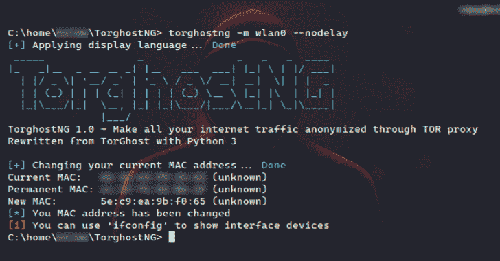
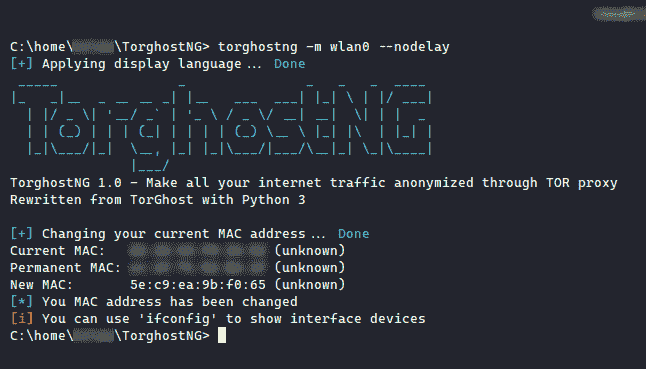
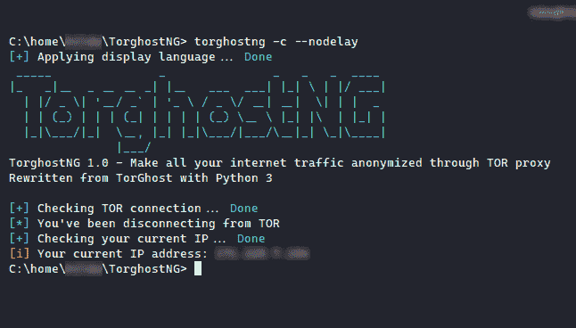
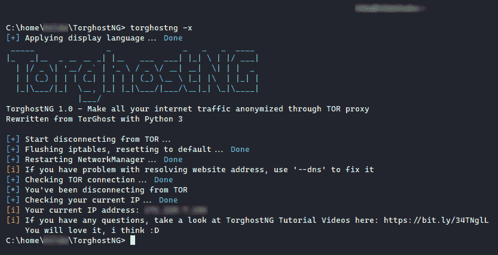
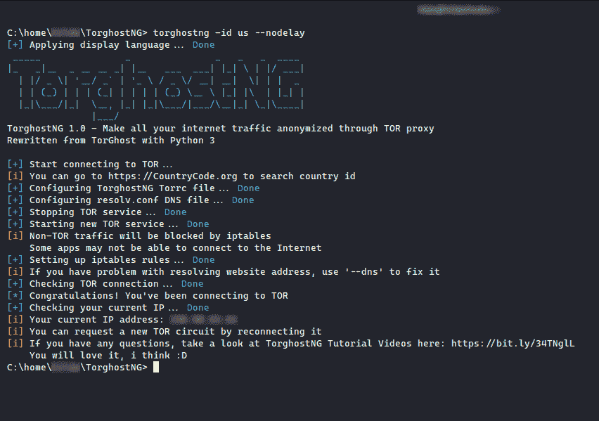
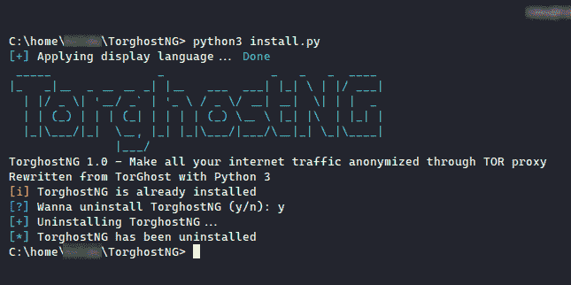

# TorghostNG:用 Tor 网络匿名化你所有的网络流量

> 原文：<https://kalilinuxtutorials.com/torghostng/>

TorghostNG 将通过 Tor 网络匿名化您的所有互联网流量。用 Python 3 从 TorGhost 改写。

用 Python 3 改写自 [TorGhost](https://github.com/SusmithKrishnan/torghost) 。TorghostNG 的测试对象是:

*   Kali Linux
*   曼哈罗

有什么新消息？

*   修正了 [`torghostng.py`](https://github.com/gitkern3l/TorghostNG/blob/master/torghostng.py) 中的`update_commands`等人
*   [`theme.py`](https://github.com/gitkern3l/TorghostNG/blob/master/torngconf/theme.py) 里改了几样东西
*   [`install.py`](https://github.com/gitkern3l/TorghostNG/blob/master/install.py) 里改了几样东西
*   现在你可以用`-r`改变 Tor 电路

**使用前？**

*   为了 Tor 网络的好，BitTorrent 流量会被 iptables 屏蔽。尽管你可以通过对 torrent 客户端做一些调整来绕过它😥。很难完全阻止所有的洪流交通。
*   出于安全原因，TorghostNG 将禁用 IPv6 以防止 IPv6 泄漏(这发生在我 lmao 身上)。

**安装**

TorghostNG 目前支持:

*   基于 Arch Linux 的 GNU/Linux 发行版
*   基于 Debian/Ubuntu 的 GNU/Linux 发行版
*   基于 Fedora、CentOS、RHEL、openSUSE 的 GNU/Linux 发行版
*   [Solus OS](https://getsol.us)
*   [Void Linux](https://voidlinux.org)
*   年长的人:[休闲服](http://slackware.com)
*   (一天有太多的包管理器:v)

要安装 TorghostNG，请打开您的终端并输入以下命令

**git 克隆 https://github . com/githacktools/torghong
CD torghong
sudo python 3 install . py
sudo torghong**

但是在 Slackware 中，你使用`sudo python3 torghostng.py`来运行 TorghostNG :v

**帮助**

**选项:**
**-h，–help**显示此帮助信息并退出
**-s，–Start**开始连接 Tor
**-x，–Stop**停止连接 Tor
**-r，–Renew**更新当前 Tor 电路
**-id COUNTRY ID** 连接特定国家的 Tor 出口节点。去 CountryCode.org 搜索国家 ID
**-mac 界面**随机更改 mac 地址。使用“ifconfig”显示接口设备
**-c，–checkip**检查您当前的 IPv4 地址
**–DNS**当网站地址无法解析时，使用此选项修复 DNS
**-l，–language**更改显示语言。英语是默认的
**–list**显示可用语言列表
**-u，–update**检查更新
**–nodelay**禁用延迟时间

您可以同时组合多个选项，例如:

*   **`torghostng -s -m INTERFACE` :** 连接前更改 MAC 地址
*   **`torghostng -c -m INTERFACE` :** 检查 IP 地址和更改 MAC 地址
*   **`torghostng -s -x` :** 连接 Tor anh 然后停止:v

**如何更新？**

打开终端，键入`**torghostng -u**`和 sudo 来更新 TorghostNG，但是它会下载新的 TorghostNG 到`**/root**`，因为你是以 root 身份运行的。如果你不喜欢，你可以输入`**git pull -f**`和**T3。**

**也读作-[拦截:策略作为代码静态分析审计](https://kalilinuxtutorials.com/intercept/)**

**截图**

*   更改 MAC 地址:`**torghostng -m INTERFACE**`

*   正在检查 IP 地址:`**torghostng -c**`

*   从 Tor 断开:`**torghostng -x**`

*   连接到特定国家的 Tor 出口节点:`**torghostng -id COUNTRY ID**`

*   正在卸载 TorghostNG: `**python3 install.py**`

**鸣谢:** [@SecureGF](https://twitter.com/securegf)

[**Download**](https://github.com/GitHackTools/TorghostNG)