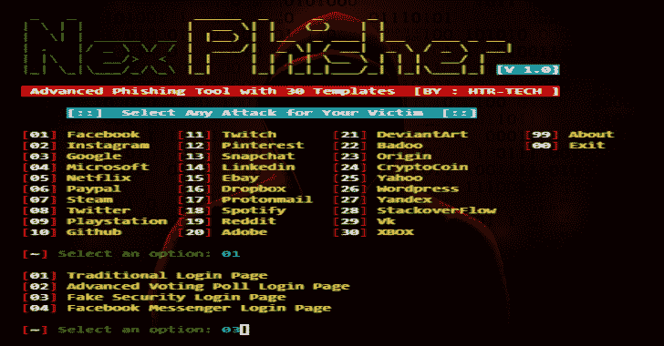
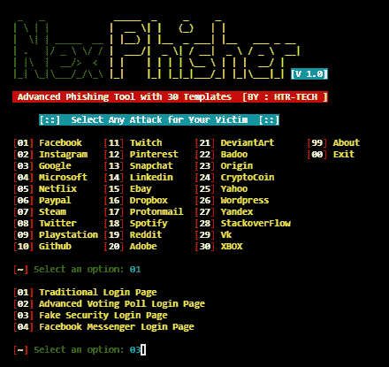
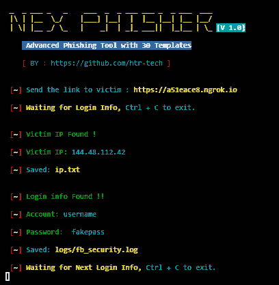

# Nexphisher:用于 Linux 和 Termux 的高级网络钓鱼工具

> 原文：<https://kalilinuxtutorials.com/nexphisher/>

NexPhisher 是一款为 Termux & Linux 开发的自动化网络钓鱼工具。钓鱼网页取自 [GNU 通用公共许可证 v3.0](https://github.com/htr-tech/zphisher/blob/master/LICENSE#L1) 下的 [Zphisher](https://github.com/htr-tech/zphisher) 。该工具拥有 30 个网站的 37 个钓鱼页面模板。有 5 个端口转发选项，包括本地主机！！

**安装**

apt 更新
apt 安装 git -y
git 克隆 https://github.com/htr-tech/nexphisher
CD 链接器
bash 安装

*   **运行**

**痛击网络杀手**

*   **或；使用单一命令**

apt 更新&& apt 安装 git -y && git 克隆 https://github.com/htr-tech/nexphisher & & CD nexphisher & & bash 安装&& bash ne

**也读作-[Powershell-Reverse-TCP:用于连接远程主机的 Powershell 脚本](https://kalilinuxtutorials.com/powershell/)**

**特性**

*   最新登录页面！
*   新的 Instagram 自动关注者页面！
*   新的端口转发选项！
*   适用于所有设备！

**截图**

[**Download**](https://github.com/htr-tech/nexphisher)