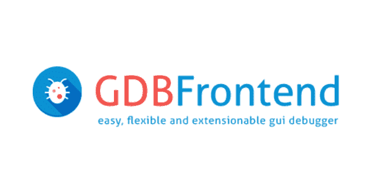
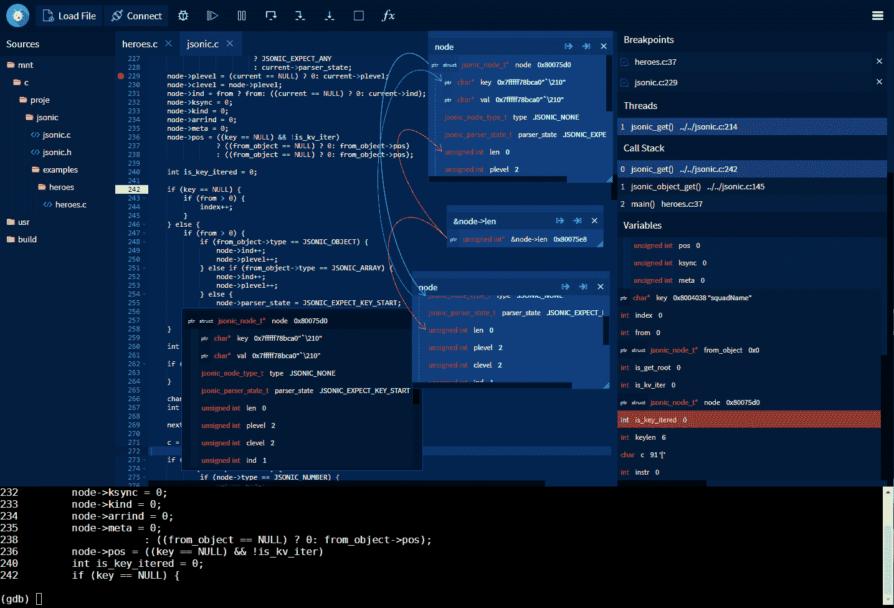

# GDBFrontend:简单、灵活且可扩展的 GUI 调试器

> 原文：<https://kalilinuxtutorials.com/gdbfrontend/>

GDBFrontend 是一个简单、灵活和可扩展的 gui 调试器。

**安装**

**Deb 包(Debian / Ubuntu / KDE Neon)**

对于基于 Debian 的发行版，可以通过 deb 包安装 GDBFrontend。

您可以通过以下命令安装它:

**https://oguzhaneroglu.com/deb/附和道。//|
sudo tee-a/etc/apt/sources . list>/dev/null
sudo apt 更新
sudo apt 安装 gdbfrontend**

使用 APT 安装后，您将在 APT 升级时获得新版本的更新。

您可以使用以下命令进行升级:

**sudo 升级
sudo 升级 gdb 前端**

您可以运行它:

**gdbfrontend**

**从 GIT 运行**

你可以下载最新的源代码并运行它。

**要求**

*   GDB => 8.2(带 python3)
*   python3
*   tmux

您可以使用以下命令运行 gdb-frontend:

**git 克隆 https://github.com/rohanrhu/gdb-frontend.git gdb-frontend
CD gdb-frontend
。/gdbfrontend**

你可以打开它:

**http://127 . 0 . 0 . 1:5551/terminal/**

或不带端子:

**http://127.0.0.1:5551/**

您可以使用以下命令打开 GDB shell:

**tmux a -t gdb 前端**

**平袋**

Flatpak 包是一个 TODO。

**。/gdbfrontend**

–help
**GDBFrontend 是一款简单、灵活且可扩展的 gui 调试器。
选项:**
–帮助，-h:显示此帮助信息。
–版本，-v:显示版本。
–GD b-executable = PATH，-g PATH:指定 GDB 可执行路径(默认为 PATH 环境变量上的“gdb”命令。)
–tmux-executable = PATH，-tmux PATH:指定 tmux 可执行路径(默认为 PATH 环境变量上的“Tmux”命令。)
–terminal-id = NAME，-t NAME:指定 tmux 终端标识符名称(默认为“gdb-frontend”)。)
–listen = IP，-l IP:指定 HTTP 和 WS 服务器的监听地址。
–PORT = PORT，-p PORT:指定三个端口的端口范围到(Gotty: PORT，HTTP: PORT+1，WS: PORT+2)。
–http-PORT = PORT:指定 HTTP 服务器端口。
–server-PORT = PORT:指定 WS 服务器端口。
–gotty-PORT = PORT:指定 Gotty 服务器端口。
–readonly，-r:使代码编辑器只读。(注意:该选项与安全性无关。)
–详细，-V:启用详细输出。

**选项**

**–帮助，-h**
显示帮助文本。
**–版本，-v**
显示版本。
**–gdb-executable = PATH，-g PATH**
你可以像 gdbfrontend-**-gdb-executable =/PATH/to/gdb 一样指定 gdb 的可执行路径。(可选)**
**–tmux-executable = PATH，-tmux PATH**
可以像 gdbfrontend**–Tmux-executable =/PATH/to/Tmux 一样指定 Tmux 可执行路径。(可选)
–terminal-id = PATH，-t PATH**
可以像 gdbfrontend–terminal-id = terminal-name 一样指定 Tmux 终端 id。(默认:GD b-frontend)
**–listen = IP，-l IP**
指定 HTTP 和 WS 服务器的监听地址。
**–PORT = PORT，-p PORT**
指定三个端口的端口范围到(Gotty: PORT，HTTP: PORT+1，WS: PORT+2)。
**–http-PORT = PORT**
指定 HTTP 服务器端口。
**–server-PORT = PORT**
指定 WS 服务器端口。
**–gotty-PORT = PORT**
指定 Gotty 服务器端口。
**–只读，-r**
使代码编辑器只读。(注意:该选项与安全性无关。)
**–详细，-v**
启用详细输出。

**故障排除**

**僵尸进程**

有时 GDB 和广发前端可能无法正确关闭。在这种情况下，您可以终止 gdb-frontend shell。

**tmux kill-session-t gdb-frontend**

**GDB 相关问题和提示**

*   GDB 不会给出链接对象的源代码**，直到单步执行一次从链接对象调用函数的代码行**。您可以在一条线上添加断点并单步执行一次，然后您将在会话期间看到来自链接对象的源代码。

**窗户**

事实上，gdb-frontend 可以在 Windows 上运行，但在 gdb 的 Windows 版本中有一些严重的问题，这些问题避免了在 Windows 上使用 gdb-frontend。当然，如果你使用的是 Windows 10，你可以在 WSL 上使用 gdb-frontend。

**关于 Windows-GDB 的问题**

*   GDB 的主线程在运行过程中被阻塞。(gdb-frontend 有一个中断机制来解决这个问题，但这还不够。)
*   Windows-GDB 的提示在运行过程中被阻止，有一些关于中断应用程序的问题。
*   当前版本的 Windows-GDB 包含 Python2。新 GDB 9 有 Python3，但是还没有发布。

[**Download**](https://github.com/rohanrhu/gdb-frontend)