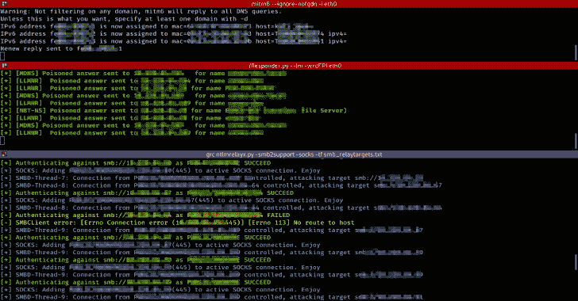

# Exegol:一个 Kali Light Base，几乎没有有用的附加工具

> 原文： [https://kalilinuxtutorials.com/exegol/](https://kalilinuxtutorials.com/exegol/)

Exegol 是一个完全配置好的 kali light base，有一些有用的附加工具(~50)，一些有用的资源(用于特权、凭证窃取等的脚本和二进制文件)。)和一些配置(一些工具的 oh-my-zsh、历史、别名、彩色输出)。

它可以用于 pentest 交战和 BugBounty。Exegol 最初的命运是成为一名随时准备好的码头工人，以备在交战期间出现紧急情况。现在，这是我和我的团队在日常工作中使用的环境。

**快速启动**

这个项目在 Docker Hub 上，你不需要克隆这个 git。

*   首先在您的 bashrc/zshrc/whateverrc 中设置以下别名。

别名 exe gol-update = ' docker pull nwodtuhs/exe gol '
别名 exe gol-build = ' docker build–tag nwodtuhs/exe gol/PATH/TO/exe gol/'
别名 exe gol-run = ' docker run–interactive–tty–detach–网络主机–volume/PATH/TO/exe gol/shared-volume:/share–name exe gol nwodtuhs/exe gol '
别名 exe gol-shell = ' docker exec-it exe gol

*   然后拉:坞站拉 nwdtuhs/exegol
*   然后运行 docker 并获得一个 shell : exegol-run && exegol-shell
*   完成后停止:exegol-stop

**也读作-[调用者:渗透测试实用程序](https://kalilinuxtutorials.com/invoker/)**

**先决条件**

如果你想在 Docker 中运行 Exegol，这里需要 docker。你也可以使用 install.sh 在其他地方部署 Exegol，但我不保证它会工作。(也就是说我不能保证任何事情，兄弟)

需要快速安装 docker & docker-compose 吗？看看这个(为 kali 用户设计的，但是我猜它可以在任何其他基于 Debian 的系统上工作)

sudo apt-get install apt-transport-https ca 证书 curl gnupg 代理软件-属性-公共
curl-fssl https://download . docker . com/Linux/Ubuntu/gpg | sudo apt-key add--
echo ' deb[arch = amd64]https://download . docker . com/Linux/debian buster stable ' | sudo tee/etc/apt/sources . list . d/docker . list

**安装(从 Docker Hub)**

它可以很长，在需要它之前拉 exegol。

**坞站拉 nwdtuhs/exegol**

**安装(来自 GitHub)**

构建可能很长，在需要之前构建 exegol。

**git 克隆 https://github.com/ShutdownRepo/Exegol
CD Exegol
docker 构建–标签 exegol**

**用途**

我个人会用这些化名去得很快很快

别名 exe gol-update = ' docker pull nwodtuhs/exe gol '
别名 exe gol-build = ' docker build–tag nwodtuhs/exe gol/PATH/TO/exe gol/'
别名 exe gol-run = ' docker run–interactive–tty–detach–网络主机–volume/PATH/TO/exe gol/shared-volume:/share–name exe gol nwodtuhs/exe gol '
别名 exe gol-shell = ' docker exec-it exe gol

*   更新 docker : `**exegol-update**`
*   运行 docker : `**exegol-run**`
*   exegol 启动运行时获取一个 shell(可以弹出多个 shell):`**exegol-shell**`
*   Stop exegol : `**exegol-stop**`

**工具**

安装在 Exegol 中的工具大多是从源代码安装的，以便在部署 Exegol 时拥有最新版本。一些工具可以在完整的 kali 安装中找到。有些安装是用 go、pip、apt、gem 等制作的。安装并不完美，但嘿，它的工作！您将在`**/opt/tools**`中找到大多数工具。一些工具:

*   响应者([https://github.com/lgandx/Responder](https://github.com/lgandx/Responder))
*   crackmapexec(https://github . com/mpga/crackmapexec
*   伊莎西([https://github.com/Hackndo/lsassy](https://github.com/Hackndo/lsassy))
*   喷雾猎犬([https://github.com/Hackndo/sprayhound](https://github.com/Hackndo/sprayhound))
*   撞包([https://github.com/SecureAuthCorp/impacket](https://github.com/SecureAuthCorp/impacket))
*   blood hound . py([https://github.com/fox-it/BloodHound.py](https://github.com/fox-it/BloodHound.py))
*   米特 6([https://github.com/fox-it/mitm6](https://github.com/fox-it/mitm6))
*   摄魂怪([https://gist . github . com/3xocyte/CFA F8 a 34 f 76569 a 8251 bde 65 Fe 69 dccc](https://gist.github.com/3xocyte/cfaf8a34f76569a8251bde65fe69dccc))
*   ACL wpn([https://github.com/fox-it/aclpwn.py](https://github.com/fox-it/aclpwn.py))
*   破冰者([https://github.com/DanMcInerney/icebreaker](https://github.com/DanMcInerney/icebreaker))
*   Powershell 帝国([https://github.com/BC-SECURITY/Empire](https://github.com/BC-SECURITY/Empire))
*   死亡之星([https://github.com/byt3bl33d3r/DeathStar](https://github.com/byt3bl33d3r/DeathStar))
*   自动恢复([https://github.com/Tib3rius/AutoRecon](https://github.com/Tib3rius/AutoRecon))
*   sn1per([https://github.com/1N3/Sn1per](https://github.com/1N3/Sn1per))
*   子列表 3r([https://github.com/aboul3la/Sublist3r](https://github.com/aboul3la/Sublist3r)
*   https://github.com/s0md3v/ReconDog
*   云失败([https://github.com/m0rtem/CloudFail](https://github.com/m0rtem/CloudFail))
*   oneforall(https://github . com/shmillty/oneforall
*   目击者([https://github.com/FortyNorthSecurity/EyeWitness](https://github.com/FortyNorthSecurity/EyeWitness))
*   wafw 00 f([https://github.com/EnableSecurity/wafw00f](https://github.com/EnableSecurity/wafw00f))
*   JSParser([https://github.com/nahamsec/JSParser](https://github.com/nahamsec/JSParser))
*   链接查找器([https://github.com/GerbenJavado/LinkFinder](https://github.com/GerbenJavado/LinkFinder))
*   SSRFmap([https://github.com/swisskyrepo/SSRFmap](https://github.com/swisskyrepo/SSRFmap))
*   伏思普洛德([https://github.com/almandin/fuxploider](https://github.com/almandin/fuxploider))
*   科尔扫描仪([https://github.com/chenjj/CORScanner](https://github.com/chenjj/CORScanner))
*   布拉齐([https://github.com/UltimateHackers/Blazy](https://github.com/UltimateHackers/Blazy))
*   xs strike([https://github.com/UltimateHackers/Blazy](https://github.com/UltimateHackers/Blazy))
*   博尔特([https://github.com/s0md3v/Bolt](https://github.com/s0md3v/Bolt))
*   subjack([https://github . com/haccer/subjack](https://github.com/haccer/subjack)
*   资产发现者([https://github.com/tomnomnom/assetfinder](https://github.com/tomnomnom/assetfinder))
*   子查找器([https://github.com/projectdiscovery/subfinder/cmd/subfinder](https://github.com/projectdiscovery/subfinder/cmd/subfinder))
*   戈布斯特([https://github.com/OJ/gobuster](https://github.com/OJ/gobuster))
*   积聚([https://github.com/OWASP/Amass](https://github.com/OWASP/Amass))
*   ffuf ( [https://github.com/ffuf/ffuf](https://github.com/ffuf/ffuf) )
*   吉特罗布([https://github.com/michenriksen/gitrob](https://github.com/michenriksen/gitrob))
*   shhgit([https://github . com/eth 0 izle/shhgit](https://github.com/eth0izzle/shhgit)
*   way back URLs([https://github.com/tomnomnom/waybackurls](https://github.com/tomnomnom/waybackurls))
*   subzy([https://github.com/lukasikic/subzy](https://github.com/lukasikic/subzy))
*   寻找域名([https://github.com/Edu4rdSHL/findomain](https://github.com/Edu4rdSHL/findomain))
*   定时攻击([https://github.com/ffleming/timing_attack](https://github.com/ffleming/timing_attack))
*   updog([https://github.com/sc0tfree/updog](https://github.com/sc0tfree/updog)
*   GRC([https://github.com/garabik/grc](https://github.com/garabik/grc))
*   gron([https://github . com/tomnom/gron](https://github.com/tomnomnom/gron)
*   pwndbg ( [https://github.com/pwndbg/pwndbg](https://github.com/pwndbg/pwndbg) )
*   暗甲([https://github.com/bats3c/darkarmour](https://github.com/bats3c/darkarmour))
*   蝙蝠([https://github.com/sharkdp/bat](https://github.com/sharkdp/bat))
*   剥壳机([https://github.com/ShutdownRepo/shellerator](https://github.com/ShutdownRepo/shellerator))
*   mdcat([https://github.com/lunaryorn/mdcat](https://github.com/lunaryorn/mdcat))
*   卡迪穆斯([https://github.com/P0cL4bs/Kadimus](https://github.com/P0cL4bs/Kadimus))
*   XSRFProbe([https://github.com/0xInfection/XSRFProbe](https://github.com/0xInfection/XSRFProbe))
*   no sqlmap([https://github.com/codingo/NoSQLMap](https://github.com/codingo/NoSQLMap))
*   krbrelayx([https://github.com/dirkjanm/krbrelayx](https://github.com/dirkjanm/krbrelayx))
*   哈克劳勒([https://github.com/hakluke/hakrawler](https://github.com/hakluke/hakrawler))
*   https://github.com/ticarpi/jwt_tool 工具([JWT](https://github.com/ticarpi/jwt_tool)
*   https://github.com/lmammino/jwt-cracker 的 JWT 饼干

**有用的资源**

除了一些预安装和配置的工具之外，您会在`/opt/resources`中找到许多有用的预获取资源，如脚本和二进制文件。有一些预 EoP 枚举脚本(EoP:特权升级)和其他有用的二进制文件，如 Rubeus 或 mimikatz。

*   利奈姆([https://github.com/rebootuser/LinEnum](https://github.com/rebootuser/LinEnum))
*   wine num([https://github . com/matareggiani/wine num](https://github.com/mattiareggiani/WinEnum)
*   Linux 智能枚举([https://github.com/diego-treitos/linux-smart-enumeration](https://github.com/diego-treitos/linux-smart-enumeration))
*   Linux 漏洞利用建议者([https://github.com/mzet-/linux-exploit-suggester](https://github.com/mzet-/linux-exploit-suggester)
*   米米卡兹([https://github.com/gentilkiwi/mimikatz](https://github.com/gentilkiwi/mimikatz))
*   linPEAS & winPEAS([https://github . com/Carlos polop/privilege-escalation-awesome-scripts-suite](https://github.com/carlospolop/privilege-escalation-awesome-scripts-suite))
*   pspy([https://github.com/DominicBreuker/pspy](https://github.com/DominicBreuker/pspy))
*   sysinternals([https://docs.microsoft.com/en-us/sysinternals/downloads/](https://docs.microsoft.com/en-us/sysinternals/downloads/))
*   PowerSploit([https://github.com/PowerShellMafia/PowerSploit](https://github.com/PowerShellMafia/PowerSploit)
*   priv check(https://github . com/ITM 4n/priv check
*   因维([https://github.com/Kevin-Robertson/Inveigh](https://github.com/Kevin-Robertson/Inveigh))
*   鲁伯([https://github.com/GhostPack/Rubeus](https://github.com/GhostPack/Rubeus))([预编译二进制](https://github.com/r3motecontrol/Ghostpack-CompiledBinaries))

[**Download**](https://github.com/ShutdownRepo/Exegol)