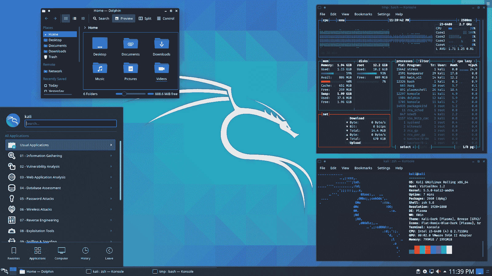
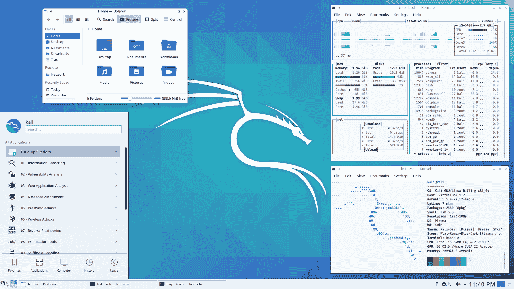
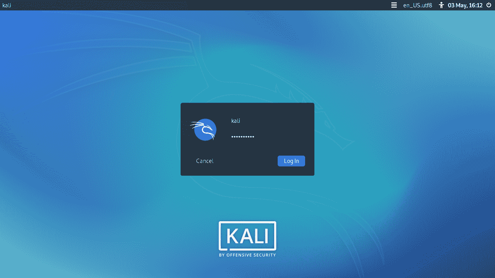
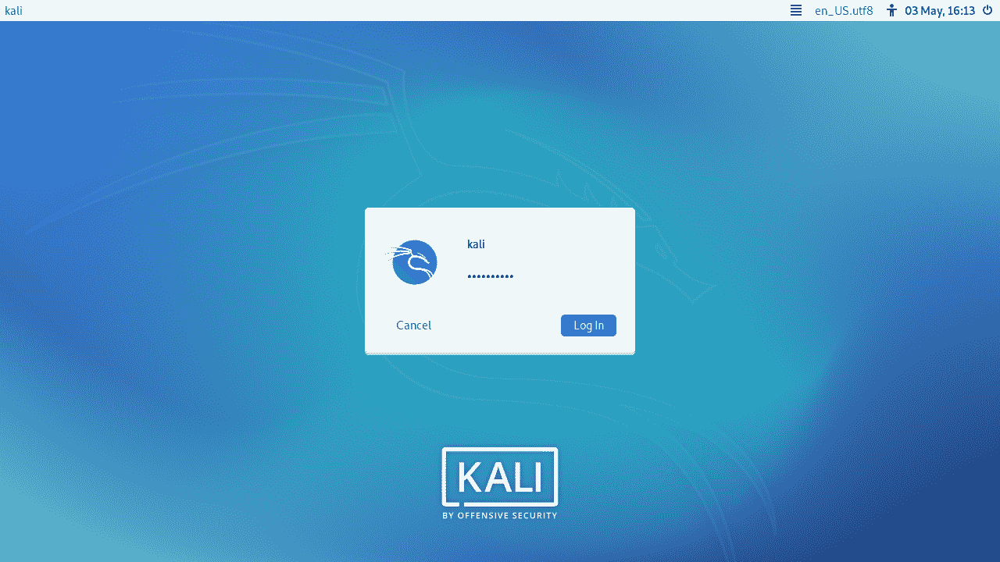
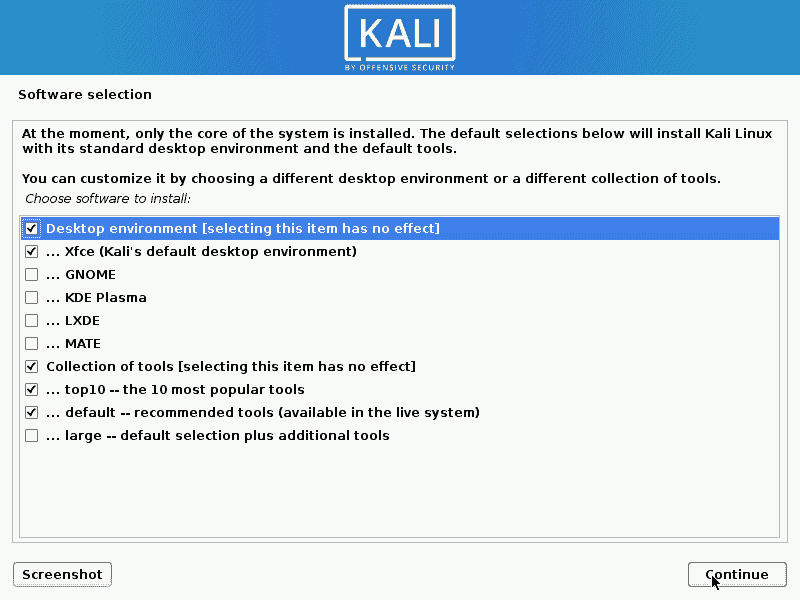

# Kali Linux 2020.2 版本–渗透测试和道德黑客 Linux 分发

> 原文：<https://kalilinuxtutorials.com/kali-linux-2020-2/>

鉴于世界的混乱，我们很高兴为您带来一个惊人的 Kali Linux 2020.2 更新！并且可以直接下载。

自 1 月日[以来的最新动态:](https://www.kali.org/releases/kali-linux-2020-1-release/)

*   KDE 等离子改造和登录
*   默认为 PowerShell。*种。*
*   卡利对武器的改进
*   安装程序变更的教训
*   新的密钥包和图标
*   在幕后，基础设施的改善

**KDE 等离子改头换面&登录**

随着 [XFCE](https://www.kali.org/news/kali-linux-2019-4-release/) 和 GNOME 进行了 Kali Linux 外观和感觉的更新，是时候回到我们的根源*(日子[回溯-linux](https://www.backtrack-linux.org/) )* 并给予 KDE 等离子一些爱和关注了。介绍我们 KDE 等离子的黑暗和光明主题:

关于主题化，我们也调整了登录界面。它看起来不同，无论是图形还是布局*(登录框现在对齐)*！

**默认 PowerShell。*种。***

[前一阵子](https://www.kali.org/news/kali-linux-2019-4-release/)，我们把 PowerShell 放到了 [Kali Linux 的网络仓库](https://www.kali.org/docs/general-use/kali-linux-sources-list-repositories/)。这意味着如果您想要 powershell，您必须通过以下方式一次性安装该软件包:

**kali @ kali:~ $ sudo apt install-y powershell**

我们现在已经把 PowerShell 放到了我们的一个(主)[元包](https://tools.kali.org/kali-metapackages)、`**kali-linux-large**`中。这意味着，如果你选择在系统设置期间安装这个元包，或者一旦 Kali 启动并运行(`**sudo apt install -y** **kali-linux-large**`)，如果 PowerShell 与你的架构兼容，你就可以直接进入它(`**pwsh**`)！

PowerShell 不在默认的元包中(那是`**kali-linux-default**`)，但是它在一个包含默认和许多额外功能的元包中，并且可以在系统设置期间包含。

**卡利对手臂的改进**

有了 [Kali Linux 2020.1](https://www.kali.org/releases/kali-linux-2020-1-release/) ，桌面镜像不再使用“root/toor”作为[默认凭证](https://www.kali.org/docs/introduction/default-credentials/)登录，而是移到了“kali/kali”。我们的手臂图像现在是一样的。我们不再使用超级用户帐户登录。

我们还在 [2019.4](https://www.kali.org/news/kali-linux-2019-4-release/) 警告说，我们将远离最低 8GB 的 SD 卡，我们终于准备好扣动扳机了。现在的要求是 16GB 或更大。

关于 ARM 设备的最后一点注意，我们不再安装`**locales-all**`了，所以我们强烈建议你设置你的语言环境。这可以通过运行下面的命令`**sudo dpkg-reconfigure locales**`来完成，然后注销并重新登录。

**安装者变更的教训**

随着 [Kali Linux 2020.1](https://www.kali.org/releases/kali-linux-2020-1-release/) 我们宣布了我们的新风格的图像，“安装”&“现场”。

**问题**它的目的是在设置期间定制“安装程序”&“实时”，以选择使用哪个元包和桌面环境。当我们这样做的时候，我们不能在这些映像中包含默认之外的元包，因为这会创建太大的 ISO。由于软件包不在映像中，如果您选择了默认选项之外的任何选项，将需要网络访问来获取默认选项之外的缺失软件包。发布后，我们注意到一些用户选择“一切”，然后等待数小时安装发生。他们不明白为什么安装要花这么长时间。

我们还在后端使用了不同的软件来生成这些图像，一些错误从裂缝中溜走了(这解释了 [2020.1a](https://bugs.kali.org/view.php?id=6053) 和 2020.1b 版本)。

**解决方案**

*   我们已经删除了安装程序镜像中的安装时间选项`**kali-linux-everything**`(它是 Kali Linux 存储库中的每个包的*),正如你可以想象的那样，在安装过程中下载和等待会花费很长时间*
*   我们已经将每一个桌面环境缓存到安装映像中(这就是为什么它比以前下载的要大一点)-允许一个完整的离线网络安装
*   我们已经删除了“实时”映像的定制——安装程序切换回复制实时文件系统的内容，允许再次完全离线安装，但强制使用我们默认的 XFCE 桌面

**总结**

*   如果你想从一个实时图像(DVD 或 u 盘)运行 Kali，请使用“实时”
*   如果你还需要什么，请使用“安装程序”
*   如果你想用 XFCE 以外的东西作为你的桌面环境，请使用“安装程序”
*   **如果不确定，获取“安装程序”**

此外，请记住，在实际评估中，“更多”并不总是“更好”。装`**kali-linux-everything**`的理由很少，不装的理由很多。对于那些选择这个选项的人，我们强烈建议你在使用它之前花些时间自学卡利。Kali 或任何其他 pentest 发行版都不是“交钥匙自动破解”解决方案。你仍然需要学习你的平台，学习你的工具，并对自己进行一般性的教育。

当你安装`**kali-linux-everything**`的时候，考虑你真正告诉 Kali 做什么。这就好比你进入手机应用商店，说“安装所有东西！”。那可能不会有好结果。我们在 Kali 中提供了很多强大的工具和选项，虽然我们可能有“给猴子提供机关枪”的名声，但我们实际上希望你知道你在做什么。卡莉不会牵你的手。它期望你做学习的工作，如果你不做，卡莉将不会原谅你。

**新的密钥包&图标**

就像每一个 Kali Linux 版本一样，我们包含了最新的软件包。指出此版本的关键点是:

*   GNOME 3.36–你们中的一些人可能已经注意到了在更新发布的前 12 个小时中出现的一个 bug。我们对此感到抱歉，并已采取措施防止此类事件再次发生
*   [乔普林](http://pkg.kali.org/pkg/joplin)——我们计划在 Kali Linux 2020.3 中用这个替换[樱桃树](http://pkg.kali.org/pkg/cherrytree)！
*   [Nextnet](http://pkg.kali.org/pkg/nextnet)
*   [Python 3.8](http://pkg.kali.org/pkg/python3-defaults)
*   [spider boot](http://pkg.kali.org/pkg/spiderfoot)

目前，由于某些工具需要，作为临时措施，我们重新纳入了`**python2-pip**`。Python 2 现在已经达到了“[生命的终点](https://www.kali.org/news/python-2-end-of-life/)，不再更新。工具制造者请请，**请**端口给 Python 3。工具的用户，如果你注意到一个工具还不是 Python 3，你也可以提供帮助！它不会永远存在。

在谈论软件包的同时，我们也开始更新每个工具的软件包徽标。你会在 Kali Linux 菜单中注意到它们，以及 [GitLab](https://gitlab.com/kalilinux/packages/) *上的工具页面(更多信息即将发布！)*

如果你的工具有一个标志，而我们错过了，请在 [bug 追踪器](https://bugs.kali.org/bug_report_page.php)上告诉我们。

**WSLconf**

WSLconf 发生在今年早些时候， [@steev](https://twitter.com/steevdave) 就“[我们如何在 Kali](https://www.youtube.com/watch?v=f8m6tKErjAI) 使用 WSL”做了 35 分钟的演讲。去看看！

**幕后基础设施改进**

我们一直在庆祝新服务器的到来，在过去的几周里，我们也一直在迁移新服务器。这包括一个新的 ARM 构建服务器和我们用于[包测试](https://autopkgtest.kali.org/)的东西。

这可能不会直接被注意到，但你可能会从中获益！如果你想帮助 Kali，我们已经在我们的文档中增加了一个新的部分，展示如何提交一个 [autopkgtest](https://kali.org/docs/development/contributing-runtime-tests) 。欢迎反馈！

**Kali Linux NetHunter**

我们对最近发生在 NetHunter 上的一些工作感到非常兴奋，我们已经做了一个[中期发布](https://www.kali.org/news/kali-nethunter-updates/)来展示它们，并尽快提供给你们。

除了之前所有的网游新闻，这一次还有更多的消息要宣布！

*   Nexmon 支持已经恢复，在 Nexus 6P、Nexus 5、索尼 Xperia Z5 Compact 等设备上为`wlan0`带来了 WiFi 显示器支持和帧注入功能！
*   OpenPlus 3T 图像已添加到下载页面。
*   我们已经在我们的库中跨越了 [160 个不同的内核，允许 net hunter](https://kalilinux.gitlab.io/nethunter/build-scripts/kali-nethunter-devices/nethunter-kernelstats.html)[支持超过 64 个设备](https://kalilinux.gitlab.io/nethunter/build-scripts/kali-nethunter-devices/nethunter-kernels.html)！是的，支持超过 160 个内核和超过 64 种设备。太神奇了。
*   我们的文档页面[得到了理所应当的更新](https://www.kali.org/docs/nethunter/)，尤其是内核开发部分。

关于 NetHunter，最常见的问题之一是“我应该在什么设备上运行它？”。保持你的[眼睛在这个页面](https://kalilinux.gitlab.io/nethunter/build-scripts/kali-nethunter-devices/nethunter-images.html)上，看看在自动更新的基础上你有什么选择！

当你想到 NetHunter 在如此紧凑的封装中提供的强大功能时，你真的会大吃一惊。看到这一进展令人惊讶，整个 Kali 团队都很兴奋地向你们展示未来会发生什么。

**下载 Kali Linux 2020.2**

**新鲜图像**那么你还在等什么？已经开始[下载](https://www.kali.org/downloads/)了！

经验丰富的 Kali 用户已经意识到了这一点，但是对于那些没有意识到的用户，我们也制作了[周版本](https://cdimage.kali.org/kali-weekly/)供你使用。如果你等不及我们的下一个版本，并且你想在下载镜像时得到最新的包，你可以用每周镜像来代替。这样你就可以少做一些更新。*要知道这些是自动化构建，我们不会像对标准发布映像那样进行质量保证*。

**现有升级**如果您已经安装了 Kali，请记住您可以随时进行快速更新:

**kali @ kali:~ $ echo】deb http://www . kali . org/kali-rolling main non-free IB | sudo tee/etc/apt/sources . list
kali @ kali:~
kali:~ $ sudo apt update&&sudo apt-y full upgrade
kali**

你现在应该在 Kali Linux 2020.2 上。我们可以通过以下方式进行快速检查:

**kali @ kali:~ $ grep version/etc/OS release
version = " 2020.2 "
version _ id = " 2020.2 "
version _ code = " kali-rolling "
kali @ kali:~ $
kali @ kali:~ $ uname-v
1 SMP debian**

注:`**uname -r**`的输出可能会因系统[架构](https://pkg.kali.org/pkg/linux-latest)的不同而不同。

像往常一样，如果你在 Kali 中遇到任何错误，请在我们的[错误跟踪器](https://bugs.kali.org/main_page.php)上提交一份报告。我们永远无法修复我们不知道坏了的东西！【Twitter 不是一个 Bug 追踪器！

[**Download**](https://www.kali.org/news/kali-linux-2020-2-release/)