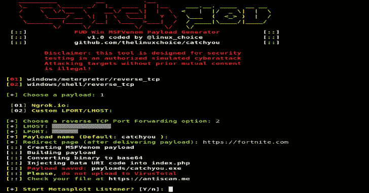
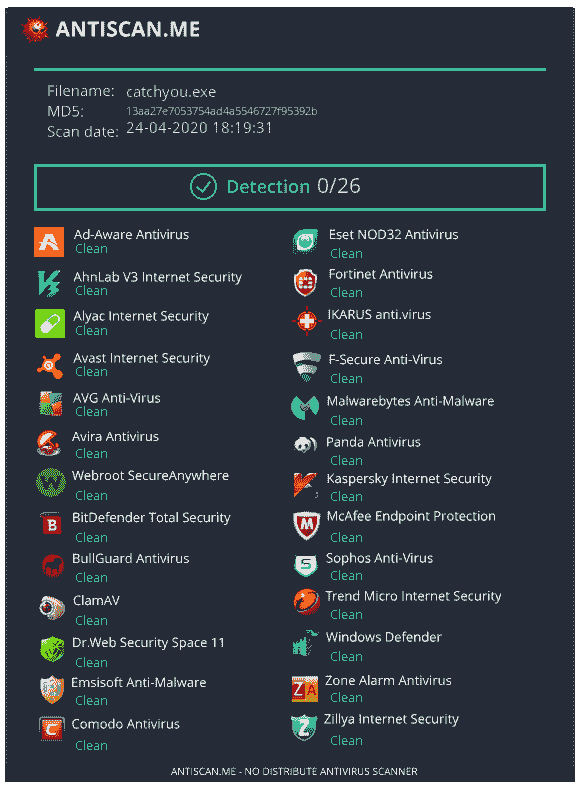

# CatchYou : FUD Win32 Msfvenom 有效负载生成器

> 原文：<https://kalilinuxtutorials.com/catchyou/>

**CatchYou** 是一款用于 FUD win32 msfvenom 有效载荷生成器(meterpreter/shell reverse tcp)的工具。

**特性**

*   完全无法检测的 Win32 MSFVenom 负载(meterpreter/shell 反向 tcp)
*   使用 ngrok 的端口转发
*   测试:Win7/Win10

**要求**

*   Metasploit/MSFVenom
*   mingw-w64: **apt-get 安装 mingw-w64**
*   转发要求:
*   Ngrok Authtoken(用于 TCP 隧道):**注册于:[https://ngrok.com/signup](https://ngrok.com/signup)**
*   您的授权令牌在您的仪表板上可用:
*   **安装您的 auhtoken: **。/ngok 认证标志<【你的 _ 认证标志>****

 ****也读作-[hive jack:内部渗透测试转储 Windows 凭证](https://kalilinuxtutorials.com/hivejack/)**

**免责声明**

未经双方同意使用它攻击目标是非法的。最终用户有责任遵守所有适用的地方、州和联邦法律。开发人员不承担任何责任，也不对本程序造成的任何误用或损坏负责

**用途**

**git 克隆 https://github.com/thelinuxchoice/catchyou
CD catch you
bash catch you . sh**

[**Download**](https://github.com/thelinuxchoice/catchyou)**