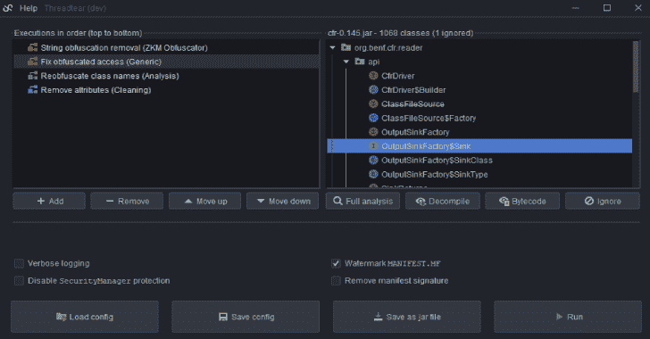
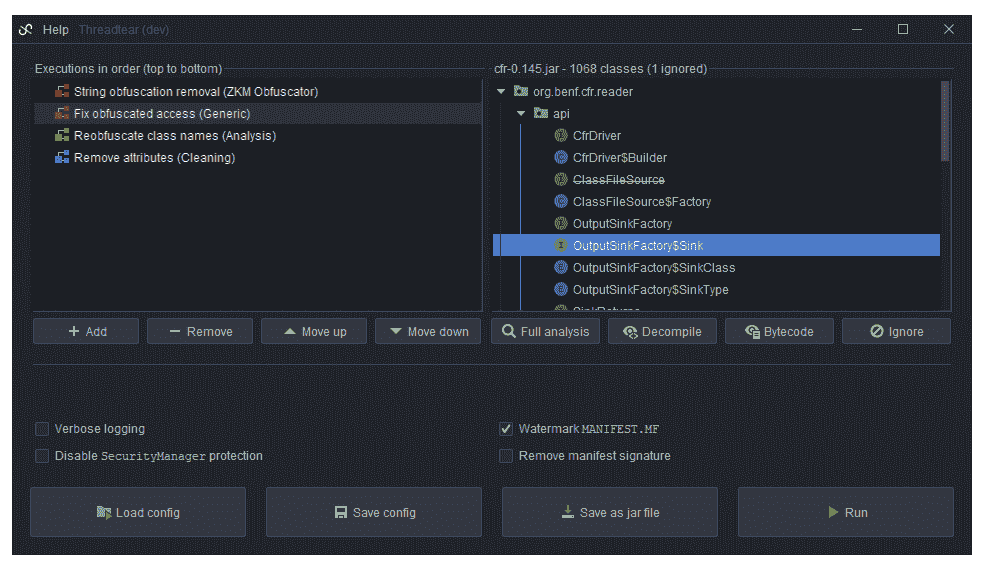
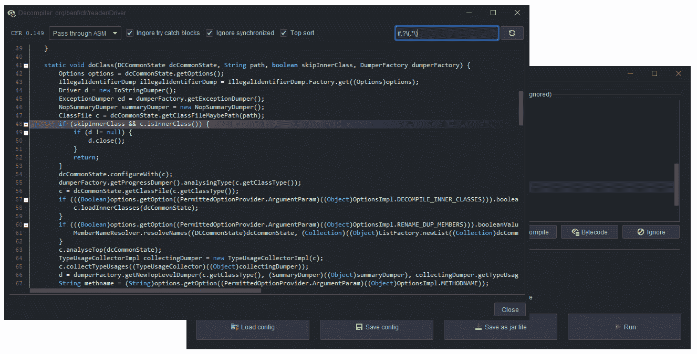
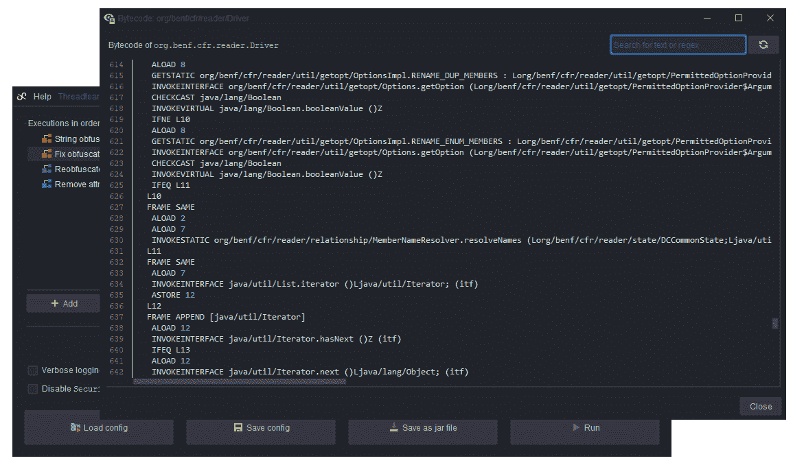
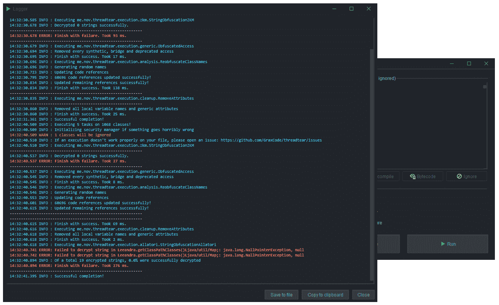
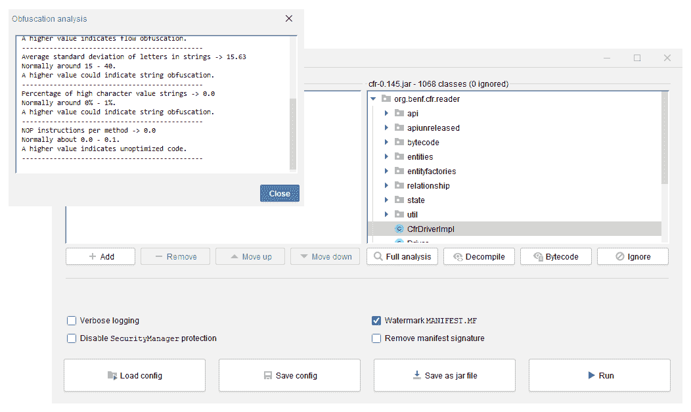
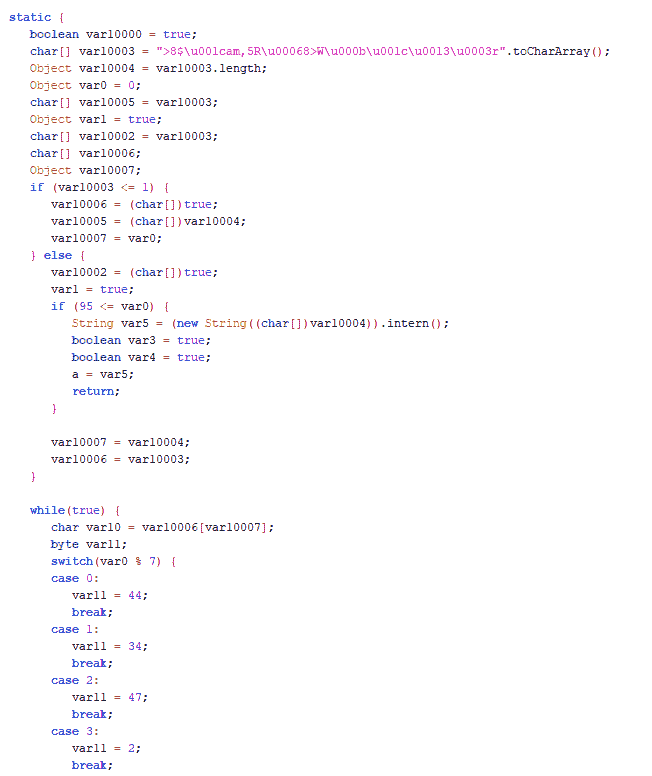
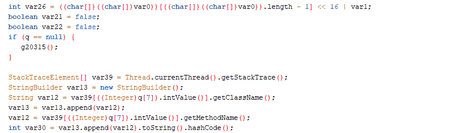
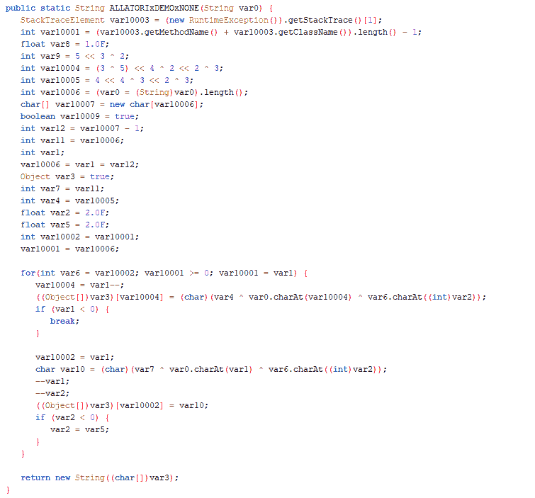

# Threadtear:多功能 Java Seobfuscation 工具套件

> 原文：<https://kalilinuxtutorials.com/threadtear/>

Threadtear 是一个多功能的 java 去泡沫工具。Android 应用程序支持即将推出(目前正在开发 dalvik 到 java 的转换器)。适用于更容易的代码分析，而不必太担心混淆。

即使是最昂贵的混淆像 ZKM 或斯特林格包括在内。为了便于调试，还包括其他工具。插入调试行号以更好地理解异常的来源，或者添加。printStackTrace()来尝试 catch 块，而无需重新编译代码。如果不使用特定于版本的方法，反向兼容性就不再是问题。

**执行**

“执行”是被执行并修改所有加载的类文件的任务。有多种类型的执行，从字节码清理到字符串去模糊。确保它们的顺序正确。例如，清理执行应该在最后执行，但是如果首先执行，也可以帮助其他执行。如果你准备好了，点击“运行”按钮，它们将按顺序执行。

**警告**

使用该工具需自担风险。一些执行使用实现的类加载器来运行 jar 文件中的代码。攻击者可以修改字节码，从而执行恶意代码。受影响的执行使用类`**me.nov.threadtear.asm.vm.VM**`。这些方法主要用于解密字符串或资源/访问混淆，因为远程执行解密方法要容易得多。

**安全**

Threadtear 使用自己的`**SecurityManager**`尽力保护你免受恶意调用(任意代码执行)，但不能保证。尤其是像 ZKM 或斯金格这样的去泡器，你必须非常小心，因为必须允许反射，否则它们将不起作用。如果你发现一个王牌，请打开一个问题。我会尽快修复它们。

**如何编译？**

首先运行`**gradle build**`，然后运行`**gradle fatJar**`。在`**builds/libs**`中，应该已经创建了一个可运行的 jar 文件。如果不想下载回购，可以使用最新版本。

**提示&招数**

有一些技巧可以帮助你成功地识别和去除 jar 文件的泡沫。在运行执行之前，反编译代码，找出需要使用的内容。你可以使用实现的反编译器。

**去泡沫指令**

去泡沫的最佳顺序是`**generic executions > access deobfuscation > string deobfuscation > cleaning executions**`。

**识别**

混淆器展示了可用于识别混淆器的模式。识别混淆器最简单的方法是浏览`**META-INF/MANIFEST.MF**`文件。有可能有一个 **`Obfuscated-By: XXX`或者`Protected-By: XXX`** 属性。

**ZKM**

极度(流)混乱的代码，通常会被包含开关的静态初始化器中的字符串解密方法或具有很长开关块的字符串解密方法(大约 250 种情况)所注意到。ZKM 是最好的(也是最老的)混淆器之一

java，而且也很贵。

**纵梁**

如果你的 jar 文件包含一些特殊的类，这些类带有字符串混淆和访问混淆使用的巨大的解密算法，那么很可能是 Stringer。如果你的文件被多个混淆器混淆，Stringer 是其中之一，你应该用 Stringer 开始你的模糊，因为 Stringer 混淆不能被覆盖。(由于自定义 JAR 签名和在字符串解密期间使用方法名)保护还不错，Stringer 是最昂贵的混淆器之一。不像普通的混淆器，它没有名称混淆。它更像是“第二层”。大概 90%的人使用这种混淆器是在使用破解。

**奶瓶**

像 iIlIlIiIl 或 aUx、cOn、PrX 这样的类名表示 Allatori 混淆。Allatori 非常常见，因为它提供了一个免费的演示，只需点击几下鼠标就可以访问。这种混淆并不难逆转。

**其他混淆器**

对于其他混淆器，你可以尝试一般执行或打开一个问题，我会看看我能做什么。

**描述&标签**

在选择执行之前，请在悬停时查看工具提示文本。它们包含关于它们做什么的简短描述，但也包含帮助您理解 JAR 文件的行为是如何改变的标记。

**执照**

Threadtear 是在 GNU 通用公共许可证 3.0 下授权的

**通知**

不要删除不属于你的文件。如果变压器不能正常工作，请提出问题或给我发电子邮件，并附上日志。
注意，输出文件很可能是不可运行的。如果您仍然想运行它们，请使用`-noverify`作为 JVM 参数！这个工具是为 Java 8 设计的，但是它也可以在更高的版本上运行。

[**Download**](https://github.com/GraxCode/threadtear)