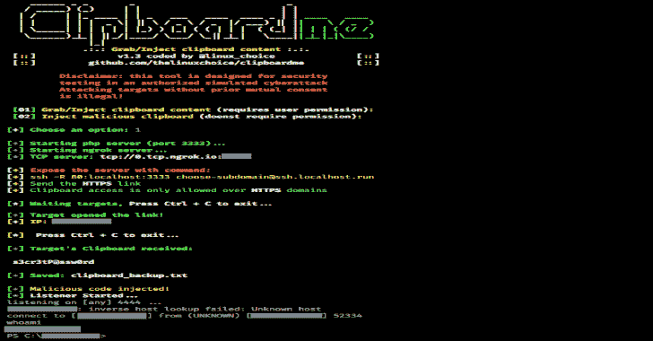

# Clipboardme:通过链接抓取和插入剪贴板内容

> 原文：<https://kalilinuxtutorials.com/clipboardme/>

**Clipboardme** 是一个通过链接抓取并注入剪贴板内容的工具。浏览器正在为异步剪贴板访问实现新的 JavaScript API，以将复制和粘贴集成到 web 应用程序中。

它取代了基于同步 execCommand 的复制和粘贴。异步剪贴板请求在等待过程中不会阻塞页面，这是对同步请求的改进，同时简化了事件并使它们与拖放 API 保持一致。

这是一个 pentester 工具，使用异步剪贴板 API，只需打开一个链接，就可以读写剪贴板中的内容。

也可阅读-[exe gol:一个卡利轻基地，几乎没有有用的附加工具](https://kalilinuxtutorials.com/exegol/)

**异步剪贴板 API 是如何工作的？**

**复制:将文本写入剪贴板**

通过调用 writeText()，无需请求权限，就可以将文本自动静默复制到剪贴板。示例:

**<脚本>
navigator . clipboard . write text('恶意命令被复制')；
</脚本>**

很简单，是吧？如果用户被说服运行剪贴板内容会有多危险？如果用户在访问 clipboardme 生成的恶意网站后，键入以下快捷序列，就可以制作一个 windows 反向外壳: **windows+x，p，ctrl + v** 。不需要按回车键，只需说服目标运行攻击者控制 windows 系统的“快捷方式”。当目标应该执行剪贴板内容时，会出现这种情况。

**粘贴:从剪贴板中读取文本**

可以通过调用 readText()从剪贴板中读取文本(需要权限)。示例:

**<脚本>
navigator . clipboard . read text()。然后(clip text =>document . write(clip text))；
</剧本>**

用户通常会将密码和个人信息等敏感信息复制到剪贴板，然后任何页面都可以读取这些信息。Clipboardme 工具可以创建 HTTPS 恶意页面来抓取内容。

为了帮助防止滥用，剪贴板访问只允许当一个网页是活跃的标签和安全域(https)。活动选项卡中的页面可以写入剪贴板而无需请求权限，但是从剪贴板读取总是需要权限。

**浏览器兼容性**

Chrome 66，Opera 53，安卓版 Chrome，安卓版 Opera

**要求**

*   Ngrok Authtoken(用于 TCP 隧道):在:[https://ngrok.com/signup](https://ngrok.com/signup)注册
*   您的授权令牌可在您的仪表板上找到:[https://dashboard.ngrok.com](https://dashboard.ngrok.com)
*   安装您的 auhtoken:。/ngok 认证令牌<your_authtoken></your_authtoken>

**法律免责声明**

未经双方同意使用 Clipboardme 攻击目标是非法的。最终用户有责任遵守所有适用的地方、州和联邦法律。开发人员不承担任何责任，也不对本程序造成的任何误用或损坏负责

**用途**

**git 克隆 https://github.com/thelinuxchoice/clipboardme
CD 剪贴板 me
bash 剪贴板 me.sh**

[**Download**](https://github.com/thelinuxchoice/clipboardme)