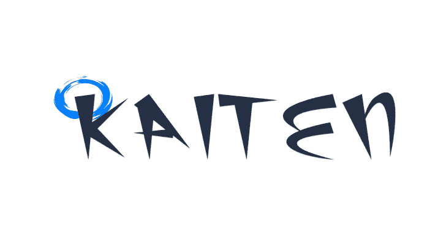
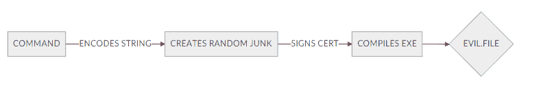

# 凯腾:不可探测的有效载荷生成

> 原文：<https://kalilinuxtutorials.com/kaiten/>

不可探测的有效载荷生成。此工具仅用于教育目的，未经双方同意使用 **Kaiten** 攻击目标是非法的。开发人员不承担任何责任，也不对本程序造成的任何误用或损坏负责。

它是什么，为什么要制造它？

我们有意将其用于渗透测试工作和学习目的。我们的凯腾 c2 现在移动到一个更好的来源。反病毒是愚蠢的。来源:https://www.shadowlabs.cc/kaiten

**要求**

*   明瓦(64 岁和 32 岁)
*   （同 groundcontrolcenter）地面控制中心
*   OSSLSIGNCODE

**也可以理解为-[PowerSploit:一个 PowerShell 后开发框架](https://kalilinuxtutorials.com/powersploit-a-powershell-post-exploitation-framework/)**

**特性**

*   不可检测的有效载荷生成
*   隐形 FUD 有效载荷
*   自签名证书
*   随机垃圾代码

**受影响的设备和操作系统**

*   Windows 操作系统
*   Android(即将推出)
*   Mac/Linux

**图解(亦其酷呵呵)**

[**Download**](https://github.com/shadowlabscc/Kaiten)