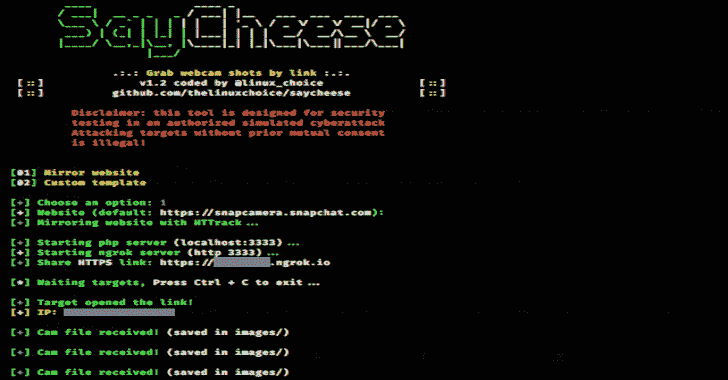

# Saycheese:通过链接抓取目标的网络摄像头照片

> 原文：<https://kalilinuxtutorials.com/saycheese/>

**Saycheese** 是一个使用 Ngrok 端口转发方法生成恶意 HTTPS 页面的工具，以及一个使用 MediaDevices.getUserMedia 执行 cam 请求的 javascript 代码

MediaDevices.getUserMedia()方法提示用户使用媒体输入的许可，该媒体输入产生具有包含所请求的媒体类型的轨道的媒体流。该流可以包括例如视频轨道(由诸如照相机、视频记录设备、屏幕共享服务等硬件或虚拟视频源产生)、音频轨道(类似地，由诸如麦克风、A/D 转换器等物理或虚拟音频源产生)以及可能的其他轨道类型。

[点击此处查看更多关于 MediaDEvices.getUserMedia()的信息](https://developer.mozilla.org/en-US/docs/Web/API/MediaDevices/getUserMedia)

为了说服目标授予访问摄像头的权限，该页面使用由[https://github.com/wybiral](https://github.com/wybiral)制作的 javascript 代码作为默认模板页面，将 favicon 转换为摄像头流。

**安装(在 Kali Linux 2020.1 上测试)**

**git 克隆 https://github.com/thelinuxchoice/saycheese
CD say cheese
bash say cheese . sh**

**也可以理解为-[Powerob:一个运行中的 Powershell 脚本混淆器](https://kalilinuxtutorials.com/powerob/)**

**免责声明**

未经双方事先同意，使用 SayCheese 攻击目标是非法的。最终用户有责任遵守所有适用的地方、州和联邦法律。开发人员不承担任何责任，也不对本程序造成的任何误用或损坏负责。

[**Download**](https://github.com/thelinuxchoice/saycheese)