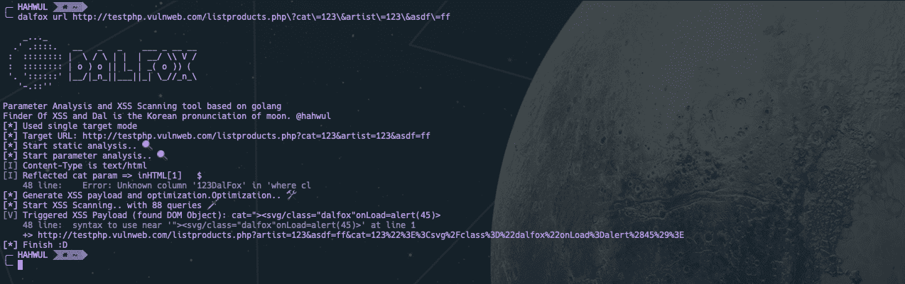

# Dalfox:参数分析和 XSS 扫描工具

> 原文：<https://kalilinuxtutorials.com/dalfox/>

**DalFox** 只是 XSS 的扫描和参数分析工具。我之前开发了 [XSpear](https://github.com/hahwul/XSpear) ，一个基于 ruby 的 XSS 工具，这一次，在移植 golang 的过程中发生了彻底的改变！！！并将其创建为一个新项目。基本概念是分析参数，找到 XSS，并基于 DOM 解析器进行验证。

我谈谈命名。Dal(달)是 moon 和 Fox 的韩语发音，被做成 fox(查找 XSS)。

**主要特征**

*   参数分析(查找反射参数，查找自由/错误字符，识别注入点)
*   静态分析(检查 CSP、X-Frame-options 等不良报头..基于基本请求/响应)
*   有效载荷的优化查询
    *   通过抽象检查注入点并生成 fit 有效负载。
    *   基于 badchar 消除不必要的负载
*   XSS 扫描(反射+存储)和 DOM 库验证
*   所有测试有效载荷(内置，您的自定义/盲)与编码器并行测试。
    *   支持双 URL 编码器
    *   支持 HTML 十六进制编码器
*   友好管道(单个 url，来自文件，来自 IO)
*   以及测试所需的各种选项😀
    *   用于查找其他漏洞的内置/自定义搜索
    *   如果你发现了，行动之后
    *   等等..

**也可理解为-[Shell operator:生成绑定的 CLI 工具&反向 Shell](https://kalilinuxtutorials.com/shellerator/)**

**如何安装？**

个人共有三种方式，我推荐 go 安装。

**开发者版本(go-get 或 go-install)**

**开始安装**

*   克隆此回购

**$ git 克隆 https://github . com/hah wul/dalfox**

*   安装在克隆的 dalfox 路径中

**$ go 安装**

*   使用 dalfox

**$ ~/go/bin/dalfox**

**go-get**

*   去找达尔福克斯！

**$ go get-u github.com/hahwul/dalfox**

*   使用 dalfox

**$ ~/go/bin/dalfox**

**发布版本**

1.  打开最新发布页面[https://github.com/hahwul/dalfox/releases/latest](https://github.com/hahwul/dalfox/releases/latest)
2.  下载文件下载并提取适合您的操作系统的文件。
3.  可以放在执行目录下使用。例如

**【CP dalfox/usr/bin/**

**用途**

基于 golang
Finder 的参数分析和 XSS 扫描工具 XSS 和 Dal 是月亮的韩语发音。@hahwul

**用法:**
dalfox【命令】

**可用命令:**
–文件使用文件模式(目标列表或 rawdata)
–帮助帮助关于任何命令
–管道使用管道模式
–sxss 使用存储的 xss 模式
–更新 dalfox(二进制补丁)
–URL 使用单目标模式
–版本显示版本

**标志 –blind string 添加您的 blind xss(例如-b hah wul . XSS . ht)
–config string 使用来自文件
的配置-C，–cookie string 添加自定义 cookie
–custom-payload string 添加来自文件
-d 的自定义有效负载，–data string 使用 POST 方法并添加正文数据
–发送到同一主机之间的延迟 int 毫秒数(1000 = = 1s)
–found-action string 如果发现弱/vuln，action(cmd)到下一个【T28 /samples/sample _ grep . JSON)
-H，–header string Add custom headers
-H，–help help for dal fox
–Ignore-return string 忽略从返回代码扫描(例如–Ignore-return 302，403，404)
–Only-discovery Only 测试参数分析
-o，–输出字符串写入输出文件
–output-format string-o/–output 的格式(txt/json/xml) 【T35**

**$ dalfox[模式][标志]**

单目标模式

**$ dal fox URL http://testphp.vulnweb.com/listproducts.php\?cat\=123\&artist \ = 123 \&asdf \ = ff-b https://hah wul . XSS . ht**

来自文件的多目标模式

**$ dal fox file URLs _ file–custom-payload。/mypayloads.txt**

管道模式

**$ cat URL _ file | dalfox pipe-h " authtype token:bbadsfkasdfasdsf 87 "**

其他小技巧，详见 [wiki](https://github.com/hahwul/dalfox/wiki) 详细说明！

**截图**

[**Download**](https://github.com/hahwul/dalfox)