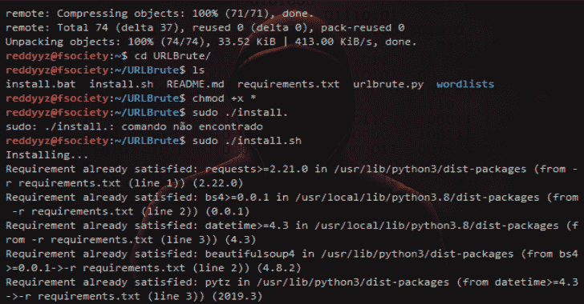

# URLBrute:暴力网站子域和目录的工具

> 原文：<https://kalilinuxtutorials.com/urlbrute/>

URLBrute 是一款帮助你暴力破解网站子域和目录的工具。
可与 python3 和 python2 一起使用。

**依赖关系**

*   urlbrute.py
    *   **请求** > = 2.21.0
    *   **bs4**= 0 . 0 . 1
    *   **datetime** > = 4.3

**也可阅读-[Payloads all things:有用有效载荷列表&Bypass](https://kalilinuxtutorials.com/payloadsallthethings/)**

**如何安装？**

在 Linux 中:

**chmod +x install.sh
sudo。/install.sh**

在 Windows 中，安装 [python 3.7](https://www.python.org/downloads/release/python-373/) ，然后以管理员身份运行 cmd:

**install.bat**

**学分**

感谢创造单词表的 **[丹塔勒](https://github.com/danTaler/WordLists)** 。