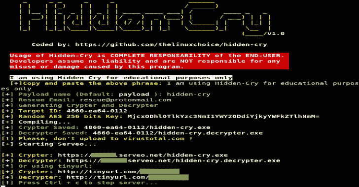

# 隐藏的 Cry–带有 AES 256 位密钥的 Windows 加密/解密生成器

> 原文：<https://kalilinuxtutorials.com/hidden-cry/>

**Hidden Cry** 是一个带有 AES 256 位密钥的 Windows Crypter/Decrypter 生成器。

**特性**

*   广域网上的作品:Serveo.net 的端口转发
*   完全检测不到(virustotal.com)->不要上传到 FUD！

**用途**

**git 克隆 https://github.com/thelinuxchoice/hidden-cry
CD 隐哭
apt-get 更新& apt-get 安装 mingw-w64 -y
chmod +x 隐哭
。/隐藏-哭泣**

**也读作——[catch you:FUD Win32 MSF venom 有效载荷生成器](https://kalilinuxtutorials.com/catchyou/)**

**免责声明**

在没有双方同意的情况下使用隐藏哭泣攻击目标是非法的。最终用户有责任遵守所有适用的地方、州和联邦法律。开发人员不承担任何责任，也不对本程序造成的任何误用或损坏负责。

[**Download**](https://github.com/thelinuxchoice/hidden-cry)