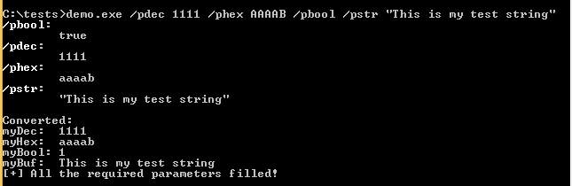
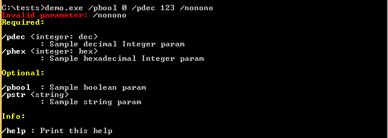

# Paramkit:一个帮助解析命令行参数的小库

> 原文：<https://kalilinuxtutorials.com/paramkit/>

Paramkit 是一个帮助解析命令行参数的小库。

**目标**

*   "就像 Python 的`argparse`一样，但是针对 C/C++ "
*   紧凑简约
*   使用方便
*   可展开的

**也可阅读-[wifi mpkin 3:流氓接入点攻击的强大框架](https://kalilinuxtutorials.com/wifipumpkin3/)**

**演示**

打印每个参数的帮助:

轻松存储常用类型的值，并验证是否填写了所有必需的参数:

验证是否没有传递无效参数:

参见[演示代码](https://github.com/hasherezade/paramkit/tree/master/demo)

[**Download**](https://github.com/hasherezade/paramkit)