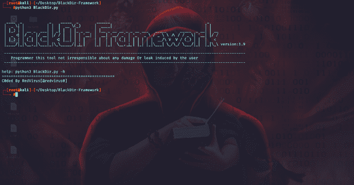
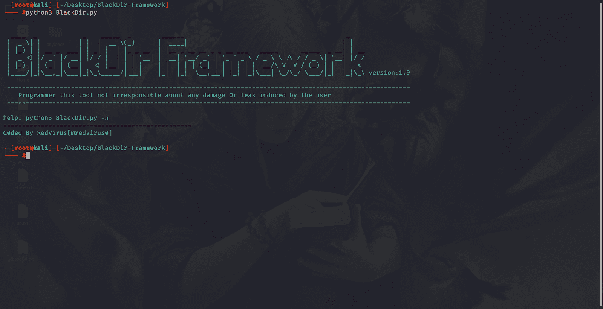
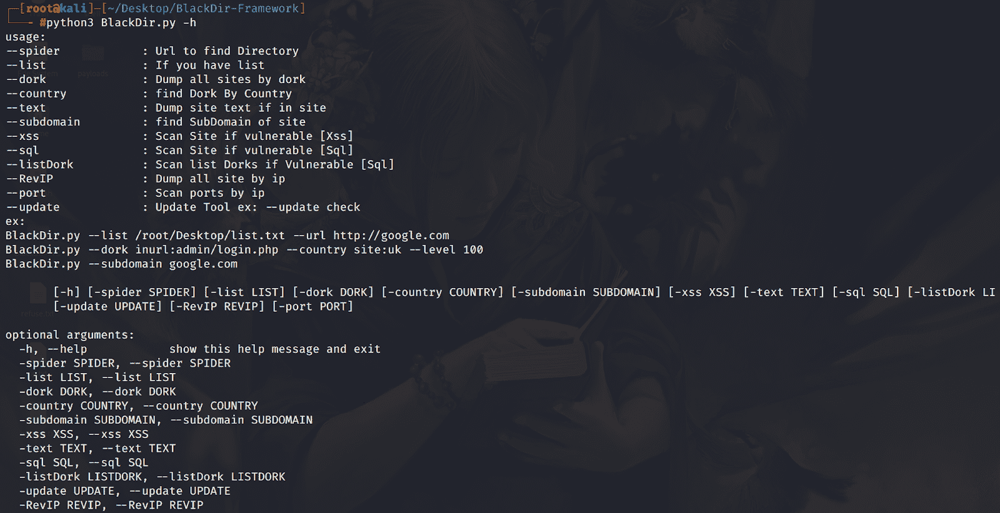
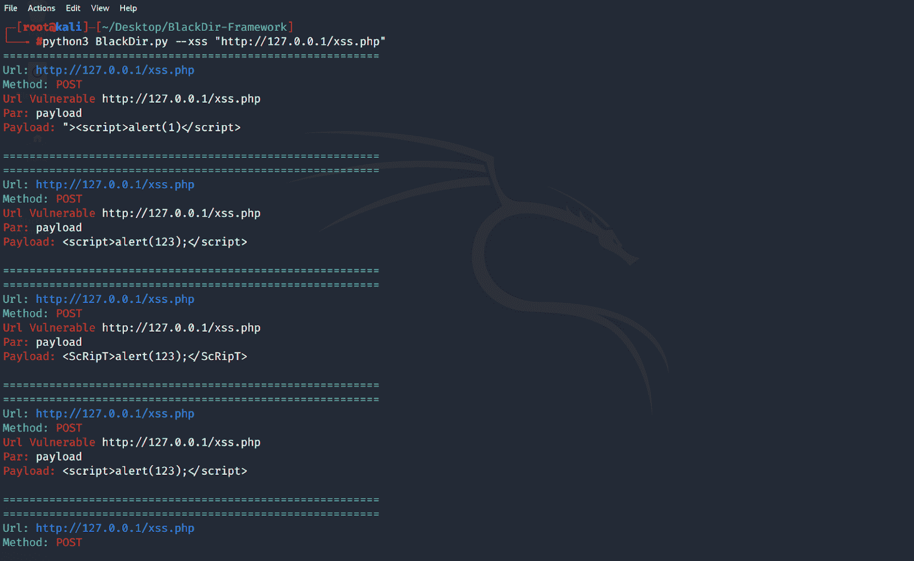
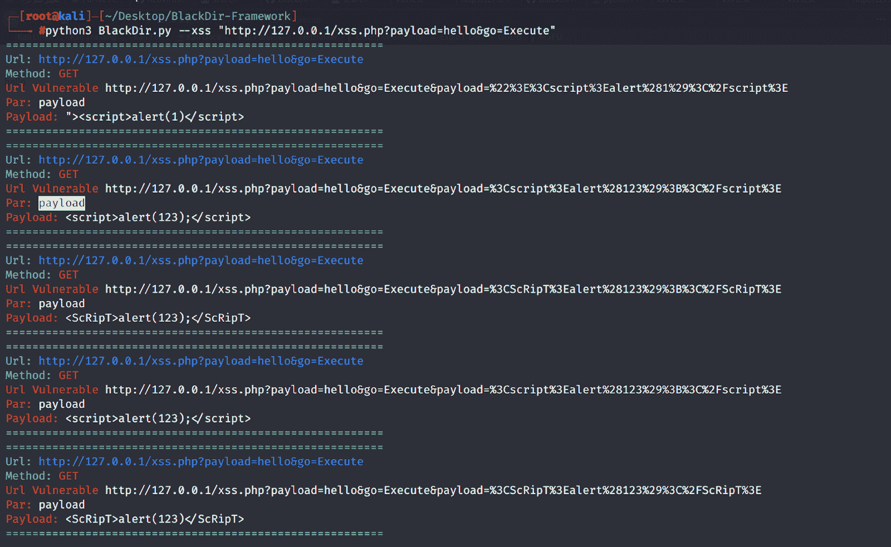

# BlackDir 框架:Web 应用程序漏洞扫描器

> 原文：<https://kalilinuxtutorials.com/blackdir-framework/>

**BlackDir Framework** 是一款 Web 应用漏洞扫描器，具有以下特性；

*   蜘蛛目录
*   查找子域
*   高级呆子搜索
*   扫描呆子列表
*   扫描网站[Xss，Sql]
*   反向 Ip 查找
*   端口扫描

**安装**

**git 克隆 https://github.com/RedVirus0/BlackDir-Framework.git
CD BlackDir
pip 3 install-r requirements . txt
python 3 BlackDir . py**

**也可阅读-[Payloads all things:有用有效载荷列表&Bypass](https://kalilinuxtutorials.com/payloadsallthethings/)**

**截图**

[**Download**](https://github.com/RedVirus0/BlackDir-Framework)