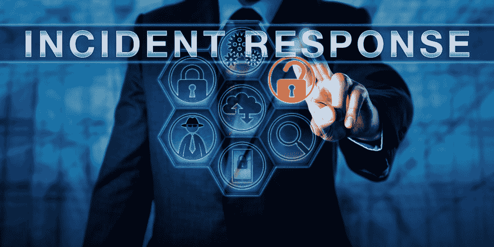

# 如何创建网络安全事件响应计划

> 原文：<https://kalilinuxtutorials.com/how-to-create-a-cybersecurity-incident-response-plan/>

无论企业在员工培训、工具和技术上投入多少，网络安全相关问题依然存在。其中许多是因为恶意软件和人为错误。对所有企业来说，了解[恶意软件、事件响应和数字取证](https://greycastlesecurity.com/resources/blog/Incident-Response/Malware-Incident-Response-and-Digital-Forensics-What-You-Need-to-Know/)非常重要。

随之而来的是对网络安全事件响应计划的需求。

目标当然是抱最好的希望，做最坏的打算。如果您没有一个主动的响应计划，网络攻击可能会摧毁您的企业。

这些计划不仅适用于大企业，事实上，对于小企业来说，确保他们有一个稳固的事件响应计划比以往任何时候都更重要。

## 事故响应的基础

事件响应是处理安全漏洞和网络威胁的结构化流程。当您有一个明确的响应计划时，您可以在威胁造成太大损害之前识别它们。您还可以降低成本，并使用您所学到的知识来构建更好的方法，以防止将来发生类似的攻击。

当一个真实的事件发生时，它可能是一个紧张的，无法抗拒的时刻。

如果有一个适当的计划，那么它可以帮助每个人知道接下来要采取什么步骤来减轻损失。

除了总体上[减轻与违规相关的损害和费用](https://www.nist.gov/itl/smallbusinesscyber/responding-cyber-incident)之外，您的事件响应还需要减少恢复时间。

当你有了一个适当的计划，你就可以穿过其他可能发生的噪音，果断清晰地行动。

## 风险评估

在创建其余的[事件响应计划](https://www2.deloitte.com/content/dam/Deloitte/global/Documents/Risk/gx-cm-cyber-pov.pdf)之前，您应该做的第一件事是进行风险评估。

风险评估将帮助您识别企业特有的威胁，以及每种威胁发生的可能性。

如果您过去已经做过风险评估，请确保它对于您当前的系统和需求来说没有过时。

你可以使用国土安全部的网络事件评分系统来帮助你进行评估和审计。

一旦你确定了风险的优先级，你就能把你的计划和资源分配给最有可能发生的情况，而不是只关注最糟糕的情况，这种情况不太可能影响你的业务。

## 确定人员和利益相关者

完成风险评估后，想想你计划中的重要人物。这些利益相关者可能在你的企业内部，也可能在企业外部。

任命一个人来领导您的事件响应，并承担主要责任。然后，他们应该指定其他人来帮助他们每一步。

如果决策者不能直接做出决策，负责事件响应的人员应该能够随时与决策者沟通。

负责处理问题的人被称为安全事件响应团队或 SIRT。

## 检测和分析

响应的检测阶段意味着您一直在监控、警告和报告任何可能发生的与安全相关的事件。

这可以包括对已知和未知威胁的[识别](https://securityintelligence.com/dont-dwell-on-it-how-to-detect-a-breach-on-your-network-more-efficiently/)，以及可能是威胁的事物，但您并不确定。

您的策略的检测和分析部分将依赖于自动扫描系统、主机和服务器的工具的使用。

使用基于取证的功能，可以通过查看在任何给定时间运行的程序来了解终端的运行状况。

## 应对、恢复和后续行动

你的计划需要包括的下一个方面是实际的反应、恢复和后续行动。

事件响应可能意味着您关闭某些系统或断开受感染系统与网络其余部分的连接。

然后，您将开始确定损坏的程度，以及是否有任何敏感数据被盗的可能性。

您将记录在此期间发生的所有事情，并且您可能需要法律顾问来确定您是否会因为该事件而在任何方面不合规。

最后，在消除安全风险后，您可以回顾和报告发生的一切。这将使您能够更好地了解您的企业面临的威胁，并且您可能会发现，您不仅更新了您的网络安全计划，还用新知识更新了您的响应计划。

你也要确保所有关键利益相关者在整个过程中都知道发生了什么，你要让所有员工都参与进来，根据经验来帮助预防未来的情况。