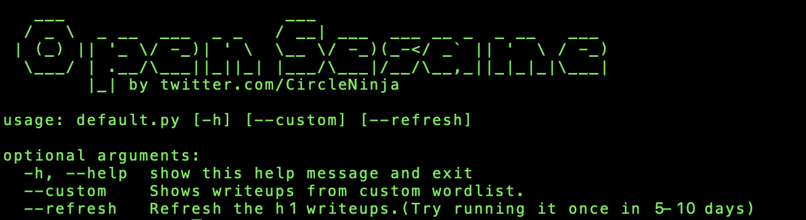
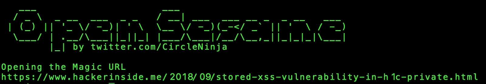
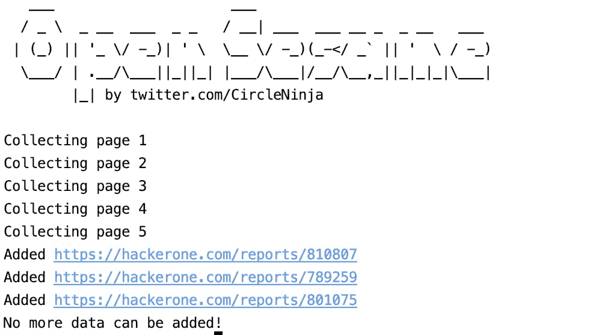

# Open Sesame:一个显示随机公开披露的黑客的 Python 工具

> 原文：<https://kalilinuxtutorials.com/open-sesame/>

**芝麻开门**包含 hackerone 披露的报告和其他 bug 赏金报告。一个 python 工具，无聊时运行以显示随机公开披露的黑客报告。在浏览器中自动打开报告。

**包含超过 8k 份公开披露的 Hackerone 报告和 addtl。约 700 个 bug 赏金的文字列表。**

这是安全爱好者和 bug 赏金猎人的生产力工具。我在这里写了一篇博客，给出了如何有效利用这一点的想法。

其他功能包括:

*   正在打开自定义单词列表中的 URL，该列表中有 bug bounty 记录。
*   获取和更新新披露的黑客一个公开披露的报告。

**也读作——[catch you:FUD Win32 MSF venom 有效载荷生成器](https://kalilinuxtutorials.com/catchyou/)**

**用途**

请在 rquirements.txt 中安装组件

`**python3 default.py**`从公开披露的 h1 报告集合中随机打开一个神奇的 URL。

从有 bug 奖励报道的自定义单词列表中打开一个随机的魔法 URL。

`**python3 default.py --refresh**`刷新新公开披露的 h1 报告并将其添加到您的文件(final.txt)

**已知问题**

*   无法区分完全公开披露的报告和有限披露的报告的能力。
*   如果长时间运行，该工具可能会破坏其工作方式。指定的默认范围是抓取 10 个页面，以减少站点负载。如果你认为你已经运行了很长时间，考虑在之前的 refresh.py 中增加主循环的范围到 50
*   跑步。这将允许收集所有报告，直到在 final.txt 中提取最近的报告。